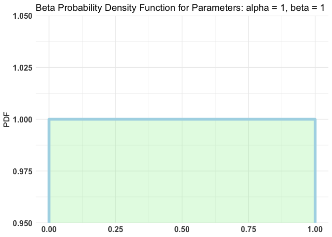
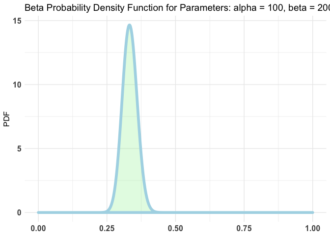
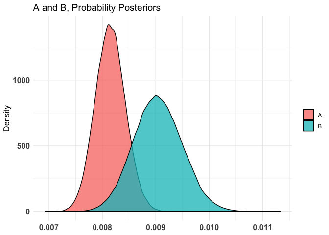
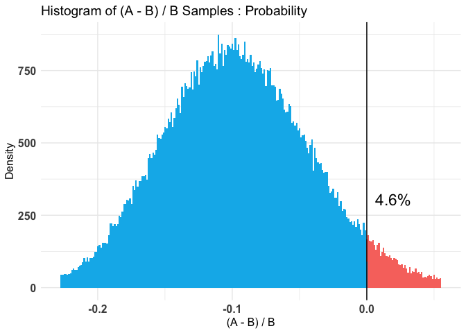

A/B Testing for A Marketing Campaign
================

``` r
library (bayesAB)
library(readxl)
Marketing_Campaign <- read_excel("marketing_performance_record.xlsm", sheet=1)
#View(Marketing_Campaign)

p <- unique(Marketing_Campaign$campaign_id)
campaign3 <- subset(Marketing_Campaign, campaign_id==p[3])
campaign4 <- subset(Marketing_Campaign, campaign_id==p[4])

total_imp3 <- sum(campaign3$impressions)
total_imp4 <- sum(campaign4$impressions)
total_click3 <- sum(campaign3$clicks)
total_click4 <- sum(campaign4$clicks)

total_imp <- c(total_imp3,total_imp4)
total_click <- c(total_click3,total_click4)
data.frame(total_imp,total_click)
```

    ##   total_imp total_click
    ## 1    101043         700
    ## 2     43179         278

``` r
prop.test(total_click,total_imp)
```

    ## 
    ##  2-sample test for equality of proportions with continuity
    ##  correction
    ## 
    ## data:  total_click out of total_imp
    ## X-squared = 1.0045, df = 1, p-value = 0.3162
    ## alternative hypothesis: two.sided
    ## 95 percent confidence interval:
    ##  -0.0004385035  0.0014173609
    ## sample estimates:
    ##      prop 1      prop 2 
    ## 0.006927744 0.006438315

``` r
A_binom <- rbinom (101043, 1, 0.0069)
B_binom <- rbinom (43179, 1, 0.0064)

plotBeta (1, 1)  
```

<!-- -->

``` r
plotBeta (100, 200) ## specific range of p
```

<!-- -->

``` r
AB1 <- bayesTest (A_binom, B_binom,
                  priors = c ('alpha' = 1, 'beta' = 1),
                  distribution = 'bernoulli')

AB2 <- bayesTest (A_binom, B_binom,
                  priors = c ('alpha' = 100,'beta' = 200),
                  distribution = 'bernoulli')

print(AB2)
```

    ## --------------------------------------------
    ## Distribution used: bernoulli 
    ## --------------------------------------------
    ## Using data with the following properties: 
    ##                  A           B
    ## Min.    0.00000000 0.000000000
    ## 1st Qu. 0.00000000 0.000000000
    ## Median  0.00000000 0.000000000
    ## Mean    0.00718506 0.006785706
    ## 3rd Qu. 0.00000000 0.000000000
    ## Max.    1.00000000 1.000000000
    ## --------------------------------------------
    ## Conjugate Prior Distribution: Beta 
    ## Conjugate Prior Parameters: 
    ## $alpha
    ## [1] 100
    ## 
    ## $beta
    ## [1] 200
    ## 
    ## --------------------------------------------
    ## Calculated posteriors for the following parameters: 
    ## Probability 
    ## --------------------------------------------
    ## Monte Carlo samples generated per posterior: 
    ## [1] 1e+05

``` r
summary(AB2)
```

    ## Quantiles of posteriors for A and B:
    ## 
    ## $Probability
    ## $Probability$A
    ##          0%         25%         50%         75%        100% 
    ## 0.006926654 0.007956501 0.008145662 0.008335633 0.009538095 
    ## 
    ## $Probability$B
    ##          0%         25%         50%         75%        100% 
    ## 0.007188062 0.008730050 0.009031838 0.009344311 0.011330633 
    ## 
    ## 
    ## --------------------------------------------
    ## 
    ## P(A > B) by (0)%: 
    ## 
    ## $Probability
    ## [1] 0.04599
    ## 
    ## --------------------------------------------
    ## 
    ## Credible Interval on (A - B) / B for interval length(s) (0.9) : 
    ## 
    ## $Probability
    ##           5%          95% 
    ## -0.183895495 -0.002330342 
    ## 
    ## --------------------------------------------
    ## 
    ## Posterior Expected Loss for choosing B over A:
    ## 
    ## $Probability
    ## [1] 0.1118996

<!-- --><!-- --><!-- -->
