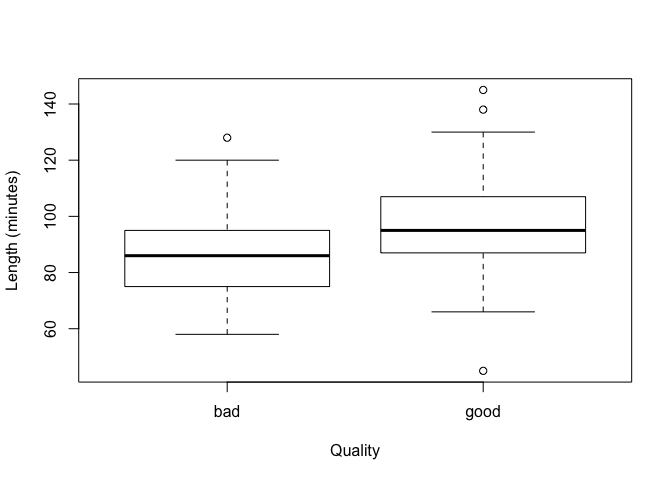

Two Treatments
================
April Sang
17/06/2019

### Experimental Plans-Comparing Two Treatments

``` r
#The dataset contains information on a sample of 100 movies.
Movies <- read.csv('filmdata.csv')

# create new good/bad variable
Movies$quality <- 'good'
Movies$quality[Movies$rating < 2.5] <- 'bad'

# for convenience, define the sample sizes:
n1 <- 42
n2 <- 58

# boxplot
boxplot(length ~ quality, data = Movies, xlab = 'Quality', ylab = 'Length (minutes)')
```

<!-- -->

    Based on the boxplot, it would appear that our assumptions about equal vari-
    ance has been met. Since the points on the qq-plot fall approximately on a
    straight line, it would appear that the normality assumption is met.

``` r
#H0 : T1 +T2 = 0
#HA : T1 +T2 =! 0

# mean of good/bad movies:
mu.bad <- mean(Movies$length[Movies$quality == 'bad'])
mu.good <- mean(Movies$length[Movies$quality == 'good'])

# mu.hat, tau1.hat and tau2.hat from our data model:
# mu.hat is overall mean:
mu.hat <- mean(Movies$length)
# mu.bad = mu.hat + tau1.hat, so tau1.hat = mu.bad - mu.hat
tau1.hat <- mu.bad - mu.hat
# mu.good = mu.hat + tau2.hat, so tau2.hat = mu.good - mu.hat
tau2.hat <- mu.good - mu.hat

# variance estimates
# pooled variance 
var.bad.hat <- var(Movies$length[Movies$quality == 'bad'])
var.good.hat <- var(Movies$length[Movies$quality == 'good'])
pooled.var <- ((n1 - 1)*var.bad.hat + (n2 - 1)*var.good.hat)/(n1 + n2 - 2)

# unpooled variance
var <- var(Movies$length)

# t-distribution is t_98 (i.e. t with n1 + n2 - 2 degrees of freedom)
# c term in our CI is taken as the 97.5 point of the t_98 distribution
c <- qt(0.975, 98)

# 95% CI: 
ci.lower <- tau1.hat - tau2.hat - c * sqrt(pooled.var) * sqrt(1/n1 + 1/n2)
ci.upper <- tau1.hat - tau2.hat + c * sqrt(pooled.var) * sqrt(1/n1 + 1/n2)

#Our 95% confidence intervals for the average lengths of good and bad movies do not overlap. We would therefore reject the null hypothesis that these types of movies have the same length on average at the 95% confidence level.
```

``` r
# using R's t-test command to check
# 2 different ways to do the same thing:
t.test(Movies$length[Movies$quality == 'bad'], Movies$length[Movies$quality == 'good'], var.equal = T)
```

    ## 
    ##  Two Sample t-test
    ## 
    ## data:  Movies$length[Movies$quality == "bad"] and Movies$length[Movies$quality == "good"]
    ## t = -3.2613, df = 98, p-value = 0.001526
    ## alternative hypothesis: true difference in means is not equal to 0
    ## 95 percent confidence interval:
    ##  -18.524043  -4.508797
    ## sample estimates:
    ## mean of x mean of y 
    ##  86.19048  97.70690

``` r
t.test(Movies$length ~ Movies$quality, var.equal = T)
```

    ## 
    ##  Two Sample t-test
    ## 
    ## data:  Movies$length by Movies$quality
    ## t = -3.2613, df = 98, p-value = 0.001526
    ## alternative hypothesis: true difference in means is not equal to 0
    ## 95 percent confidence interval:
    ##  -18.524043  -4.508797
    ## sample estimates:
    ##  mean in group bad mean in group good 
    ##           86.19048           97.70690

``` r
#So the p-value is 0.002, and it does agree with the null hypothesis of no difference in length between good and bad movies. 
```
