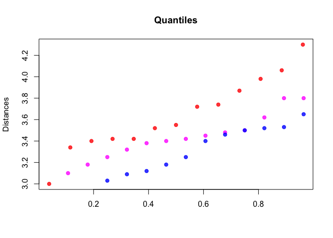
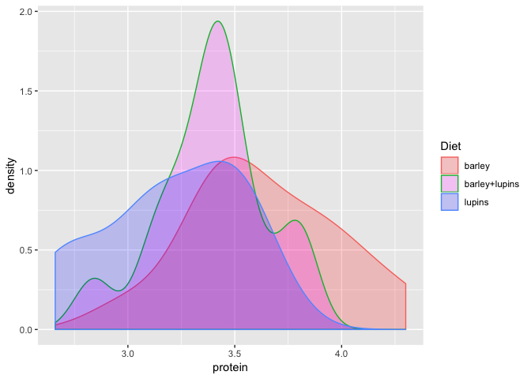
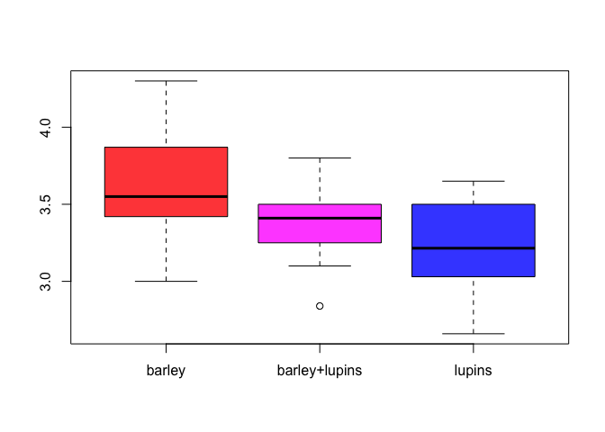

ExperimentalDesign-Unbalanced ANOVA
================
April Sang
16/06/2019

``` r
Milk <- read.csv("Milk19.csv")
dim(Milk)
```

    ## [1] 41  3

``` r
head(Milk)
```

    ##   protein Cow   Diet
    ## 1    4.30 B01 barley
    ## 2    3.00 B02 barley
    ## 3    3.42 B05 barley
    ## 4    3.74 B08 barley
    ## 5    3.87 B09 barley
    ## 6    4.06 B10 barley

``` r
summary(Milk$Diet)
```

    ##        barley barley+lupins        lupins 
    ##            13            14            14

``` r
## ------------------------------------------------------------------------
round(tapply(Milk$protein,Milk$Diet,mean),2)
```

    ##        barley barley+lupins        lupins 
    ##          3.64          3.40          3.21

``` r
round(tapply(Milk$protein,Milk$Diet, var),2)
```

    ##        barley barley+lupins        lupins 
    ##          0.12          0.07          0.11

``` r
round(tapply(Milk$protein,Milk$Diet, sd),2)
```

    ##        barley barley+lupins        lupins 
    ##          0.35          0.26          0.32

``` r
## ---- fig.width=6, fig.height=4------------------------------------------
boxcol = c(adjustcolor("red", 0.8), adjustcolor("magenta", 0.8), adjustcolor("blue", 0.8) )
boxplot(protein~Diet, data=Milk, col=boxcol)
```

<!-- -->

``` r
## ---- fig.width=4, fig.height=4------------------------------------------
barley        = Milk$protein[Milk$Diet == "barley"] 
barley.lupins = Milk$protein[Milk$Diet == "barley+lupins"] 
lupins        = Milk$protein[Milk$Diet == "lupins"] 

qq.set <- function(z) { (1:length(z) -1/2)/length(z) }

plot(qq.set(barley), sort(barley), col=boxcol[1], main="Quantiles", ylab="Distances", pch=19, xlab="")
points(qq.set(barley.lupins), sort(barley.lupins), col=boxcol[2], pch=19)
points(qq.set(lupins), sort(lupins), col=boxcol[3], pch=19)

## ------------------------------------------------------------------------
library(ggplot2)
```

<!-- -->

``` r
ggplot(Milk, aes(x=protein, color=Diet, fill=Diet)) +  
  geom_density(alpha=.2) + scale_fill_manual(values=boxcol)
```

<!-- -->

``` r
## ------------------------------------------------------------------------
library(car)
```

    ## Loading required package: carData

``` r
leveneTest(protein~Diet, data=Milk, center='mean')
```

    ## Levene's Test for Homogeneity of Variance (center = "mean")
    ##       Df F value Pr(>F)
    ## group  2    1.15 0.3274
    ##       38

``` r
## ------------------------------------------------------------------------
summary(aov(protein~Diet,data=Milk))
```

    ##             Df Sum Sq Mean Sq F value  Pr(>F)   
    ## Diet         2  1.275  0.6373   6.525 0.00366 **
    ## Residuals   38  3.711  0.0977                   
    ## ---
    ## Signif. codes:  0 '***' 0.001 '**' 0.01 '*' 0.05 '.' 0.1 ' ' 1

``` r
## ------------------------------------------------------------------------
qf(0.95, df1=2, df2=38)
```

    ## [1] 3.244818

``` r
## ------------------------------------------------------------------------
1-pf(6.525, df1=2, df2=38)
```

    ## [1] 0.003664115

``` r
pf(6.525, df1=2, df2=38, lower.tail=FALSE)
```

    ## [1] 0.003664115

``` r
## ---- fig.width=6, fig.height=4------------------------------------------
boxcol = c(adjustcolor("red", 0.8), adjustcolor("magenta", 0.8), adjustcolor("blue", 0.8) )
boxplot(protein~Diet, data=Milk, col=boxcol)
```

<!-- -->

``` r
## ------------------------------------------------------------------------
round(tapply(Milk$protein,Milk$Diet,mean),2)
```

    ##        barley barley+lupins        lupins 
    ##          3.64          3.40          3.21

``` r
## ------------------------------------------------------------------------
a = c(-1/2, 1, -1/2)
tavg = round(tapply(Milk$protein,Milk$Diet,mean),2)
theta.hat = sum( a * tavg)
theta.hat
```

    ## [1] -0.025

``` r
## ------------------------------------------------------------------------
mod      = aov(protein~Diet,data=Milk)
s2.hat   = sum(mod$residuals^2)/mod$df.residual 
r        = table(Milk$Diet)
se.theta = round(sqrt( s2.hat* sum(a^2/r)  ),3)
se.theta
```

    ## [1] 0.103

``` r
## ------------------------------------------------------------------------
cval = round(qt( 0.975, df= mod$df.residual ),3)
round(theta.hat + c(-1,+1)*se.theta* cval,3)
```

    ## [1] -0.233  0.183

``` r
## ------------------------------------------------------------------------
t.obs     = theta.hat/se.theta
round(2*pt( abs(t.obs), df= mod$df.residual, lower.tail=FALSE),7)
```

    ## [1] 0.8095289

``` r
## ------------------------------------------------------------------------
round(2*pnorm( abs(t.obs), lower.tail=FALSE),7)
```

    ## [1] 0.8082235
