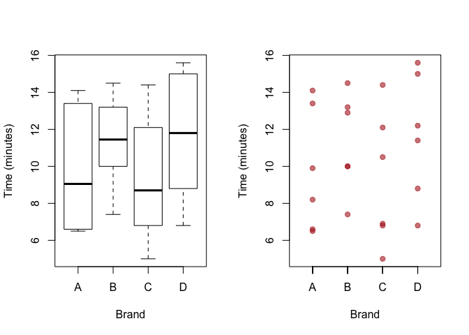

RBD-Randomized Block Design
================
April Sang
17/06/2019

# Randomized Block Design Example

  - A company wants to replace some software.

They have four choices (we’ll call them A-D). The selection team
conducted a trial to compare the four products. They selected 6
different tasks and chose 24 employees to the tasks in groups of 4 at
random. Within each group, one employee used each product to complete
the task. We’ll focus on the timee taken to complete the task. (The data
are available on Learn as ‘RBDProducts.csv’.)

``` r
RBD <- read.csv('RBDProducts.csv')
head(RBD)
```

    ##   task brand time
    ## 1    1     A  6.5
    ## 2    1     B 10.0
    ## 3    1     C  5.0
    ## 4    1     D  6.8
    ## 5    2     A 14.1
    ## 6    2     B 14.5

## Summary Statistics

The average of times by each brand

``` r
tapply(RBD$time, RBD$brand, mean)
```

    ##         A         B         C         D 
    ##  9.783333 11.333333  9.283333 11.633333

The average of times by each task

``` r
tapply(RBD$time, RBD$task, mean)
```

    ##      1      2      3      4      5      6 
    ##  7.075 14.500 11.450 13.500  8.050  8.475

boxplot\!

``` r
par(mfrow=c(1,2))
boxplot(RBD$time ~ RBD$brand, xlab = 'Brand', ylab = 'Time (minutes)')
plot( as.numeric(RBD$brand), RBD$time, xlab = 'Brand', ylab = 'Time (minutes)', xaxt='n', xlim=c(0.5, 4.5), pch=19, col=adjustcolor("firebrick", .6))
axis(side=1,  as.numeric(RBD$brand),  RBD$brand )
```

<!-- -->

Manual calculation of the terms in the ANOVA table: 4 treatments
(products/brands) and 6 blocks (tasks)

``` r
t <- 4
b <- 6
```

For convenience, define y1, y2, y3, y4 for products A, B, C, D:

``` r
y1 <- RBD$time[RBD$brand == 'A']
y2 <- RBD$time[RBD$brand == 'B']
y3 <- RBD$time[RBD$brand == 'C']
y4 <- RBD$time[RBD$brand == 'D']
```

or use some R’s build in function such as `aggregate`.

``` r
aggregate(time  ~ task, RBD, mean)
```

    ##   task   time
    ## 1    1  7.075
    ## 2    2 14.500
    ## 3    3 11.450
    ## 4    4 13.500
    ## 5    5  8.050
    ## 6    6  8.475

The overall average

``` r
ybar <- mean(RBD$time)
```

The average within each treatment

``` r
tapply(RBD$time, RBD$brand, mean)
```

    ##         A         B         C         D 
    ##  9.783333 11.333333  9.283333 11.633333

or equivalently,

``` r
avgBrand = aggregate(time  ~ brand, RBD, mean)$time
aggregate(time  ~ brand, RBD, mean)
```

    ##   brand      time
    ## 1     A  9.783333
    ## 2     B 11.333333
    ## 3     C  9.283333
    ## 4     D 11.633333

The averages within each block

``` r
avgTask = tapply(RBD$time, RBD$task, mean)
aggregate(time  ~ task, RBD, mean)
```

    ##   task   time
    ## 1    1  7.075
    ## 2    2 14.500
    ## 3    3 11.450
    ## 4    4 13.500
    ## 5    5  8.050
    ## 6    6  8.475

The treatment sum of squares

``` r
SST <- b*sum( (avgBrand - ybar)^2 )
SST
```

    ## [1] 23.835

The block sum of squares

``` r
SSB <- t*sum( (avgTask - ybar)^2 )
SSB
```

    ## [1] 190.9433

The total sum of squares:

``` r
SS <- sum((RBD$time - mean(RBD$time))^2)
SS
```

    ## [1] 238.5983

The residual sum of squares by substraction

``` r
SSR <- SS - SST - SSB
SSR
```

    ## [1] 23.82

The residual sum of squares by direct calculation

``` r
sum( (RBD$time - avgTask[RBD$task] - avgBrand[RBD$brand] + ybar )^2 )
```

    ## [1] 23.82

The degrees of freedom

``` r
df.t <- t - 1
df.b <- b - 1
df.r <- (t-1)*(b-1)
c(df.t, df.b, df.r)
```

    ## [1]  3  5 15

The mean squares

``` r
MST <- SST/df.t
MSB <- SSB/df.b
MSR <- SSR/df.r
c(MST, MSB, MSR)
```

    ## [1]  7.94500 38.18867  1.58800

The F-statistic

``` r
Fobs <- MST/MSR
Fobs
```

    ## [1] 5.003149

The p-value

``` r
p.val <- pf(Fobs, df.t, df.r, lower.tail = FALSE)
```

Manually constructed ANOVA table

``` r
temp = matrix(NA, nrow=3, ncol=5)
dimnames(temp)[[1]] = c("Brand", "Task", "Residuals")
dimnames(temp)[[2]] = c("Df", "Sum Sq", "Mean Sq", "F value", "Pr(>F)")
temp[,1] = c(df.t, df.b, df.r)
temp[,2] = c(SST, SSB, SSR)
temp[,3] = c(MST, MSB, MSR)
temp[1,4] = Fobs
temp[1,5] = p.val
print(round(temp, 3), na.print="" )
```

    ##           Df  Sum Sq Mean Sq F value Pr(>F)
    ## Brand      3  23.835   7.945   5.003  0.013
    ## Task       5 190.943  38.189               
    ## Residuals 15  23.820   1.588

The anova test:

``` r
summary(aov(time ~ brand + as.factor(task), data = RBD))
```

    ##                 Df Sum Sq Mean Sq F value   Pr(>F)    
    ## brand            3  23.83    7.94   5.003   0.0133 *  
    ## as.factor(task)  5 190.94   38.19  24.048 1.15e-06 ***
    ## Residuals       15  23.82    1.59                     
    ## ---
    ## Signif. codes:  0 '***' 0.001 '**' 0.01 '*' 0.05 '.' 0.1 ' ' 1
