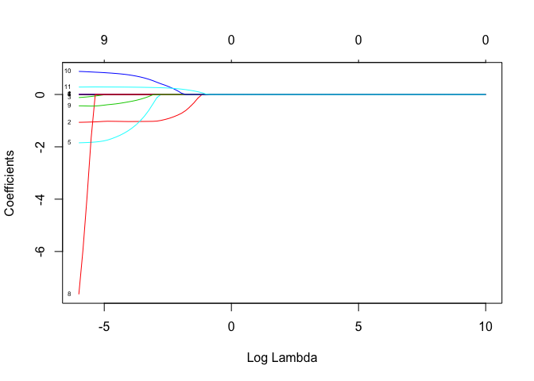

MLModels
================
April Sang
16/06/2019

##### \-

##### Regression Model

``` r
#regression model
winequality <- read.csv('winequality-red.csv', header = T, sep = ";")
winequality
```

    ##      fixed.acidity volatile.acidity citric.acid residual.sugar chlorides
    ## 1              7.4            0.700        0.00           1.90     0.076
    ## 2              7.8            0.880        0.00           2.60     0.098
    ## 3              7.8            0.760        0.04           2.30     0.092
    ## 4             11.2            0.280        0.56           1.90     0.075
    ## 5              7.4            0.700        0.00           1.90     0.076
    ## 6              7.4            0.660        0.00           1.80     0.075
    ## 7              7.9            0.600        0.06           1.60     0.069
    ## 8              7.3            0.650        0.00           1.20     0.065
    ## 9              7.8            0.580        0.02           2.00     0.073
    ## 10             7.5            0.500        0.36           6.10     0.071
    ## 11             6.7            0.580        0.08           1.80     0.097
    ## 12             7.5            0.500        0.36           6.10     0.071
    ## 13             5.6            0.615        0.00           1.60     0.089
    ## 14             7.8            0.610        0.29           1.60     0.114
    ## 15             8.9            0.620        0.18           3.80     0.176
    ## 16             8.9            0.620        0.19           3.90     0.170
    ## 17             8.5            0.280        0.56           1.80     0.092
    ## 18             8.1            0.560        0.28           1.70     0.368
    ## 19             7.4            0.590        0.08           4.40     0.086
    ## 20             7.9            0.320        0.51           1.80     0.341
    ## 21             8.9            0.220        0.48           1.80     0.077
    ## 22             7.6            0.390        0.31           2.30     0.082
    ## 23             7.9            0.430        0.21           1.60     0.106
    ## 24             8.5            0.490        0.11           2.30     0.084
    ## 25             6.9            0.400        0.14           2.40     0.085
    ## 26             6.3            0.390        0.16           1.40     0.080
    ## 27             7.6            0.410        0.24           1.80     0.080
    ## 28             7.9            0.430        0.21           1.60     0.106
    ## 29             7.1            0.710        0.00           1.90     0.080
    ## 30             7.8            0.645        0.00           2.00     0.082
    ## 31             6.7            0.675        0.07           2.40     0.089
    ## 32             6.9            0.685        0.00           2.50     0.105
    ## 33             8.3            0.655        0.12           2.30     0.083
    ## 34             6.9            0.605        0.12          10.70     0.073
    ## 35             5.2            0.320        0.25           1.80     0.103
    ## 36             7.8            0.645        0.00           5.50     0.086
    ## 37             7.8            0.600        0.14           2.40     0.086
    ## 38             8.1            0.380        0.28           2.10     0.066
    ## 39             5.7            1.130        0.09           1.50     0.172
    ## 40             7.3            0.450        0.36           5.90     0.074
    ## 41             7.3            0.450        0.36           5.90     0.074
    ## 42             8.8            0.610        0.30           2.80     0.088
    ## 43             7.5            0.490        0.20           2.60     0.332
    ## 44             8.1            0.660        0.22           2.20     0.069
    ## 45             6.8            0.670        0.02           1.80     0.050
    ## 46             4.6            0.520        0.15           2.10     0.054
    ## 47             7.7            0.935        0.43           2.20     0.114
    ## 48             8.7            0.290        0.52           1.60     0.113
    ## 49             6.4            0.400        0.23           1.60     0.066
    ## 50             5.6            0.310        0.37           1.40     0.074
    ## 51             8.8            0.660        0.26           1.70     0.074
    ## 52             6.6            0.520        0.04           2.20     0.069
    ## 53             6.6            0.500        0.04           2.10     0.068
    ## 54             8.6            0.380        0.36           3.00     0.081
    ## 55             7.6            0.510        0.15           2.80     0.110
    ## 56             7.7            0.620        0.04           3.80     0.084
    ## 57            10.2            0.420        0.57           3.40     0.070
    ## 58             7.5            0.630        0.12           5.10     0.111
    ## 59             7.8            0.590        0.18           2.30     0.076
    ## 60             7.3            0.390        0.31           2.40     0.074
    ## 61             8.8            0.400        0.40           2.20     0.079
    ## 62             7.7            0.690        0.49           1.80     0.115
    ## 63             7.5            0.520        0.16           1.90     0.085
    ## 64             7.0            0.735        0.05           2.00     0.081
    ## 65             7.2            0.725        0.05           4.65     0.086
    ## 66             7.2            0.725        0.05           4.65     0.086
    ## 67             7.5            0.520        0.11           1.50     0.079
    ## 68             6.6            0.705        0.07           1.60     0.076
    ## 69             9.3            0.320        0.57           2.00     0.074
    ## 70             8.0            0.705        0.05           1.90     0.074
    ## 71             7.7            0.630        0.08           1.90     0.076
    ## 72             7.7            0.670        0.23           2.10     0.088
    ## 73             7.7            0.690        0.22           1.90     0.084
    ## 74             8.3            0.675        0.26           2.10     0.084
    ## 75             9.7            0.320        0.54           2.50     0.094
    ## 76             8.8            0.410        0.64           2.20     0.093
    ## 77             8.8            0.410        0.64           2.20     0.093
    ## 78             6.8            0.785        0.00           2.40     0.104
    ## 79             6.7            0.750        0.12           2.00     0.086
    ## 80             8.3            0.625        0.20           1.50     0.080
    ## 81             6.2            0.450        0.20           1.60     0.069
    ## 82             7.8            0.430        0.70           1.90     0.464
    ## 83             7.4            0.500        0.47           2.00     0.086
    ## 84             7.3            0.670        0.26           1.80     0.401
    ## 85             6.3            0.300        0.48           1.80     0.069
    ## 86             6.9            0.550        0.15           2.20     0.076
    ## 87             8.6            0.490        0.28           1.90     0.110
    ## 88             7.7            0.490        0.26           1.90     0.062
    ## 89             9.3            0.390        0.44           2.10     0.107
    ## 90             7.0            0.620        0.08           1.80     0.076
    ## 91             7.9            0.520        0.26           1.90     0.079
    ## 92             8.6            0.490        0.28           1.90     0.110
    ## 93             8.6            0.490        0.29           2.00     0.110
    ## 94             7.7            0.490        0.26           1.90     0.062
    ## 95             5.0            1.020        0.04           1.40     0.045
    ## 96             4.7            0.600        0.17           2.30     0.058
    ## 97             6.8            0.775        0.00           3.00     0.102
    ## 98             7.0            0.500        0.25           2.00     0.070
    ## 99             7.6            0.900        0.06           2.50     0.079
    ## 100            8.1            0.545        0.18           1.90     0.080
    ## 101            8.3            0.610        0.30           2.10     0.084
    ## 102            7.8            0.500        0.30           1.90     0.075
    ## 103            8.1            0.545        0.18           1.90     0.080
    ## 104            8.1            0.575        0.22           2.10     0.077
    ## 105            7.2            0.490        0.24           2.20     0.070
    ## 106            8.1            0.575        0.22           2.10     0.077
    ## 107            7.8            0.410        0.68           1.70     0.467
    ## 108            6.2            0.630        0.31           1.70     0.088
    ## 109            8.0            0.330        0.53           2.50     0.091
    ## 110            8.1            0.785        0.52           2.00     0.122
    ## 111            7.8            0.560        0.19           1.80     0.104
    ## 112            8.4            0.620        0.09           2.20     0.084
    ## 113            8.4            0.600        0.10           2.20     0.085
    ## 114           10.1            0.310        0.44           2.30     0.080
    ## 115            7.8            0.560        0.19           1.80     0.104
    ## 116            9.4            0.400        0.31           2.20     0.090
    ## 117            8.3            0.540        0.28           1.90     0.077
    ## 118            7.8            0.560        0.12           2.00     0.082
    ## 119            8.8            0.550        0.04           2.20     0.119
    ## 120            7.0            0.690        0.08           1.80     0.097
    ## 121            7.3            1.070        0.09           1.70     0.178
    ## 122            8.8            0.550        0.04           2.20     0.119
    ## 123            7.3            0.695        0.00           2.50     0.075
    ## 124            8.0            0.710        0.00           2.60     0.080
    ## 125            7.8            0.500        0.17           1.60     0.082
    ## 126            9.0            0.620        0.04           1.90     0.146
    ## 127            8.2            1.330        0.00           1.70     0.081
    ## 128            8.1            1.330        0.00           1.80     0.082
    ## 129            8.0            0.590        0.16           1.80     0.065
    ## 130            6.1            0.380        0.15           1.80     0.072
    ## 131            8.0            0.745        0.56           2.00     0.118
    ## 132            5.6            0.500        0.09           2.30     0.049
    ## 133            5.6            0.500        0.09           2.30     0.049
    ## 134            6.6            0.500        0.01           1.50     0.060
    ## 135            7.9            1.040        0.05           2.20     0.084
    ## 136            8.4            0.745        0.11           1.90     0.090
    ## 137            8.3            0.715        0.15           1.80     0.089
    ## 138            7.2            0.415        0.36           2.00     0.081
    ## 139            7.8            0.560        0.19           2.10     0.081
    ## 140            7.8            0.560        0.19           2.00     0.081
    ## 141            8.4            0.745        0.11           1.90     0.090
    ## 142            8.3            0.715        0.15           1.80     0.089
    ## 143            5.2            0.340        0.00           1.80     0.050
    ## 144            6.3            0.390        0.08           1.70     0.066
    ## 145            5.2            0.340        0.00           1.80     0.050
    ## 146            8.1            0.670        0.55           1.80     0.117
    ## 147            5.8            0.680        0.02           1.80     0.087
    ## 148            7.6            0.490        0.26           1.60     0.236
    ## 149            6.9            0.490        0.10           2.30     0.074
    ## 150            8.2            0.400        0.44           2.80     0.089
    ## 151            7.3            0.330        0.47           2.10     0.077
    ## 152            9.2            0.520        1.00           3.40     0.610
    ## 153            7.5            0.600        0.03           1.80     0.095
    ## 154            7.5            0.600        0.03           1.80     0.095
    ## 155            7.1            0.430        0.42           5.50     0.070
    ## 156            7.1            0.430        0.42           5.50     0.071
    ## 157            7.1            0.430        0.42           5.50     0.070
    ## 158            7.1            0.430        0.42           5.50     0.071
    ## 159            7.1            0.680        0.00           2.20     0.073
    ## 160            6.8            0.600        0.18           1.90     0.079
    ## 161            7.6            0.950        0.03           2.00     0.090
    ## 162            7.6            0.680        0.02           1.30     0.072
    ## 163            7.8            0.530        0.04           1.70     0.076
    ## 164            7.4            0.600        0.26           7.30     0.070
    ## 165            7.3            0.590        0.26           7.20     0.070
    ## 166            7.8            0.630        0.48           1.70     0.100
    ## 167            6.8            0.640        0.10           2.10     0.085
    ## 168            7.3            0.550        0.03           1.60     0.072
    ## 169            6.8            0.630        0.07           2.10     0.089
    ## 170            7.5            0.705        0.24           1.80     0.360
    ## 171            7.9            0.885        0.03           1.80     0.058
    ## 172            8.0            0.420        0.17           2.00     0.073
    ## 173            8.0            0.420        0.17           2.00     0.073
    ## 174            7.4            0.620        0.05           1.90     0.068
    ## 175            7.3            0.380        0.21           2.00     0.080
    ## 176            6.9            0.500        0.04           1.50     0.085
    ## 177            7.3            0.380        0.21           2.00     0.080
    ## 178            7.5            0.520        0.42           2.30     0.087
    ## 179            7.0            0.805        0.00           2.50     0.068
    ## 180            8.8            0.610        0.14           2.40     0.067
    ## 181            8.8            0.610        0.14           2.40     0.067
    ## 182            8.9            0.610        0.49           2.00     0.270
    ## 183            7.2            0.730        0.02           2.50     0.076
    ## 184            6.8            0.610        0.20           1.80     0.077
    ## 185            6.7            0.620        0.21           1.90     0.079
    ## 186            8.9            0.310        0.57           2.00     0.111
    ## 187            7.4            0.390        0.48           2.00     0.082
    ## 188            7.7            0.705        0.10           2.60     0.084
    ## 189            7.9            0.500        0.33           2.00     0.084
    ## 190            7.9            0.490        0.32           1.90     0.082
    ## 191            8.2            0.500        0.35           2.90     0.077
    ## 192            6.4            0.370        0.25           1.90     0.074
    ## 193            6.8            0.630        0.12           3.80     0.099
    ## 194            7.6            0.550        0.21           2.20     0.071
    ## 195            7.6            0.550        0.21           2.20     0.071
    ## 196            7.8            0.590        0.33           2.00     0.074
    ## 197            7.3            0.580        0.30           2.40     0.074
    ## 198           11.5            0.300        0.60           2.00     0.067
    ## 199            5.4            0.835        0.08           1.20     0.046
    ## 200            6.9            1.090        0.06           2.10     0.061
    ## 201            9.6            0.320        0.47           1.40     0.056
    ## 202            8.8            0.370        0.48           2.10     0.097
    ## 203            6.8            0.500        0.11           1.50     0.075
    ## 204            7.0            0.420        0.35           1.60     0.088
    ## 205            7.0            0.430        0.36           1.60     0.089
    ## 206           12.8            0.300        0.74           2.60     0.095
    ## 207           12.8            0.300        0.74           2.60     0.095
    ## 208            7.8            0.570        0.31           1.80     0.069
    ## 209            7.8            0.440        0.28           2.70     0.100
    ## 210           11.0            0.300        0.58           2.10     0.054
    ## 211            9.7            0.530        0.60           2.00     0.039
    ## 212            8.0            0.725        0.24           2.80     0.083
    ## 213           11.6            0.440        0.64           2.10     0.059
    ## 214            8.2            0.570        0.26           2.20     0.060
    ## 215            7.8            0.735        0.08           2.40     0.092
    ## 216            7.0            0.490        0.49           5.60     0.060
    ## 217            8.7            0.625        0.16           2.00     0.101
    ## 218            8.1            0.725        0.22           2.20     0.072
    ## 219            7.5            0.490        0.19           1.90     0.076
    ## 220            7.8            0.530        0.33           2.40     0.080
    ## 221            7.8            0.340        0.37           2.00     0.082
    ## 222            7.4            0.530        0.26           2.00     0.101
    ## 223            6.8            0.610        0.04           1.50     0.057
    ## 224            8.6            0.645        0.25           2.00     0.083
    ## 225            8.4            0.635        0.36           2.00     0.089
    ## 226            7.7            0.430        0.25           2.60     0.073
    ## 227            8.9            0.590        0.50           2.00     0.337
    ## 228            9.0            0.820        0.14           2.60     0.089
    ## 229            7.7            0.430        0.25           2.60     0.073
    ## 230            6.9            0.520        0.25           2.60     0.081
    ## 231            5.2            0.480        0.04           1.60     0.054
    ## 232            8.0            0.380        0.06           1.80     0.078
    ## 233            8.5            0.370        0.20           2.80     0.090
    ## 234            6.9            0.520        0.25           2.60     0.081
    ## 235            8.2            1.000        0.09           2.30     0.065
    ## 236            7.2            0.630        0.00           1.90     0.097
    ## 237            7.2            0.630        0.00           1.90     0.097
    ## 238            7.2            0.645        0.00           1.90     0.097
    ## 239            7.2            0.630        0.00           1.90     0.097
    ## 240            8.2            1.000        0.09           2.30     0.065
    ## 241            8.9            0.635        0.37           1.70     0.263
    ## 242           12.0            0.380        0.56           2.10     0.093
    ## 243            7.7            0.580        0.10           1.80     0.102
    ## 244           15.0            0.210        0.44           2.20     0.075
    ## 245           15.0            0.210        0.44           2.20     0.075
    ## 246            7.3            0.660        0.00           2.00     0.084
    ## 247            7.1            0.680        0.07           1.90     0.075
    ## 248            8.2            0.600        0.17           2.30     0.072
    ## 249            7.7            0.530        0.06           1.70     0.074
    ## 250            7.3            0.660        0.00           2.00     0.084
    ## 251           10.8            0.320        0.44           1.60     0.063
    ## 252            7.1            0.600        0.00           1.80     0.074
    ## 253           11.1            0.350        0.48           3.10     0.090
    ## 254            7.7            0.775        0.42           1.90     0.092
    ## 255            7.1            0.600        0.00           1.80     0.074
    ## 256            8.0            0.570        0.23           3.20     0.073
    ## 257            9.4            0.340        0.37           2.20     0.075
    ## 258            6.6            0.695        0.00           2.10     0.075
    ## 259            7.7            0.410        0.76           1.80     0.611
    ## 260           10.0            0.310        0.47           2.60     0.085
    ## 261            7.9            0.330        0.23           1.70     0.077
    ## 262            7.0            0.975        0.04           2.00     0.087
    ## 263            8.0            0.520        0.03           1.70     0.070
    ## 264            7.9            0.370        0.23           1.80     0.077
    ## 265           12.5            0.560        0.49           2.40     0.064
    ## 266           11.8            0.260        0.52           1.80     0.071
    ## 267            8.1            0.870        0.00           3.30     0.096
    ## 268            7.9            0.350        0.46           3.60     0.078
    ## 269            6.9            0.540        0.04           3.00     0.077
    ## 270           11.5            0.180        0.51           4.00     0.104
    ## 271            7.9            0.545        0.06           4.00     0.087
    ## 272           11.5            0.180        0.51           4.00     0.104
    ## 273           10.9            0.370        0.58           4.00     0.071
    ## 274            8.4            0.715        0.20           2.40     0.076
    ## 275            7.5            0.650        0.18           7.00     0.088
    ## 276            7.9            0.545        0.06           4.00     0.087
    ## 277            6.9            0.540        0.04           3.00     0.077
    ## 278           11.5            0.180        0.51           4.00     0.104
    ## 279           10.3            0.320        0.45           6.40     0.073
    ## 280            8.9            0.400        0.32           5.60     0.087
    ## 281           11.4            0.260        0.44           3.60     0.071
    ## 282            7.7            0.270        0.68           3.50     0.358
    ## 283            7.6            0.520        0.12           3.00     0.067
    ## 284            8.9            0.400        0.32           5.60     0.087
    ## 285            9.9            0.590        0.07           3.40     0.102
    ## 286            9.9            0.590        0.07           3.40     0.102
    ## 287           12.0            0.450        0.55           2.00     0.073
    ## 288            7.5            0.400        0.12           3.00     0.092
    ## 289            8.7            0.520        0.09           2.50     0.091
    ## 290           11.6            0.420        0.53           3.30     0.105
    ## 291            8.7            0.520        0.09           2.50     0.091
    ## 292           11.0            0.200        0.48           2.00     0.343
    ## 293           10.4            0.550        0.23           2.70     0.091
    ## 294            6.9            0.360        0.25           2.40     0.098
    ## 295           13.3            0.340        0.52           3.20     0.094
    ## 296           10.8            0.500        0.46           2.50     0.073
    ## 297           10.6            0.830        0.37           2.60     0.086
    ## 298            7.1            0.630        0.06           2.00     0.083
    ## 299            7.2            0.650        0.02           2.30     0.094
    ## 300            6.9            0.670        0.06           2.10     0.080
    ## 301            7.5            0.530        0.06           2.60     0.086
    ## 302           11.1            0.180        0.48           1.50     0.068
    ## 303            8.3            0.705        0.12           2.60     0.092
    ## 304            7.4            0.670        0.12           1.60     0.186
    ## 305            8.4            0.650        0.60           2.10     0.112
    ## 306           10.3            0.530        0.48           2.50     0.063
    ## 307            7.6            0.620        0.32           2.20     0.082
    ## 308           10.3            0.410        0.42           2.40     0.213
    ## 309           10.3            0.430        0.44           2.40     0.214
    ## 310            7.4            0.290        0.38           1.70     0.062
    ## 311           10.3            0.530        0.48           2.50     0.063
    ## 312            7.9            0.530        0.24           2.00     0.072
    ## 313            9.0            0.460        0.31           2.80     0.093
    ## 314            8.6            0.470        0.30           3.00     0.076
    ## 315            7.4            0.360        0.29           2.60     0.087
    ## 316            7.1            0.350        0.29           2.50     0.096
    ## 317            9.6            0.560        0.23           3.40     0.102
    ## 318            9.6            0.770        0.12           2.90     0.082
    ## 319            9.8            0.660        0.39           3.20     0.083
    ## 320            9.6            0.770        0.12           2.90     0.082
    ## 321            9.8            0.660        0.39           3.20     0.083
    ## 322            9.3            0.610        0.26           3.40     0.090
    ## 323            7.8            0.620        0.05           2.30     0.079
    ## 324           10.3            0.590        0.42           2.80     0.090
    ## 325           10.0            0.490        0.20          11.00     0.071
    ## 326           10.0            0.490        0.20          11.00     0.071
    ## 327           11.6            0.530        0.66           3.65     0.121
    ## 328           10.3            0.440        0.50           4.50     0.107
    ## 329           13.4            0.270        0.62           2.60     0.082
    ## 330           10.7            0.460        0.39           2.00     0.061
    ## 331           10.2            0.360        0.64           2.90     0.122
    ## 332           10.2            0.360        0.64           2.90     0.122
    ## 333            8.0            0.580        0.28           3.20     0.066
    ## 334            8.4            0.560        0.08           2.10     0.105
    ## 335            7.9            0.650        0.01           2.50     0.078
    ## 336           11.9            0.695        0.53           3.40     0.128
    ## 337            8.9            0.430        0.45           1.90     0.052
    ## 338            7.8            0.430        0.32           2.80     0.080
    ## 339           12.4            0.490        0.58           3.00     0.103
    ## 340           12.5            0.280        0.54           2.30     0.082
    ## 341           12.2            0.340        0.50           2.40     0.066
    ## 342           10.6            0.420        0.48           2.70     0.065
    ## 343           10.9            0.390        0.47           1.80     0.118
    ## 344           10.9            0.390        0.47           1.80     0.118
    ## 345           11.9            0.570        0.50           2.60     0.082
    ## 346            7.0            0.685        0.00           1.90     0.067
    ## 347            6.6            0.815        0.02           2.70     0.072
    ## 348           13.8            0.490        0.67           3.00     0.093
    ## 349            9.6            0.560        0.31           2.80     0.089
    ## 350            9.1            0.785        0.00           2.60     0.093
    ## 351           10.7            0.670        0.22           2.70     0.107
    ## 352            9.1            0.795        0.00           2.60     0.096
    ## 353            7.7            0.665        0.00           2.40     0.090
    ## 354           13.5            0.530        0.79           4.80     0.120
    ## 355            6.1            0.210        0.40           1.40     0.066
    ## 356            6.7            0.750        0.01           2.40     0.078
    ## 357           11.5            0.410        0.52           3.00     0.080
    ## 358           10.5            0.420        0.66           2.95     0.116
    ## 359           11.9            0.430        0.66           3.10     0.109
    ## 360           12.6            0.380        0.66           2.60     0.088
    ## 361            8.2            0.700        0.23           2.00     0.099
    ## 362            8.6            0.450        0.31           2.60     0.086
    ## 363           11.9            0.580        0.66           2.50     0.072
    ## 364           12.5            0.460        0.63           2.00     0.071
    ## 365           12.8            0.615        0.66           5.80     0.083
    ## 366           10.0            0.420        0.50           3.40     0.107
    ## 367           12.8            0.615        0.66           5.80     0.083
    ## 368           10.4            0.575        0.61           2.60     0.076
    ## 369           10.3            0.340        0.52           2.80     0.159
    ## 370            9.4            0.270        0.53           2.40     0.074
    ## 371            6.9            0.765        0.02           2.30     0.063
    ## 372            7.9            0.240        0.40           1.60     0.056
    ## 373            9.1            0.280        0.48           1.80     0.067
    ## 374            7.4            0.550        0.22           2.20     0.106
    ## 375           14.0            0.410        0.63           3.80     0.089
    ## 376           11.5            0.540        0.71           4.40     0.124
    ## 377           11.5            0.450        0.50           3.00     0.078
    ## 378            9.4            0.270        0.53           2.40     0.074
    ## 379           11.4            0.625        0.66           6.20     0.088
    ## 380            8.3            0.420        0.38           2.50     0.094
    ## 381            8.3            0.260        0.42           2.00     0.080
    ## 382           13.7            0.415        0.68           2.90     0.085
    ## 383            8.3            0.260        0.42           2.00     0.080
    ## 384            8.3            0.260        0.42           2.00     0.080
    ## 385            7.7            0.510        0.28           2.10     0.087
    ## 386            7.4            0.630        0.07           2.40     0.090
    ## 387            7.8            0.540        0.26           2.00     0.088
    ## 388            8.3            0.660        0.15           1.90     0.079
    ## 389            7.8            0.460        0.26           1.90     0.088
    ## 390            9.6            0.380        0.31           2.50     0.096
    ## 391            5.6            0.850        0.05           1.40     0.045
    ## 392           13.7            0.415        0.68           2.90     0.085
    ## 393            9.5            0.370        0.52           2.00     0.082
    ## 394            8.4            0.665        0.61           2.00     0.112
    ## 395           12.7            0.600        0.65           2.30     0.063
    ## 396           12.0            0.370        0.76           4.20     0.066
    ## 397            6.6            0.735        0.02           7.90     0.122
    ## 398           11.5            0.590        0.59           2.60     0.087
    ## 399           11.5            0.590        0.59           2.60     0.087
    ## 400            8.7            0.765        0.22           2.30     0.064
    ## 401            6.6            0.735        0.02           7.90     0.122
    ## 402            7.7            0.260        0.30           1.70     0.059
    ## 403           12.2            0.480        0.54           2.60     0.085
    ## 404           11.4            0.600        0.49           2.70     0.085
    ## 405            7.7            0.690        0.05           2.70     0.075
    ## 406            8.7            0.310        0.46           1.40     0.059
    ## 407            9.8            0.440        0.47           2.50     0.063
    ## 408           12.0            0.390        0.66           3.00     0.093
    ## 409           10.4            0.340        0.58           3.70     0.174
    ## 410           12.5            0.460        0.49           4.50     0.070
    ## 411            9.0            0.430        0.34           2.50     0.080
    ## 412            9.1            0.450        0.35           2.40     0.080
    ## 413            7.1            0.735        0.16           1.90     0.100
    ## 414            9.9            0.400        0.53           6.70     0.097
    ## 415            8.8            0.520        0.34           2.70     0.087
    ## 416            8.6            0.725        0.24           6.60     0.117
    ## 417           10.6            0.480        0.64           2.20     0.111
    ## 418            7.0            0.580        0.12           1.90     0.091
    ## 419           11.9            0.380        0.51           2.00     0.121
    ## 420            6.8            0.770        0.00           1.80     0.066
    ## 421            9.5            0.560        0.33           2.40     0.089
    ## 422            6.6            0.840        0.03           2.30     0.059
    ## 423            7.7            0.960        0.20           2.00     0.047
    ## 424           10.5            0.240        0.47           2.10     0.066
    ## 425            7.7            0.960        0.20           2.00     0.047
    ## 426            6.6            0.840        0.03           2.30     0.059
    ## 427            6.4            0.670        0.08           2.10     0.045
    ## 428            9.5            0.780        0.22           1.90     0.077
    ## 429            9.1            0.520        0.33           1.30     0.070
    ## 430           12.8            0.840        0.63           2.40     0.088
    ## 431           10.5            0.240        0.47           2.10     0.066
    ## 432            7.8            0.550        0.35           2.20     0.074
    ## 433           11.9            0.370        0.69           2.30     0.078
    ## 434           12.3            0.390        0.63           2.30     0.091
    ## 435           10.4            0.410        0.55           3.20     0.076
    ## 436           12.3            0.390        0.63           2.30     0.091
    ## 437            8.0            0.670        0.30           2.00     0.060
    ## 438           11.1            0.450        0.73           3.20     0.066
    ## 439           10.4            0.410        0.55           3.20     0.076
    ## 440            7.0            0.620        0.18           1.50     0.062
    ## 441           12.6            0.310        0.72           2.20     0.072
    ## 442           11.9            0.400        0.65           2.15     0.068
    ## 443           15.6            0.685        0.76           3.70     0.100
    ## 444           10.0            0.440        0.49           2.70     0.077
    ## 445            5.3            0.570        0.01           1.70     0.054
    ## 446            9.5            0.735        0.10           2.10     0.079
    ## 447           12.5            0.380        0.60           2.60     0.081
    ## 448            9.3            0.480        0.29           2.10     0.127
    ## 449            8.6            0.530        0.22           2.00     0.100
    ## 450           11.9            0.390        0.69           2.80     0.095
    ## 451           11.9            0.390        0.69           2.80     0.095
    ## 452            8.4            0.370        0.53           1.80     0.413
    ## 453            6.8            0.560        0.03           1.70     0.084
    ## 454           10.4            0.330        0.63           2.80     0.084
    ## 455            7.0            0.230        0.40           1.60     0.063
    ## 456           11.3            0.620        0.67           5.20     0.086
    ## 457            8.9            0.590        0.39           2.30     0.095
    ## 458            9.2            0.630        0.21           2.70     0.097
    ## 459           10.4            0.330        0.63           2.80     0.084
    ## 460           11.6            0.580        0.66           2.20     0.074
    ## 461            9.2            0.430        0.52           2.30     0.083
    ## 462            8.3            0.615        0.22           2.60     0.087
    ## 463           11.0            0.260        0.68           2.55     0.085
    ## 464            8.1            0.660        0.70           2.20     0.098
    ## 465           11.5            0.315        0.54           2.10     0.084
    ## 466           10.0            0.290        0.40           2.90     0.098
    ## 467           10.3            0.500        0.42           2.00     0.069
    ## 468            8.8            0.460        0.45           2.60     0.065
    ## 469           11.4            0.360        0.69           2.10     0.090
    ## 470            8.7            0.820        0.02           1.20     0.070
    ## 471           13.0            0.320        0.65           2.60     0.093
    ## 472            9.6            0.540        0.42           2.40     0.081
    ## 473           12.5            0.370        0.55           2.60     0.083
    ## 474            9.9            0.350        0.55           2.10     0.062
    ## 475           10.5            0.280        0.51           1.70     0.080
    ## 476            9.6            0.680        0.24           2.20     0.087
    ## 477            9.3            0.270        0.41           2.00     0.091
    ## 478           10.4            0.240        0.49           1.80     0.075
    ## 479            9.6            0.680        0.24           2.20     0.087
    ## 480            9.4            0.685        0.11           2.70     0.077
    ## 481           10.6            0.280        0.39          15.50     0.069
    ## 482            9.4            0.300        0.56           2.80     0.080
    ## 483           10.6            0.360        0.59           2.20     0.152
    ## 484           10.6            0.360        0.60           2.20     0.152
    ## 485           10.6            0.440        0.68           4.10     0.114
    ## 486           10.2            0.670        0.39           1.90     0.054
    ## 487           10.2            0.670        0.39           1.90     0.054
    ## 488           10.2            0.645        0.36           1.80     0.053
    ## 489           11.6            0.320        0.55           2.80     0.081
    ## 490            9.3            0.390        0.40           2.60     0.073
    ## 491            9.3            0.775        0.27           2.80     0.078
    ## 492            9.2            0.410        0.50           2.50     0.055
    ## 493            8.9            0.400        0.51           2.60     0.052
    ## 494            8.7            0.690        0.31           3.00     0.086
    ## 495            6.5            0.390        0.23           8.30     0.051
    ## 496           10.7            0.350        0.53           2.60     0.070
    ## 497            7.8            0.520        0.25           1.90     0.081
    ## 498            7.2            0.340        0.32           2.50     0.090
    ## 499           10.7            0.350        0.53           2.60     0.070
    ## 500            8.7            0.690        0.31           3.00     0.086
    ## 501            7.8            0.520        0.25           1.90     0.081
    ## 502           10.4            0.440        0.73           6.55     0.074
    ## 503           10.4            0.440        0.73           6.55     0.074
    ## 504           10.5            0.260        0.47           1.90     0.078
    ## 505           10.5            0.240        0.42           1.80     0.077
    ## 506           10.2            0.490        0.63           2.90     0.072
    ## 507           10.4            0.240        0.46           1.80     0.075
    ## 508           11.2            0.670        0.55           2.30     0.084
    ## 509           10.0            0.590        0.31           2.20     0.090
    ## 510           13.3            0.290        0.75           2.80     0.084
    ## 511           12.4            0.420        0.49           4.60     0.073
    ## 512           10.0            0.590        0.31           2.20     0.090
    ## 513           10.7            0.400        0.48           2.10     0.125
    ## 514           10.5            0.510        0.64           2.40     0.107
    ## 515           10.5            0.510        0.64           2.40     0.107
    ## 516            8.5            0.655        0.49           6.10     0.122
    ## 517           12.5            0.600        0.49           4.30     0.100
    ## 518           10.4            0.610        0.49           2.10     0.200
    ## 519           10.9            0.210        0.49           2.80     0.088
    ## 520            7.3            0.365        0.49           2.50     0.088
    ## 521            9.8            0.250        0.49           2.70     0.088
    ## 522            7.6            0.410        0.49           2.00     0.088
    ## 523            8.2            0.390        0.49           2.30     0.099
    ## 524            9.3            0.400        0.49           2.50     0.085
    ## 525            9.2            0.430        0.49           2.40     0.086
    ## 526           10.4            0.640        0.24           2.80     0.105
    ## 527            7.3            0.365        0.49           2.50     0.088
    ## 528            7.0            0.380        0.49           2.50     0.097
    ## 529            8.2            0.420        0.49           2.60     0.084
    ## 530            9.9            0.630        0.24           2.40     0.077
    ## 531            9.1            0.220        0.24           2.10     0.078
    ## 532           11.9            0.380        0.49           2.70     0.098
    ## 533           11.9            0.380        0.49           2.70     0.098
    ## 534           10.3            0.270        0.24           2.10     0.072
    ## 535           10.0            0.480        0.24           2.70     0.102
    ## 536            9.1            0.220        0.24           2.10     0.078
    ## 537            9.9            0.630        0.24           2.40     0.077
    ## 538            8.1            0.825        0.24           2.10     0.084
    ## 539           12.9            0.350        0.49           5.80     0.066
    ## 540           11.2            0.500        0.74           5.15     0.100
    ## 541            9.2            0.590        0.24           3.30     0.101
    ## 542            9.5            0.460        0.49           6.30     0.064
    ## 543            9.3            0.715        0.24           2.10     0.070
    ## 544           11.2            0.660        0.24           2.50     0.085
    ## 545           14.3            0.310        0.74           1.80     0.075
    ## 546            9.1            0.470        0.49           2.60     0.094
    ## 547            7.5            0.550        0.24           2.00     0.078
    ## 548           10.6            0.310        0.49           2.50     0.067
    ## 549           12.4            0.350        0.49           2.60     0.079
    ## 550            9.0            0.530        0.49           1.90     0.171
    ## 551            6.8            0.510        0.01           2.10     0.074
    ## 552            9.4            0.430        0.24           2.80     0.092
    ## 553            9.5            0.460        0.24           2.70     0.092
    ## 554            5.0            1.040        0.24           1.60     0.050
    ## 555           15.5            0.645        0.49           4.20     0.095
    ## 556           15.5            0.645        0.49           4.20     0.095
    ## 557           10.9            0.530        0.49           4.60     0.118
    ## 558           15.6            0.645        0.49           4.20     0.095
    ## 559           10.9            0.530        0.49           4.60     0.118
    ## 560           13.0            0.470        0.49           4.30     0.085
    ## 561           12.7            0.600        0.49           2.80     0.075
    ## 562            9.0            0.440        0.49           2.40     0.078
    ## 563            9.0            0.540        0.49           2.90     0.094
    ## 564            7.6            0.290        0.49           2.70     0.092
    ## 565           13.0            0.470        0.49           4.30     0.085
    ## 566           12.7            0.600        0.49           2.80     0.075
    ## 567            8.7            0.700        0.24           2.50     0.226
    ## 568            8.7            0.700        0.24           2.50     0.226
    ## 569            9.8            0.500        0.49           2.60     0.250
    ## 570            6.2            0.360        0.24           2.20     0.095
    ## 571           11.5            0.350        0.49           3.30     0.070
    ## 572            6.2            0.360        0.24           2.20     0.095
    ## 573           10.2            0.240        0.49           2.40     0.075
    ## 574           10.5            0.590        0.49           2.10     0.070
    ## 575           10.6            0.340        0.49           3.20     0.078
    ## 576           12.3            0.270        0.49           3.10     0.079
    ## 577            9.9            0.500        0.24           2.30     0.103
    ## 578            8.8            0.440        0.49           2.80     0.083
    ## 579            8.8            0.470        0.49           2.90     0.085
    ## 580           10.6            0.310        0.49           2.20     0.063
    ## 581           12.3            0.500        0.49           2.20     0.089
    ## 582           12.3            0.500        0.49           2.20     0.089
    ## 583           11.7            0.490        0.49           2.20     0.083
    ## 584           12.0            0.280        0.49           1.90     0.074
    ## 585           11.8            0.330        0.49           3.40     0.093
    ## 586            7.6            0.510        0.24           2.40     0.091
    ## 587           11.1            0.310        0.49           2.70     0.094
    ## 588            7.3            0.730        0.24           1.90     0.108
    ## 589            5.0            0.420        0.24           2.00     0.060
    ## 590           10.2            0.290        0.49           2.60     0.059
    ## 591            9.0            0.450        0.49           2.60     0.084
    ## 592            6.6            0.390        0.49           1.70     0.070
    ## 593            9.0            0.450        0.49           2.60     0.084
    ## 594            9.9            0.490        0.58           3.50     0.094
    ## 595            7.9            0.720        0.17           2.60     0.096
    ## 596            8.9            0.595        0.41           7.90     0.086
    ## 597           12.4            0.400        0.51           2.00     0.059
    ## 598           11.9            0.580        0.58           1.90     0.071
    ## 599            8.5            0.585        0.18           2.10     0.078
    ## 600           12.7            0.590        0.45           2.30     0.082
    ## 601            8.2            0.915        0.27           2.10     0.088
    ## 602           13.2            0.460        0.52           2.20     0.071
    ## 603            7.7            0.835        0.00           2.60     0.081
    ## 604           13.2            0.460        0.52           2.20     0.071
    ## 605            8.3            0.580        0.13           2.90     0.096
    ## 606            8.3            0.600        0.13           2.60     0.085
    ## 607            9.4            0.410        0.48           4.60     0.072
    ## 608            8.8            0.480        0.41           3.30     0.092
    ## 609           10.1            0.650        0.37           5.10     0.110
    ## 610            6.3            0.360        0.19           3.20     0.075
    ## 611            8.8            0.240        0.54           2.50     0.083
    ## 612           13.2            0.380        0.55           2.70     0.081
    ## 613            7.5            0.640        0.00           2.40     0.077
    ## 614            8.2            0.390        0.38           1.50     0.058
    ## 615            9.2            0.755        0.18           2.20     0.148
    ## 616            9.6            0.600        0.50           2.30     0.079
    ## 617            9.6            0.600        0.50           2.30     0.079
    ## 618           11.5            0.310        0.51           2.20     0.079
    ## 619           11.4            0.460        0.50           2.70     0.122
    ## 620           11.3            0.370        0.41           2.30     0.088
    ## 621            8.3            0.540        0.24           3.40     0.076
    ## 622            8.2            0.560        0.23           3.40     0.078
    ## 623           10.0            0.580        0.22           1.90     0.080
    ## 624            7.9            0.510        0.25           2.90     0.077
    ## 625            6.8            0.690        0.00           5.60     0.124
    ## 626            6.8            0.690        0.00           5.60     0.124
    ## 627            8.8            0.600        0.29           2.20     0.098
    ## 628            8.8            0.600        0.29           2.20     0.098
    ## 629            8.7            0.540        0.26           2.50     0.097
    ## 630            7.6            0.685        0.23           2.30     0.111
    ## 631            8.7            0.540        0.26           2.50     0.097
    ## 632           10.4            0.280        0.54           2.70     0.105
    ## 633            7.6            0.410        0.14           3.00     0.087
    ## 634           10.1            0.935        0.22           3.40     0.105
    ## 635            7.9            0.350        0.21           1.90     0.073
    ## 636            8.7            0.840        0.00           1.40     0.065
    ## 637            9.6            0.880        0.28           2.40     0.086
    ## 638            9.5            0.885        0.27           2.30     0.084
    ## 639            7.7            0.915        0.12           2.20     0.143
    ## 640            8.9            0.290        0.35           1.90     0.067
    ## 641            9.9            0.540        0.45           2.30     0.071
    ## 642            9.5            0.590        0.44           2.30     0.071
    ## 643            9.9            0.540        0.45           2.30     0.071
    ## 644            9.5            0.590        0.44           2.30     0.071
    ## 645            9.9            0.540        0.45           2.30     0.071
    ## 646            7.8            0.640        0.10           6.00     0.115
    ## 647            7.3            0.670        0.05           3.60     0.107
    ## 648            8.3            0.845        0.01           2.20     0.070
    ## 649            8.7            0.480        0.30           2.80     0.066
    ## 650            6.7            0.420        0.27           8.60     0.068
    ## 651           10.7            0.430        0.39           2.20     0.106
    ## 652            9.8            0.880        0.25           2.50     0.104
    ## 653           15.9            0.360        0.65           7.50     0.096
    ## 654            9.4            0.330        0.59           2.80     0.079
    ## 655            8.6            0.470        0.47           2.40     0.074
    ## 656            9.7            0.550        0.17           2.90     0.087
    ## 657           10.7            0.430        0.39           2.20     0.106
    ## 658           12.0            0.500        0.59           1.40     0.073
    ## 659            7.2            0.520        0.07           1.40     0.074
    ## 660            7.1            0.840        0.02           4.40     0.096
    ## 661            7.2            0.520        0.07           1.40     0.074
    ## 662            7.5            0.420        0.31           1.60     0.080
    ## 663            7.2            0.570        0.06           1.60     0.076
    ## 664           10.1            0.280        0.46           1.80     0.050
    ## 665           12.1            0.400        0.52           2.00     0.092
    ## 666            9.4            0.590        0.14           2.00     0.084
    ## 667            8.3            0.490        0.36           1.80     0.222
    ## 668           11.3            0.340        0.45           2.00     0.082
    ## 669           10.0            0.730        0.43           2.30     0.059
    ## 670           11.3            0.340        0.45           2.00     0.082
    ## 671            6.9            0.400        0.24           2.50     0.083
    ## 672            8.2            0.730        0.21           1.70     0.074
    ## 673            9.8            1.240        0.34           2.00     0.079
    ## 674            8.2            0.730        0.21           1.70     0.074
    ## 675           10.8            0.400        0.41           2.20     0.084
    ## 676            9.3            0.410        0.39           2.20     0.064
    ## 677           10.8            0.400        0.41           2.20     0.084
    ## 678            8.6            0.800        0.11           2.30     0.084
    ## 679            8.3            0.780        0.10           2.60     0.081
    ## 680           10.8            0.260        0.45           3.30     0.060
    ## 681           13.3            0.430        0.58           1.90     0.070
    ## 682            8.0            0.450        0.23           2.20     0.094
    ## 683            8.5            0.460        0.31           2.25     0.078
    ## 684            8.1            0.780        0.23           2.60     0.059
    ## 685            9.8            0.980        0.32           2.30     0.078
    ## 686            8.1            0.780        0.23           2.60     0.059
    ## 687            7.1            0.650        0.18           1.80     0.070
    ## 688            9.1            0.640        0.23           3.10     0.095
    ## 689            7.7            0.660        0.04           1.60     0.039
    ## 690            8.1            0.380        0.48           1.80     0.157
    ## 691            7.4            1.185        0.00           4.25     0.097
    ## 692            9.2            0.920        0.24           2.60     0.087
    ## 693            8.6            0.490        0.51           2.00     0.422
    ## 694            9.0            0.480        0.32           2.80     0.084
    ## 695            9.0            0.470        0.31           2.70     0.084
    ## 696            5.1            0.470        0.02           1.30     0.034
    ## 697            7.0            0.650        0.02           2.10     0.066
    ## 698            7.0            0.650        0.02           2.10     0.066
    ## 699            9.4            0.615        0.28           3.20     0.087
    ## 700           11.8            0.380        0.55           2.10     0.071
    ## 701           10.6            1.020        0.43           2.90     0.076
    ## 702            7.0            0.650        0.02           2.10     0.066
    ## 703            7.0            0.640        0.02           2.10     0.067
    ## 704            7.5            0.380        0.48           2.60     0.073
    ## 705            9.1            0.765        0.04           1.60     0.078
    ## 706            8.4            1.035        0.15           6.00     0.073
    ## 707            7.0            0.780        0.08           2.00     0.093
    ## 708            7.4            0.490        0.19           3.00     0.077
    ## 709            7.8            0.545        0.12           2.50     0.068
    ## 710            9.7            0.310        0.47           1.60     0.062
    ## 711           10.6            1.025        0.43           2.80     0.080
    ## 712            8.9            0.565        0.34           3.00     0.093
    ## 713            8.7            0.690        0.00           3.20     0.084
    ## 714            8.0            0.430        0.36           2.30     0.075
    ## 715            9.9            0.740        0.28           2.60     0.078
    ## 716            7.2            0.490        0.18           2.70     0.069
    ## 717            8.0            0.430        0.36           2.30     0.075
    ## 718            7.6            0.460        0.11           2.60     0.079
    ## 719            8.4            0.560        0.04           2.00     0.082
    ## 720            7.1            0.660        0.00           3.90     0.086
    ## 721            8.4            0.560        0.04           2.00     0.082
    ## 722            8.9            0.480        0.24           2.85     0.094
    ## 723            7.6            0.420        0.08           2.70     0.084
    ## 724            7.1            0.310        0.30           2.20     0.053
    ## 725            7.5            1.115        0.10           3.10     0.086
    ## 726            9.0            0.660        0.17           3.00     0.077
    ## 727            8.1            0.720        0.09           2.80     0.084
    ## 728            6.4            0.570        0.02           1.80     0.067
    ## 729            6.4            0.570        0.02           1.80     0.067
    ## 730            6.4            0.865        0.03           3.20     0.071
    ## 731            9.5            0.550        0.66           2.30     0.387
    ## 732            8.9            0.875        0.13           3.45     0.088
    ## 733            7.3            0.835        0.03           2.10     0.092
    ## 734            7.0            0.450        0.34           2.70     0.082
    ## 735            7.7            0.560        0.20           2.00     0.075
    ## 736            7.7            0.965        0.10           2.10     0.112
    ## 737            7.7            0.965        0.10           2.10     0.112
    ## 738            8.2            0.590        0.00           2.50     0.093
    ## 739            9.0            0.460        0.23           2.80     0.092
    ## 740            9.0            0.690        0.00           2.40     0.088
    ## 741            8.3            0.760        0.29           4.20     0.075
    ## 742            9.2            0.530        0.24           2.60     0.078
    ## 743            6.5            0.615        0.00           1.90     0.065
    ## 744           11.6            0.410        0.58           2.80     0.096
    ## 745           11.1            0.390        0.54           2.70     0.095
    ## 746            7.3            0.510        0.18           2.10     0.070
    ## 747            8.2            0.340        0.38           2.50     0.080
    ## 748            8.6            0.330        0.40           2.60     0.083
    ## 749            7.2            0.500        0.18           2.10     0.071
    ## 750            7.3            0.510        0.18           2.10     0.070
    ## 751            8.3            0.650        0.10           2.90     0.089
    ## 752            8.3            0.650        0.10           2.90     0.089
    ## 753            7.6            0.540        0.13           2.50     0.097
    ## 754            8.3            0.650        0.10           2.90     0.089
    ## 755            7.8            0.480        0.68           1.70     0.415
    ## 756            7.8            0.910        0.07           1.90     0.058
    ## 757            6.3            0.980        0.01           2.00     0.057
    ## 758            8.1            0.870        0.00           2.20     0.084
    ## 759            8.1            0.870        0.00           2.20     0.084
    ## 760            8.8            0.420        0.21           2.50     0.092
    ## 761            9.0            0.580        0.25           2.80     0.075
    ## 762            9.3            0.655        0.26           2.00     0.096
    ## 763            8.8            0.700        0.00           1.70     0.069
    ## 764            9.3            0.655        0.26           2.00     0.096
    ## 765            9.1            0.680        0.11           2.80     0.093
    ## 766            9.2            0.670        0.10           3.00     0.091
    ## 767            8.8            0.590        0.18           2.90     0.089
    ## 768            7.5            0.600        0.32           2.70     0.103
    ## 769            7.1            0.590        0.02           2.30     0.082
    ## 770            7.9            0.720        0.01           1.90     0.076
    ## 771            7.1            0.590        0.02           2.30     0.082
    ## 772            9.4            0.685        0.26           2.40     0.082
    ## 773            9.5            0.570        0.27           2.30     0.082
    ## 774            7.9            0.400        0.29           1.80     0.157
    ## 775            7.9            0.400        0.30           1.80     0.157
    ## 776            7.2            1.000        0.00           3.00     0.102
    ## 777            6.9            0.765        0.18           2.40     0.243
    ## 778            6.9            0.635        0.17           2.40     0.241
    ## 779            8.3            0.430        0.30           3.40     0.079
    ## 780            7.1            0.520        0.03           2.60     0.076
    ## 781            7.0            0.570        0.00           2.00     0.190
    ## 782            6.5            0.460        0.14           2.40     0.114
    ## 783            9.0            0.820        0.05           2.40     0.081
    ## 784            6.5            0.460        0.14           2.40     0.114
    ## 785            7.1            0.590        0.01           2.50     0.077
    ## 786            9.9            0.350        0.41           2.30     0.083
    ## 787            9.9            0.350        0.41           2.30     0.083
    ## 788           10.0            0.560        0.24           2.20     0.079
    ## 789           10.0            0.560        0.24           2.20     0.079
    ## 790            8.6            0.630        0.17           2.90     0.099
    ## 791            7.4            0.370        0.43           2.60     0.082
    ## 792            8.8            0.640        0.17           2.90     0.084
    ## 793            7.1            0.610        0.02           2.50     0.081
    ## 794            7.7            0.600        0.00           2.60     0.055
    ## 795           10.1            0.270        0.54           2.30     0.065
    ## 796           10.8            0.890        0.30           2.60     0.132
    ## 797            8.7            0.460        0.31           2.50     0.126
    ## 798            9.3            0.370        0.44           1.60     0.038
    ## 799            9.4            0.500        0.34           3.60     0.082
    ## 800            9.4            0.500        0.34           3.60     0.082
    ## 801            7.2            0.610        0.08           4.00     0.082
    ## 802            8.6            0.550        0.09           3.30     0.068
    ## 803            5.1            0.585        0.00           1.70     0.044
    ## 804            7.7            0.560        0.08           2.50     0.114
    ## 805            8.4            0.520        0.22           2.70     0.084
    ## 806            8.2            0.280        0.40           2.40     0.052
    ## 807            8.4            0.250        0.39           2.00     0.041
    ## 808            8.2            0.280        0.40           2.40     0.052
    ## 809            7.4            0.530        0.12           1.90     0.165
    ## 810            7.6            0.480        0.31           2.80     0.070
    ## 811            7.3            0.490        0.10           2.60     0.068
    ## 812           12.9            0.500        0.55           2.80     0.072
    ## 813           10.8            0.450        0.33           2.50     0.099
    ## 814            6.9            0.390        0.24           2.10     0.102
    ## 815           12.6            0.410        0.54           2.80     0.103
    ## 816           10.8            0.450        0.33           2.50     0.099
    ## 817            9.8            0.510        0.19           3.20     0.081
    ## 818           10.8            0.290        0.42           1.60     0.084
    ## 819            7.1            0.715        0.00           2.35     0.071
    ## 820            9.1            0.660        0.15           3.20     0.097
    ## 821            7.0            0.685        0.00           1.90     0.099
    ## 822            4.9            0.420        0.00           2.10     0.048
    ## 823            6.7            0.540        0.13           2.00     0.076
    ## 824            6.7            0.540        0.13           2.00     0.076
    ## 825            7.1            0.480        0.28           2.80     0.068
    ## 826            7.1            0.460        0.14           2.80     0.076
    ## 827            7.5            0.270        0.34           2.30     0.050
    ## 828            7.1            0.460        0.14           2.80     0.076
    ## 829            7.8            0.570        0.09           2.30     0.065
    ## 830            5.9            0.610        0.08           2.10     0.071
    ## 831            7.5            0.685        0.07           2.50     0.058
    ## 832            5.9            0.610        0.08           2.10     0.071
    ## 833           10.4            0.440        0.42           1.50     0.145
    ## 834           11.6            0.470        0.44           1.60     0.147
    ## 835            8.8            0.685        0.26           1.60     0.088
    ## 836            7.6            0.665        0.10           1.50     0.066
    ## 837            6.7            0.280        0.28           2.40     0.012
    ## 838            6.7            0.280        0.28           2.40     0.012
    ## 839           10.1            0.310        0.35           1.60     0.075
    ## 840            6.0            0.500        0.04           2.20     0.092
    ## 841           11.1            0.420        0.47           2.65     0.085
    ## 842            6.6            0.660        0.00           3.00     0.115
    ## 843           10.6            0.500        0.45           2.60     0.119
    ## 844            7.1            0.685        0.35           2.00     0.088
    ## 845            9.9            0.250        0.46           1.70     0.062
    ## 846            6.4            0.640        0.21           1.80     0.081
    ## 847            6.4            0.640        0.21           1.80     0.081
    ## 848            7.4            0.680        0.16           1.80     0.078
    ## 849            6.4            0.640        0.21           1.80     0.081
    ## 850            6.4            0.630        0.21           1.60     0.080
    ## 851            9.3            0.430        0.44           1.90     0.085
    ## 852            9.3            0.430        0.44           1.90     0.085
    ## 853            8.0            0.420        0.32           2.50     0.080
    ## 854            9.3            0.360        0.39           1.50     0.080
    ## 855            9.3            0.360        0.39           1.50     0.080
    ## 856            7.6            0.735        0.02           2.50     0.071
    ## 857            9.3            0.360        0.39           1.50     0.080
    ## 858            8.2            0.260        0.34           2.50     0.073
    ## 859           11.7            0.280        0.47           1.70     0.054
    ## 860            6.8            0.560        0.22           1.80     0.074
    ## 861            7.2            0.620        0.06           2.70     0.077
    ## 862            5.8            1.010        0.66           2.00     0.039
    ## 863            7.5            0.420        0.32           2.70     0.067
    ## 864            7.2            0.620        0.06           2.50     0.078
    ## 865            7.2            0.620        0.06           2.70     0.077
    ## 866            7.2            0.635        0.07           2.60     0.077
    ## 867            6.8            0.490        0.22           2.30     0.071
    ## 868            6.9            0.510        0.23           2.00     0.072
    ## 869            6.8            0.560        0.22           1.80     0.074
    ## 870            7.6            0.630        0.03           2.00     0.080
    ## 871            7.7            0.715        0.01           2.10     0.064
    ## 872            6.9            0.560        0.03           1.50     0.086
    ## 873            7.3            0.350        0.24           2.00     0.067
    ## 874            9.1            0.210        0.37           1.60     0.067
    ## 875           10.4            0.380        0.46           2.10     0.104
    ## 876            8.8            0.310        0.40           2.80     0.109
    ## 877            7.1            0.470        0.00           2.20     0.067
    ## 878            7.7            0.715        0.01           2.10     0.064
    ## 879            8.8            0.610        0.19           4.00     0.094
    ## 880            7.2            0.600        0.04           2.50     0.076
    ## 881            9.2            0.560        0.18           1.60     0.078
    ## 882            7.6            0.715        0.00           2.10     0.068
    ## 883            8.4            0.310        0.29           3.10     0.194
    ## 884            7.2            0.600        0.04           2.50     0.076
    ## 885            8.8            0.610        0.19           4.00     0.094
    ## 886            8.9            0.750        0.14           2.50     0.086
    ## 887            9.0            0.800        0.12           2.40     0.083
    ## 888           10.7            0.520        0.38           2.60     0.066
    ## 889            6.8            0.570        0.00           2.50     0.072
    ## 890           10.7            0.900        0.34           6.60     0.112
    ## 891            7.2            0.340        0.24           2.00     0.071
    ## 892            7.2            0.660        0.03           2.30     0.078
    ## 893           10.1            0.450        0.23           1.90     0.082
    ## 894            7.2            0.660        0.03           2.30     0.078
    ## 895            7.2            0.630        0.03           2.20     0.080
    ## 896            7.1            0.590        0.01           2.30     0.080
    ## 897            8.3            0.310        0.39           2.40     0.078
    ## 898            7.1            0.590        0.01           2.30     0.080
    ## 899            8.3            0.310        0.39           2.40     0.078
    ## 900            8.3            1.020        0.02           3.40     0.084
    ## 901            8.9            0.310        0.36           2.60     0.056
    ## 902            7.4            0.635        0.10           2.40     0.080
    ## 903            7.4            0.635        0.10           2.40     0.080
    ## 904            6.8            0.590        0.06           6.00     0.060
    ## 905            6.8            0.590        0.06           6.00     0.060
    ## 906            9.2            0.580        0.20           3.00     0.081
    ## 907            7.2            0.540        0.27           2.60     0.084
    ## 908            6.1            0.560        0.00           2.20     0.079
    ## 909            7.4            0.520        0.13           2.40     0.078
    ## 910            7.3            0.305        0.39           1.20     0.059
    ## 911            9.3            0.380        0.48           3.80     0.132
    ## 912            9.1            0.280        0.46           9.00     0.114
    ## 913           10.0            0.460        0.44           2.90     0.065
    ## 914            9.4            0.395        0.46           4.60     0.094
    ## 915            7.3            0.305        0.39           1.20     0.059
    ## 916            8.6            0.315        0.40           2.20     0.079
    ## 917            5.3            0.715        0.19           1.50     0.161
    ## 918            6.8            0.410        0.31           8.80     0.084
    ## 919            8.4            0.360        0.32           2.20     0.081
    ## 920            8.4            0.620        0.12           1.80     0.072
    ## 921            9.6            0.410        0.37           2.30     0.091
    ## 922            8.4            0.360        0.32           2.20     0.081
    ## 923            8.4            0.620        0.12           1.80     0.072
    ## 924            6.8            0.410        0.31           8.80     0.084
    ## 925            8.6            0.470        0.27           2.30     0.055
    ## 926            8.6            0.220        0.36           1.90     0.064
    ## 927            9.4            0.240        0.33           2.30     0.061
    ## 928            8.4            0.670        0.19           2.20     0.093
    ## 929            8.6            0.470        0.27           2.30     0.055
    ## 930            8.7            0.330        0.38           3.30     0.063
    ## 931            6.6            0.610        0.01           1.90     0.080
    ## 932            7.4            0.610        0.01           2.00     0.074
    ## 933            7.6            0.400        0.29           1.90     0.078
    ## 934            7.4            0.610        0.01           2.00     0.074
    ## 935            6.6            0.610        0.01           1.90     0.080
    ## 936            8.8            0.300        0.38           2.30     0.060
    ## 937            8.8            0.300        0.38           2.30     0.060
    ## 938           12.0            0.630        0.50           1.40     0.071
    ## 939            7.2            0.380        0.38           2.80     0.068
    ## 940            6.2            0.460        0.17           1.60     0.073
    ## 941            9.6            0.330        0.52           2.20     0.074
    ## 942            9.9            0.270        0.49           5.00     0.082
    ## 943           10.1            0.430        0.40           2.60     0.092
    ## 944            9.8            0.500        0.34           2.30     0.094
    ## 945            8.3            0.300        0.49           3.80     0.090
    ## 946           10.2            0.440        0.42           2.00     0.071
    ## 947           10.2            0.440        0.58           4.10     0.092
    ## 948            8.3            0.280        0.48           2.10     0.093
    ## 949            8.9            0.120        0.45           1.80     0.075
    ## 950            8.9            0.120        0.45           1.80     0.075
    ## 951            8.9            0.120        0.45           1.80     0.075
    ## 952            8.3            0.280        0.48           2.10     0.093
    ## 953            8.2            0.310        0.40           2.20     0.058
    ## 954           10.2            0.340        0.48           2.10     0.052
    ## 955            7.6            0.430        0.40           2.70     0.082
    ## 956            8.5            0.210        0.52           1.90     0.090
    ## 957            9.0            0.360        0.52           2.10     0.111
    ## 958            9.5            0.370        0.52           2.00     0.088
    ## 959            6.4            0.570        0.12           2.30     0.120
    ## 960            8.0            0.590        0.05           2.00     0.089
    ## 961            8.5            0.470        0.27           1.90     0.058
    ## 962            7.1            0.560        0.14           1.60     0.078
    ## 963            6.6            0.570        0.02           2.10     0.115
    ## 964            8.8            0.270        0.39           2.00     0.100
    ## 965            8.5            0.470        0.27           1.90     0.058
    ## 966            8.3            0.340        0.40           2.40     0.065
    ## 967            9.0            0.380        0.41           2.40     0.103
    ## 968            8.5            0.660        0.20           2.10     0.097
    ## 969            9.0            0.400        0.43           2.40     0.068
    ## 970            6.7            0.560        0.09           2.90     0.079
    ## 971           10.4            0.260        0.48           1.90     0.066
    ## 972           10.4            0.260        0.48           1.90     0.066
    ## 973           10.1            0.380        0.50           2.40     0.104
    ## 974            8.5            0.340        0.44           1.70     0.079
    ## 975            8.8            0.330        0.41           5.90     0.073
    ## 976            7.2            0.410        0.30           2.10     0.083
    ## 977            7.2            0.410        0.30           2.10     0.083
    ## 978            8.4            0.590        0.29           2.60     0.109
    ## 979            7.0            0.400        0.32           3.60     0.061
    ## 980           12.2            0.450        0.49           1.40     0.075
    ## 981            9.1            0.500        0.30           1.90     0.065
    ## 982            9.5            0.860        0.26           1.90     0.079
    ## 983            7.3            0.520        0.32           2.10     0.070
    ## 984            9.1            0.500        0.30           1.90     0.065
    ## 985           12.2            0.450        0.49           1.40     0.075
    ## 986            7.4            0.580        0.00           2.00     0.064
    ## 987            9.8            0.340        0.39           1.40     0.066
    ## 988            7.1            0.360        0.30           1.60     0.080
    ## 989            7.7            0.390        0.12           1.70     0.097
    ## 990            9.7            0.295        0.40           1.50     0.073
    ## 991            7.7            0.390        0.12           1.70     0.097
    ## 992            7.1            0.340        0.28           2.00     0.082
    ## 993            6.5            0.400        0.10           2.00     0.076
    ## 994            7.1            0.340        0.28           2.00     0.082
    ## 995           10.0            0.350        0.45           2.50     0.092
    ## 996            7.7            0.600        0.06           2.00     0.079
    ## 997            5.6            0.660        0.00           2.20     0.087
    ## 998            5.6            0.660        0.00           2.20     0.087
    ## 999            8.9            0.840        0.34           1.40     0.050
    ## 1000           6.4            0.690        0.00           1.65     0.055
    ## 1001           7.5            0.430        0.30           2.20     0.062
    ## 1002           9.9            0.350        0.38           1.50     0.058
    ## 1003           9.1            0.290        0.33           2.05     0.063
    ## 1004           6.8            0.360        0.32           1.80     0.067
    ## 1005           8.2            0.430        0.29           1.60     0.081
    ## 1006           6.8            0.360        0.32           1.80     0.067
    ## 1007           9.1            0.290        0.33           2.05     0.063
    ## 1008           9.1            0.300        0.34           2.00     0.064
    ## 1009           8.9            0.350        0.40           3.60     0.110
    ## 1010           9.6            0.500        0.36           2.80     0.116
    ## 1011           8.9            0.280        0.45           1.70     0.067
    ## 1012           8.9            0.320        0.31           2.00     0.088
    ## 1013           7.7            1.005        0.15           2.10     0.102
    ## 1014           7.5            0.710        0.00           1.60     0.092
    ## 1015           8.0            0.580        0.16           2.00     0.120
    ## 1016          10.5            0.390        0.46           2.20     0.075
    ## 1017           8.9            0.380        0.40           2.20     0.068
    ## 1018           8.0            0.180        0.37           0.90     0.049
    ## 1019           8.0            0.180        0.37           0.90     0.049
    ## 1020           7.0            0.500        0.14           1.80     0.078
    ## 1021          11.3            0.360        0.66           2.40     0.123
    ## 1022          11.3            0.360        0.66           2.40     0.123
    ## 1023           7.0            0.510        0.09           2.10     0.062
    ## 1024           8.2            0.320        0.42           2.30     0.098
    ## 1025           7.7            0.580        0.01           1.80     0.088
    ## 1026           8.6            0.830        0.00           2.80     0.095
    ## 1027           7.9            0.310        0.32           1.90     0.066
    ## 1028           6.4            0.795        0.00           2.20     0.065
    ## 1029           7.2            0.340        0.21           2.50     0.075
    ## 1030           7.7            0.580        0.01           1.80     0.088
    ## 1031           7.1            0.590        0.00           2.10     0.091
    ## 1032           7.3            0.550        0.01           1.80     0.093
    ## 1033           8.1            0.820        0.00           4.10     0.095
    ## 1034           7.5            0.570        0.08           2.60     0.089
    ## 1035           8.9            0.745        0.18           2.50     0.077
    ## 1036          10.1            0.370        0.34           2.40     0.085
    ## 1037           7.6            0.310        0.34           2.50     0.082
    ## 1038           7.3            0.910        0.10           1.80     0.074
    ## 1039           8.7            0.410        0.41           6.20     0.078
    ## 1040           8.9            0.500        0.21           2.20     0.088
    ## 1041           7.4            0.965        0.00           2.20     0.088
    ## 1042           6.9            0.490        0.19           1.70     0.079
    ## 1043           8.9            0.500        0.21           2.20     0.088
    ## 1044           9.5            0.390        0.41           8.90     0.069
    ## 1045           6.4            0.390        0.33           3.30     0.046
    ## 1046           6.9            0.440        0.00           1.40     0.070
    ## 1047           7.6            0.780        0.00           1.70     0.076
    ## 1048           7.1            0.430        0.17           1.80     0.082
    ## 1049           9.3            0.490        0.36           1.70     0.081
    ## 1050           9.3            0.500        0.36           1.80     0.084
    ## 1051           7.1            0.430        0.17           1.80     0.082
    ## 1052           8.5            0.460        0.59           1.40     0.414
    ## 1053           5.6            0.605        0.05           2.40     0.073
    ## 1054           8.3            0.330        0.42           2.30     0.070
    ## 1055           8.2            0.640        0.27           2.00     0.095
    ## 1056           8.2            0.640        0.27           2.00     0.095
    ## 1057           8.9            0.480        0.53           4.00     0.101
    ## 1058           7.6            0.420        0.25           3.90     0.104
    ## 1059           9.9            0.530        0.57           2.40     0.093
    ## 1060           8.9            0.480        0.53           4.00     0.101
    ## 1061          11.6            0.230        0.57           1.80     0.074
    ## 1062           9.1            0.400        0.50           1.80     0.071
    ## 1063           8.0            0.380        0.44           1.90     0.098
    ## 1064          10.2            0.290        0.65           2.40     0.075
    ## 1065           8.2            0.740        0.09           2.00     0.067
    ## 1066           7.7            0.610        0.18           2.40     0.083
    ## 1067           6.6            0.520        0.08           2.40     0.070
    ## 1068          11.1            0.310        0.53           2.20     0.060
    ## 1069          11.1            0.310        0.53           2.20     0.060
    ## 1070           8.0            0.620        0.35           2.80     0.086
    ## 1071           9.3            0.330        0.45           1.50     0.057
    ## 1072           7.5            0.770        0.20           8.10     0.098
    ## 1073           7.2            0.350        0.26           1.80     0.083
    ## 1074           8.0            0.620        0.33           2.70     0.088
    ## 1075           7.5            0.770        0.20           8.10     0.098
    ## 1076           9.1            0.250        0.34           2.00     0.071
    ## 1077           9.9            0.320        0.56           2.00     0.073
    ## 1078           8.6            0.370        0.65           6.40     0.080
    ## 1079           8.6            0.370        0.65           6.40     0.080
    ## 1080           7.9            0.300        0.68           8.30     0.050
    ## 1081          10.3            0.270        0.56           1.40     0.047
    ## 1082           7.9            0.300        0.68           8.30     0.050
    ## 1083           7.2            0.380        0.30           1.80     0.073
    ## 1084           8.7            0.420        0.45           2.40     0.072
    ## 1085           7.2            0.380        0.30           1.80     0.073
    ## 1086           6.8            0.480        0.08           1.80     0.074
    ## 1087           8.5            0.340        0.40           4.70     0.055
    ## 1088           7.9            0.190        0.42           1.60     0.057
    ## 1089          11.6            0.410        0.54           1.50     0.095
    ## 1090          11.6            0.410        0.54           1.50     0.095
    ## 1091          10.0            0.260        0.54           1.90     0.083
    ## 1092           7.9            0.340        0.42           2.00     0.086
    ## 1093           7.0            0.540        0.09           2.00     0.081
    ## 1094           9.2            0.310        0.36           2.20     0.079
    ## 1095           6.6            0.725        0.09           5.50     0.117
    ## 1096           9.4            0.400        0.47           2.50     0.087
    ## 1097           6.6            0.725        0.09           5.50     0.117
    ## 1098           8.6            0.520        0.38           1.50     0.096
    ## 1099           8.0            0.310        0.45           2.10     0.216
    ## 1100           8.6            0.520        0.38           1.50     0.096
    ## 1101           8.4            0.340        0.42           2.10     0.072
    ## 1102           7.4            0.490        0.27           2.10     0.071
    ## 1103           6.1            0.480        0.09           1.70     0.078
    ## 1104           7.4            0.490        0.27           2.10     0.071
    ## 1105           8.0            0.480        0.34           2.20     0.073
    ## 1106           6.3            0.570        0.28           2.10     0.048
    ## 1107           8.2            0.230        0.42           1.90     0.069
    ## 1108           9.1            0.300        0.41           2.00     0.068
    ## 1109           8.1            0.780        0.10           3.30     0.090
    ## 1110          10.8            0.470        0.43           2.10     0.171
    ## 1111           8.3            0.530        0.00           1.40     0.070
    ## 1112           5.4            0.420        0.27           2.00     0.092
    ## 1113           7.9            0.330        0.41           1.50     0.056
    ## 1114           8.9            0.240        0.39           1.60     0.074
    ## 1115           5.0            0.400        0.50           4.30     0.046
    ## 1116           7.0            0.690        0.07           2.50     0.091
    ## 1117           7.0            0.690        0.07           2.50     0.091
    ## 1118           7.0            0.690        0.07           2.50     0.091
    ## 1119           7.1            0.390        0.12           2.10     0.065
    ## 1120           5.6            0.660        0.00           2.50     0.066
    ## 1121           7.9            0.540        0.34           2.50     0.076
    ## 1122           6.6            0.500        0.00           1.80     0.062
    ## 1123           6.3            0.470        0.00           1.40     0.055
    ## 1124          10.7            0.400        0.37           1.90     0.081
    ## 1125           6.5            0.580        0.00           2.20     0.096
    ## 1126           8.8            0.240        0.35           1.70     0.055
    ## 1127           5.8            0.290        0.26           1.70     0.063
    ## 1128           6.3            0.760        0.00           2.90     0.072
    ## 1129          10.0            0.430        0.33           2.70     0.095
    ## 1130          10.5            0.430        0.35           3.30     0.092
    ## 1131           9.1            0.600        0.00           1.90     0.058
    ## 1132           5.9            0.190        0.21           1.70     0.045
    ## 1133           7.4            0.360        0.34           1.80     0.075
    ## 1134           7.2            0.480        0.07           5.50     0.089
    ## 1135           8.5            0.280        0.35           1.70     0.061
    ## 1136           8.0            0.250        0.43           1.70     0.067
    ## 1137          10.4            0.520        0.45           2.00     0.080
    ## 1138          10.4            0.520        0.45           2.00     0.080
    ## 1139           7.5            0.410        0.15           3.70     0.104
    ## 1140           8.2            0.510        0.24           2.00     0.079
    ## 1141           7.3            0.400        0.30           1.70     0.080
    ## 1142           8.2            0.380        0.32           2.50     0.080
    ## 1143           6.9            0.450        0.11           2.40     0.043
    ## 1144           7.0            0.220        0.30           1.80     0.065
    ## 1145           7.3            0.320        0.23           2.30     0.066
    ## 1146           8.2            0.200        0.43           2.50     0.076
    ## 1147           7.8            0.500        0.12           1.80     0.178
    ## 1148          10.0            0.410        0.45           6.20     0.071
    ## 1149           7.8            0.390        0.42           2.00     0.086
    ## 1150          10.0            0.350        0.47           2.00     0.061
    ## 1151           8.2            0.330        0.32           2.80     0.067
    ## 1152           6.1            0.580        0.23           2.50     0.044
    ## 1153           8.3            0.600        0.25           2.20     0.118
    ## 1154           9.6            0.420        0.35           2.10     0.083
    ## 1155           6.6            0.580        0.00           2.20     0.100
    ## 1156           8.3            0.600        0.25           2.20     0.118
    ## 1157           8.5            0.180        0.51           1.75     0.071
    ## 1158           5.1            0.510        0.18           2.10     0.042
    ## 1159           6.7            0.410        0.43           2.80     0.076
    ## 1160          10.2            0.410        0.43           2.20     0.110
    ## 1161          10.6            0.360        0.57           2.30     0.087
    ## 1162           8.8            0.450        0.43           1.40     0.076
    ## 1163           8.5            0.320        0.42           2.30     0.075
    ## 1164           9.0            0.785        0.24           1.70     0.078
    ## 1165           9.0            0.785        0.24           1.70     0.078
    ## 1166           8.5            0.440        0.50           1.90     0.369
    ## 1167           9.9            0.540        0.26           2.00     0.111
    ## 1168           8.2            0.330        0.39           2.50     0.074
    ## 1169           6.5            0.340        0.27           2.80     0.067
    ## 1170           7.6            0.500        0.29           2.30     0.086
    ## 1171           9.2            0.360        0.34           1.60     0.062
    ## 1172           7.1            0.590        0.00           2.20     0.078
    ## 1173           9.7            0.420        0.46           2.10     0.074
    ## 1174           7.6            0.360        0.31           1.70     0.079
    ## 1175           7.6            0.360        0.31           1.70     0.079
    ## 1176           6.5            0.610        0.00           2.20     0.095
    ## 1177           6.5            0.880        0.03           5.60     0.079
    ## 1178           7.1            0.660        0.00           2.40     0.052
    ## 1179           5.6            0.915        0.00           2.10     0.041
    ## 1180           8.2            0.350        0.33           2.40     0.076
    ## 1181           8.2            0.350        0.33           2.40     0.076
    ## 1182           9.8            0.390        0.43           1.65     0.068
    ## 1183          10.2            0.400        0.40           2.50     0.068
    ## 1184           6.8            0.660        0.07           1.60     0.070
    ## 1185           6.7            0.640        0.23           2.10     0.080
    ## 1186           7.0            0.430        0.30           2.00     0.085
    ## 1187           6.6            0.800        0.03           7.80     0.079
    ## 1188           7.0            0.430        0.30           2.00     0.085
    ## 1189           6.7            0.640        0.23           2.10     0.080
    ## 1190           8.8            0.955        0.05           1.80     0.075
    ## 1191           9.1            0.400        0.57           4.60     0.080
    ## 1192           6.5            0.885        0.00           2.30     0.166
    ## 1193           7.2            0.250        0.37           2.50     0.063
    ## 1194           6.4            0.885        0.00           2.30     0.166
    ## 1195           7.0            0.745        0.12           1.80     0.114
    ## 1196           6.2            0.430        0.22           1.80     0.078
    ## 1197           7.9            0.580        0.23           2.30     0.076
    ## 1198           7.7            0.570        0.21           1.50     0.069
    ## 1199           7.7            0.260        0.26           2.00     0.052
    ## 1200           7.9            0.580        0.23           2.30     0.076
    ## 1201           7.7            0.570        0.21           1.50     0.069
    ## 1202           7.9            0.340        0.36           1.90     0.065
    ## 1203           8.6            0.420        0.39           1.80     0.068
    ## 1204           9.9            0.740        0.19           5.80     0.111
    ## 1205           7.2            0.360        0.46           2.10     0.074
    ## 1206           7.2            0.360        0.46           2.10     0.074
    ## 1207           7.2            0.360        0.46           2.10     0.074
    ## 1208           9.9            0.720        0.55           1.70     0.136
    ## 1209           7.2            0.360        0.46           2.10     0.074
    ## 1210           6.2            0.390        0.43           2.00     0.071
    ## 1211           6.8            0.650        0.02           2.10     0.078
    ## 1212           6.6            0.440        0.15           2.10     0.076
    ## 1213           6.8            0.650        0.02           2.10     0.078
    ## 1214           9.6            0.380        0.42           1.90     0.071
    ## 1215          10.2            0.330        0.46           1.90     0.081
    ## 1216           8.8            0.270        0.46           2.10     0.095
    ## 1217           7.9            0.570        0.31           2.00     0.079
    ## 1218           8.2            0.340        0.37           1.90     0.057
    ## 1219           8.2            0.400        0.31           1.90     0.082
    ## 1220           9.0            0.390        0.40           1.30     0.044
    ## 1221          10.9            0.320        0.52           1.80     0.132
    ## 1222          10.9            0.320        0.52           1.80     0.132
    ## 1223           8.1            0.530        0.22           2.20     0.078
    ## 1224          10.5            0.360        0.47           2.20     0.074
    ## 1225          12.6            0.390        0.49           2.50     0.080
    ## 1226           9.2            0.460        0.23           2.60     0.091
    ## 1227           7.5            0.580        0.03           4.10     0.080
    ## 1228           9.0            0.580        0.25           2.00     0.104
    ## 1229           5.1            0.420        0.00           1.80     0.044
    ## 1230           7.6            0.430        0.29           2.10     0.075
    ## 1231           7.7            0.180        0.34           2.70     0.066
    ## 1232           7.8            0.815        0.01           2.60     0.074
    ## 1233           7.6            0.430        0.29           2.10     0.075
    ## 1234          10.2            0.230        0.37           2.20     0.057
    ## 1235           7.1            0.750        0.01           2.20     0.059
    ## 1236           6.0            0.330        0.32          12.90     0.054
    ## 1237           7.8            0.550        0.00           1.70     0.070
    ## 1238           7.1            0.750        0.01           2.20     0.059
    ## 1239           8.1            0.730        0.00           2.50     0.081
    ## 1240           6.5            0.670        0.00           4.30     0.057
    ## 1241           7.5            0.610        0.20           1.70     0.076
    ## 1242           9.8            0.370        0.39           2.50     0.079
    ## 1243           9.0            0.400        0.41           2.00     0.058
    ## 1244           8.3            0.560        0.22           2.40     0.082
    ## 1245           5.9            0.290        0.25          13.40     0.067
    ## 1246           7.4            0.550        0.19           1.80     0.082
    ## 1247           7.4            0.740        0.07           1.70     0.086
    ## 1248           7.4            0.550        0.19           1.80     0.082
    ## 1249           6.9            0.410        0.33           2.20     0.081
    ## 1250           7.1            0.600        0.01           2.30     0.079
    ## 1251           7.1            0.600        0.01           2.30     0.079
    ## 1252           7.5            0.580        0.14           2.20     0.077
    ## 1253           7.1            0.720        0.00           1.80     0.123
    ## 1254           7.9            0.660        0.00           1.40     0.096
    ## 1255           7.8            0.700        0.06           1.90     0.079
    ## 1256           6.1            0.640        0.02           2.40     0.069
    ## 1257           7.5            0.590        0.22           1.80     0.082
    ## 1258           7.0            0.580        0.28           4.80     0.085
    ## 1259           6.8            0.640        0.00           2.70     0.123
    ## 1260           6.8            0.640        0.00           2.70     0.123
    ## 1261           8.6            0.635        0.68           1.80     0.403
    ## 1262           6.3            1.020        0.00           2.00     0.083
    ## 1263           9.8            0.450        0.38           2.50     0.081
    ## 1264           8.2            0.780        0.00           2.20     0.089
    ## 1265           8.5            0.370        0.32           1.80     0.066
    ## 1266           7.2            0.570        0.05           2.30     0.081
    ## 1267           7.2            0.570        0.05           2.30     0.081
    ## 1268          10.4            0.430        0.50           2.30     0.068
    ## 1269           6.9            0.410        0.31           2.00     0.079
    ## 1270           5.5            0.490        0.03           1.80     0.044
    ## 1271           5.0            0.380        0.01           1.60     0.048
    ## 1272           7.3            0.440        0.20           1.60     0.049
    ## 1273           5.9            0.460        0.00           1.90     0.077
    ## 1274           7.5            0.580        0.20           2.00     0.073
    ## 1275           7.8            0.580        0.13           2.10     0.102
    ## 1276           8.0            0.715        0.22           2.30     0.075
    ## 1277           8.5            0.400        0.40           6.30     0.050
    ## 1278           7.0            0.690        0.00           1.90     0.114
    ## 1279           8.0            0.715        0.22           2.30     0.075
    ## 1280           9.8            0.300        0.39           1.70     0.062
    ## 1281           7.1            0.460        0.20           1.90     0.077
    ## 1282           7.1            0.460        0.20           1.90     0.077
    ## 1283           7.9            0.765        0.00           2.00     0.084
    ## 1284           8.7            0.630        0.28           2.70     0.096
    ## 1285           7.0            0.420        0.19           2.30     0.071
    ## 1286          11.3            0.370        0.50           1.80     0.090
    ## 1287           7.1            0.160        0.44           2.50     0.068
    ## 1288           8.0            0.600        0.08           2.60     0.056
    ## 1289           7.0            0.600        0.30           4.50     0.068
    ## 1290           7.0            0.600        0.30           4.50     0.068
    ## 1291           7.6            0.740        0.00           1.90     0.100
    ## 1292           8.2            0.635        0.10           2.10     0.073
    ## 1293           5.9            0.395        0.13           2.40     0.056
    ## 1294           7.5            0.755        0.00           1.90     0.084
    ## 1295           8.2            0.635        0.10           2.10     0.073
    ## 1296           6.6            0.630        0.00           4.30     0.093
    ## 1297           6.6            0.630        0.00           4.30     0.093
    ## 1298           7.2            0.530        0.14           2.10     0.064
    ## 1299           5.7            0.600        0.00           1.40     0.063
    ## 1300           7.6            1.580        0.00           2.10     0.137
    ## 1301           5.2            0.645        0.00           2.15     0.080
    ## 1302           6.7            0.860        0.07           2.00     0.100
    ## 1303           9.1            0.370        0.32           2.10     0.064
    ## 1304           8.0            0.280        0.44           1.80     0.081
    ## 1305           7.6            0.790        0.21           2.30     0.087
    ## 1306           7.5            0.610        0.26           1.90     0.073
    ## 1307           9.7            0.690        0.32           2.50     0.088
    ## 1308           6.8            0.680        0.09           3.90     0.068
    ## 1309           9.7            0.690        0.32           2.50     0.088
    ## 1310           7.0            0.620        0.10           1.40     0.071
    ## 1311           7.5            0.610        0.26           1.90     0.073
    ## 1312           6.5            0.510        0.15           3.00     0.064
    ## 1313           8.0            1.180        0.21           1.90     0.083
    ## 1314           7.0            0.360        0.21           2.30     0.086
    ## 1315           7.0            0.360        0.21           2.40     0.086
    ## 1316           7.5            0.630        0.27           2.00     0.083
    ## 1317           5.4            0.740        0.00           1.20     0.041
    ## 1318           9.9            0.440        0.46           2.20     0.091
    ## 1319           7.5            0.630        0.27           2.00     0.083
    ## 1320           9.1            0.760        0.68           1.70     0.414
    ## 1321           9.7            0.660        0.34           2.60     0.094
    ## 1322           5.0            0.740        0.00           1.20     0.041
    ## 1323           9.1            0.340        0.42           1.80     0.058
    ## 1324           9.1            0.360        0.39           1.80     0.060
    ## 1325           6.7            0.460        0.24           1.70     0.077
    ## 1326           6.7            0.460        0.24           1.70     0.077
    ## 1327           6.7            0.460        0.24           1.70     0.077
    ## 1328           6.7            0.460        0.24           1.70     0.077
    ## 1329           6.5            0.520        0.11           1.80     0.073
    ## 1330           7.4            0.600        0.26           2.10     0.083
    ## 1331           7.4            0.600        0.26           2.10     0.083
    ## 1332           7.8            0.870        0.26           3.80     0.107
    ## 1333           8.4            0.390        0.10           1.70     0.075
    ## 1334           9.1            0.775        0.22           2.20     0.079
    ## 1335           7.2            0.835        0.00           2.00     0.166
    ## 1336           6.6            0.580        0.02           2.40     0.069
    ## 1337           6.0            0.500        0.00           1.40     0.057
    ## 1338           6.0            0.500        0.00           1.40     0.057
    ## 1339           6.0            0.500        0.00           1.40     0.057
    ## 1340           7.5            0.510        0.02           1.70     0.084
    ## 1341           7.5            0.510        0.02           1.70     0.084
    ## 1342           7.5            0.510        0.02           1.70     0.084
    ## 1343           7.6            0.540        0.02           1.70     0.085
    ## 1344           7.5            0.510        0.02           1.70     0.084
    ## 1345          11.5            0.420        0.48           2.60     0.077
    ## 1346           8.2            0.440        0.24           2.30     0.063
    ## 1347           6.1            0.590        0.01           2.10     0.056
    ## 1348           7.2            0.655        0.03           1.80     0.078
    ## 1349           7.2            0.655        0.03           1.80     0.078
    ## 1350           6.9            0.570        0.00           2.80     0.081
    ## 1351           9.0            0.600        0.29           2.00     0.069
    ## 1352           7.2            0.620        0.01           2.30     0.065
    ## 1353           7.6            0.645        0.03           1.90     0.086
    ## 1354           7.6            0.645        0.03           1.90     0.086
    ## 1355           7.2            0.580        0.03           2.30     0.077
    ## 1356           6.1            0.320        0.25           1.80     0.086
    ## 1357           6.1            0.340        0.25           1.80     0.084
    ## 1358           7.3            0.430        0.24           2.50     0.078
    ## 1359           7.4            0.640        0.17           5.40     0.168
    ## 1360          11.6            0.475        0.40           1.40     0.091
    ## 1361           9.2            0.540        0.31           2.30     0.112
    ## 1362           8.3            0.850        0.14           2.50     0.093
    ## 1363          11.6            0.475        0.40           1.40     0.091
    ## 1364           8.0            0.830        0.27           2.00     0.080
    ## 1365           7.2            0.605        0.02           1.90     0.096
    ## 1366           7.8            0.500        0.09           2.20     0.115
    ## 1367           7.3            0.740        0.08           1.70     0.094
    ## 1368           6.9            0.540        0.30           2.20     0.088
    ## 1369           8.0            0.770        0.32           2.10     0.079
    ## 1370           6.6            0.610        0.00           1.60     0.069
    ## 1371           8.7            0.780        0.51           1.70     0.415
    ## 1372           7.5            0.580        0.56           3.10     0.153
    ## 1373           8.7            0.780        0.51           1.70     0.415
    ## 1374           7.7            0.750        0.27           3.80     0.110
    ## 1375           6.8            0.815        0.00           1.20     0.267
    ## 1376           7.2            0.560        0.26           2.00     0.083
    ## 1377           8.2            0.885        0.20           1.40     0.086
    ## 1378           5.2            0.490        0.26           2.30     0.090
    ## 1379           7.2            0.450        0.15           2.00     0.078
    ## 1380           7.5            0.570        0.02           2.60     0.077
    ## 1381           7.5            0.570        0.02           2.60     0.077
    ## 1382           6.8            0.830        0.09           1.80     0.074
    ## 1383           8.0            0.600        0.22           2.10     0.080
    ## 1384           8.0            0.600        0.22           2.10     0.080
    ## 1385           7.1            0.755        0.15           1.80     0.107
    ## 1386           8.0            0.810        0.25           3.40     0.076
    ## 1387           7.4            0.640        0.07           1.80     0.100
    ## 1388           7.4            0.640        0.07           1.80     0.100
    ## 1389           6.6            0.640        0.31           6.10     0.083
    ## 1390           6.7            0.480        0.02           2.20     0.080
    ## 1391           6.0            0.490        0.00           2.30     0.068
    ## 1392           8.0            0.640        0.22           2.40     0.094
    ## 1393           7.1            0.620        0.06           1.30     0.070
    ## 1394           8.0            0.520        0.25           2.00     0.078
    ## 1395           6.4            0.570        0.14           3.90     0.070
    ## 1396           8.6            0.685        0.10           1.60     0.092
    ## 1397           8.7            0.675        0.10           1.60     0.090
    ## 1398           7.3            0.590        0.26           2.00     0.080
    ## 1399           7.0            0.600        0.12           2.20     0.083
    ## 1400           7.2            0.670        0.00           2.20     0.068
    ## 1401           7.9            0.690        0.21           2.10     0.080
    ## 1402           7.9            0.690        0.21           2.10     0.080
    ## 1403           7.6            0.300        0.42           2.00     0.052
    ## 1404           7.2            0.330        0.33           1.70     0.061
    ## 1405           8.0            0.500        0.39           2.60     0.082
    ## 1406           7.7            0.280        0.30           2.00     0.062
    ## 1407           8.2            0.240        0.34           5.10     0.062
    ## 1408           6.0            0.510        0.00           2.10     0.064
    ## 1409           8.1            0.290        0.36           2.20     0.048
    ## 1410           6.0            0.510        0.00           2.10     0.064
    ## 1411           6.6            0.960        0.00           1.80     0.082
    ## 1412           6.4            0.470        0.40           2.40     0.071
    ## 1413           8.2            0.240        0.34           5.10     0.062
    ## 1414           9.9            0.570        0.25           2.00     0.104
    ## 1415          10.0            0.320        0.59           2.20     0.077
    ## 1416           6.2            0.580        0.00           1.60     0.065
    ## 1417          10.0            0.320        0.59           2.20     0.077
    ## 1418           7.3            0.340        0.33           2.50     0.064
    ## 1419           7.8            0.530        0.01           1.60     0.077
    ## 1420           7.7            0.640        0.21           2.20     0.077
    ## 1421           7.8            0.530        0.01           1.60     0.077
    ## 1422           7.5            0.400        0.18           1.60     0.079
    ## 1423           7.0            0.540        0.00           2.10     0.079
    ## 1424           6.4            0.530        0.09           3.90     0.123
    ## 1425           8.3            0.260        0.37           1.40     0.076
    ## 1426           8.3            0.260        0.37           1.40     0.076
    ## 1427           7.7            0.230        0.37           1.80     0.046
    ## 1428           7.6            0.410        0.33           2.50     0.078
    ## 1429           7.8            0.640        0.00           1.90     0.072
    ## 1430           7.9            0.180        0.40           2.20     0.049
    ## 1431           7.4            0.410        0.24           1.80     0.066
    ## 1432           7.6            0.430        0.31           2.10     0.069
    ## 1433           5.9            0.440        0.00           1.60     0.042
    ## 1434           6.1            0.400        0.16           1.80     0.069
    ## 1435          10.2            0.540        0.37          15.40     0.214
    ## 1436          10.2            0.540        0.37          15.40     0.214
    ## 1437          10.0            0.380        0.38           1.60     0.169
    ## 1438           6.8            0.915        0.29           4.80     0.070
    ## 1439           7.0            0.590        0.00           1.70     0.052
    ## 1440           7.3            0.670        0.02           2.20     0.072
    ## 1441           7.2            0.370        0.32           2.00     0.062
    ## 1442           7.4            0.785        0.19           5.20     0.094
    ## 1443           6.9            0.630        0.02           1.90     0.078
    ## 1444           6.9            0.580        0.20           1.75     0.058
    ## 1445           7.3            0.670        0.02           2.20     0.072
    ## 1446           7.4            0.785        0.19           5.20     0.094
    ## 1447           6.9            0.630        0.02           1.90     0.078
    ## 1448           6.8            0.670        0.00           1.90     0.080
    ## 1449           6.9            0.580        0.01           1.90     0.080
    ## 1450           7.2            0.380        0.31           2.00     0.056
    ## 1451           7.2            0.370        0.32           2.00     0.062
    ## 1452           7.8            0.320        0.44           2.70     0.104
    ## 1453           6.6            0.580        0.02           2.00     0.062
    ## 1454           7.6            0.490        0.33           1.90     0.074
    ## 1455          11.7            0.450        0.63           2.20     0.073
    ## 1456           6.5            0.900        0.00           1.60     0.052
    ## 1457           6.0            0.540        0.06           1.80     0.050
    ## 1458           7.6            0.490        0.33           1.90     0.074
    ## 1459           8.4            0.290        0.40           1.70     0.067
    ## 1460           7.9            0.200        0.35           1.70     0.054
    ## 1461           6.4            0.420        0.09           2.30     0.054
    ## 1462           6.2            0.785        0.00           2.10     0.060
    ## 1463           6.8            0.640        0.03           2.30     0.075
    ## 1464           6.9            0.630        0.01           2.40     0.076
    ## 1465           6.8            0.590        0.10           1.70     0.063
    ## 1466           6.8            0.590        0.10           1.70     0.063
    ## 1467           7.3            0.480        0.32           2.10     0.062
    ## 1468           6.7            1.040        0.08           2.30     0.067
    ## 1469           7.3            0.480        0.32           2.10     0.062
    ## 1470           7.3            0.980        0.05           2.10     0.061
    ## 1471          10.0            0.690        0.11           1.40     0.084
    ## 1472           6.7            0.700        0.08           3.75     0.067
    ## 1473           7.6            0.350        0.60           2.60     0.073
    ## 1474           6.1            0.600        0.08           1.80     0.071
    ## 1475           9.9            0.500        0.50          13.80     0.205
    ## 1476           5.3            0.470        0.11           2.20     0.048
    ## 1477           9.9            0.500        0.50          13.80     0.205
    ## 1478           5.3            0.470        0.11           2.20     0.048
    ## 1479           7.1            0.875        0.05           5.70     0.082
    ## 1480           8.2            0.280        0.60           3.00     0.104
    ## 1481           5.6            0.620        0.03           1.50     0.080
    ## 1482           8.2            0.280        0.60           3.00     0.104
    ## 1483           7.2            0.580        0.54           2.10     0.114
    ## 1484           8.1            0.330        0.44           1.50     0.042
    ## 1485           6.8            0.910        0.06           2.00     0.060
    ## 1486           7.0            0.655        0.16           2.10     0.074
    ## 1487           6.8            0.680        0.21           2.10     0.070
    ## 1488           6.0            0.640        0.05           1.90     0.066
    ## 1489           5.6            0.540        0.04           1.70     0.049
    ## 1490           6.2            0.570        0.10           2.10     0.048
    ## 1491           7.1            0.220        0.49           1.80     0.039
    ## 1492           5.6            0.540        0.04           1.70     0.049
    ## 1493           6.2            0.650        0.06           1.60     0.050
    ## 1494           7.7            0.540        0.26           1.90     0.089
    ## 1495           6.4            0.310        0.09           1.40     0.066
    ## 1496           7.0            0.430        0.02           1.90     0.080
    ## 1497           7.7            0.540        0.26           1.90     0.089
    ## 1498           6.9            0.740        0.03           2.30     0.054
    ## 1499           6.6            0.895        0.04           2.30     0.068
    ## 1500           6.9            0.740        0.03           2.30     0.054
    ## 1501           7.5            0.725        0.04           1.50     0.076
    ## 1502           7.8            0.820        0.29           4.30     0.083
    ## 1503           7.3            0.585        0.18           2.40     0.078
    ## 1504           6.2            0.440        0.39           2.50     0.077
    ## 1505           7.5            0.380        0.57           2.30     0.106
    ## 1506           6.7            0.760        0.02           1.80     0.078
    ## 1507           6.8            0.810        0.05           2.00     0.070
    ## 1508           7.5            0.380        0.57           2.30     0.106
    ## 1509           7.1            0.270        0.60           2.10     0.074
    ## 1510           7.9            0.180        0.40           1.80     0.062
    ## 1511           6.4            0.360        0.21           2.20     0.047
    ## 1512           7.1            0.690        0.04           2.10     0.068
    ## 1513           6.4            0.790        0.04           2.20     0.061
    ## 1514           6.4            0.560        0.15           1.80     0.078
    ## 1515           6.9            0.840        0.21           4.10     0.074
    ## 1516           6.9            0.840        0.21           4.10     0.074
    ## 1517           6.1            0.320        0.25           2.30     0.071
    ## 1518           6.5            0.530        0.06           2.00     0.063
    ## 1519           7.4            0.470        0.46           2.20     0.114
    ## 1520           6.6            0.700        0.08           2.60     0.106
    ## 1521           6.5            0.530        0.06           2.00     0.063
    ## 1522           6.9            0.480        0.20           1.90     0.082
    ## 1523           6.1            0.320        0.25           2.30     0.071
    ## 1524           6.8            0.480        0.25           2.00     0.076
    ## 1525           6.0            0.420        0.19           2.00     0.075
    ## 1526           6.7            0.480        0.08           2.10     0.064
    ## 1527           6.8            0.470        0.08           2.20     0.064
    ## 1528           7.1            0.530        0.07           1.70     0.071
    ## 1529           7.9            0.290        0.49           2.20     0.096
    ## 1530           7.1            0.690        0.08           2.10     0.063
    ## 1531           6.6            0.440        0.09           2.20     0.063
    ## 1532           6.1            0.705        0.10           2.80     0.081
    ## 1533           7.2            0.530        0.13           2.00     0.058
    ## 1534           8.0            0.390        0.30           1.90     0.074
    ## 1535           6.6            0.560        0.14           2.40     0.064
    ## 1536           7.0            0.550        0.13           2.20     0.075
    ## 1537           6.1            0.530        0.08           1.90     0.077
    ## 1538           5.4            0.580        0.08           1.90     0.059
    ## 1539           6.2            0.640        0.09           2.50     0.081
    ## 1540           7.2            0.390        0.32           1.80     0.065
    ## 1541           6.2            0.520        0.08           4.40     0.071
    ## 1542           7.4            0.250        0.29           2.20     0.054
    ## 1543           6.7            0.855        0.02           1.90     0.064
    ## 1544          11.1            0.440        0.42           2.20     0.064
    ## 1545           8.4            0.370        0.43           2.30     0.063
    ## 1546           6.5            0.630        0.33           1.80     0.059
    ## 1547           7.0            0.570        0.02           2.00     0.072
    ## 1548           6.3            0.600        0.10           1.60     0.048
    ## 1549          11.2            0.400        0.50           2.00     0.099
    ## 1550           7.4            0.360        0.30           1.80     0.074
    ## 1551           7.1            0.680        0.00           2.30     0.087
    ## 1552           7.1            0.670        0.00           2.30     0.083
    ## 1553           6.3            0.680        0.01           3.70     0.103
    ## 1554           7.3            0.735        0.00           2.20     0.080
    ## 1555           6.6            0.855        0.02           2.40     0.062
    ## 1556           7.0            0.560        0.17           1.70     0.065
    ## 1557           6.6            0.880        0.04           2.20     0.066
    ## 1558           6.6            0.855        0.02           2.40     0.062
    ## 1559           6.9            0.630        0.33           6.70     0.235
    ## 1560           7.8            0.600        0.26           2.00     0.080
    ## 1561           7.8            0.600        0.26           2.00     0.080
    ## 1562           7.8            0.600        0.26           2.00     0.080
    ## 1563           7.2            0.695        0.13           2.00     0.076
    ## 1564           7.2            0.695        0.13           2.00     0.076
    ## 1565           7.2            0.695        0.13           2.00     0.076
    ## 1566           6.7            0.670        0.02           1.90     0.061
    ## 1567           6.7            0.160        0.64           2.10     0.059
    ## 1568           7.2            0.695        0.13           2.00     0.076
    ## 1569           7.0            0.560        0.13           1.60     0.077
    ## 1570           6.2            0.510        0.14           1.90     0.056
    ## 1571           6.4            0.360        0.53           2.20     0.230
    ## 1572           6.4            0.380        0.14           2.20     0.038
    ## 1573           7.3            0.690        0.32           2.20     0.069
    ## 1574           6.0            0.580        0.20           2.40     0.075
    ## 1575           5.6            0.310        0.78          13.90     0.074
    ## 1576           7.5            0.520        0.40           2.20     0.060
    ## 1577           8.0            0.300        0.63           1.60     0.081
    ## 1578           6.2            0.700        0.15           5.10     0.076
    ## 1579           6.8            0.670        0.15           1.80     0.118
    ## 1580           6.2            0.560        0.09           1.70     0.053
    ## 1581           7.4            0.350        0.33           2.40     0.068
    ## 1582           6.2            0.560        0.09           1.70     0.053
    ## 1583           6.1            0.715        0.10           2.60     0.053
    ## 1584           6.2            0.460        0.29           2.10     0.074
    ## 1585           6.7            0.320        0.44           2.40     0.061
    ## 1586           7.2            0.390        0.44           2.60     0.066
    ## 1587           7.5            0.310        0.41           2.40     0.065
    ## 1588           5.8            0.610        0.11           1.80     0.066
    ## 1589           7.2            0.660        0.33           2.50     0.068
    ## 1590           6.6            0.725        0.20           7.80     0.073
    ## 1591           6.3            0.550        0.15           1.80     0.077
    ## 1592           5.4            0.740        0.09           1.70     0.089
    ## 1593           6.3            0.510        0.13           2.30     0.076
    ## 1594           6.8            0.620        0.08           1.90     0.068
    ## 1595           6.2            0.600        0.08           2.00     0.090
    ## 1596           5.9            0.550        0.10           2.20     0.062
    ## 1597           6.3            0.510        0.13           2.30     0.076
    ## 1598           5.9            0.645        0.12           2.00     0.075
    ## 1599           6.0            0.310        0.47           3.60     0.067
    ##      free.sulfur.dioxide total.sulfur.dioxide density   pH sulphates
    ## 1                   11.0                 34.0 0.99780 3.51      0.56
    ## 2                   25.0                 67.0 0.99680 3.20      0.68
    ## 3                   15.0                 54.0 0.99700 3.26      0.65
    ## 4                   17.0                 60.0 0.99800 3.16      0.58
    ## 5                   11.0                 34.0 0.99780 3.51      0.56
    ## 6                   13.0                 40.0 0.99780 3.51      0.56
    ## 7                   15.0                 59.0 0.99640 3.30      0.46
    ## 8                   15.0                 21.0 0.99460 3.39      0.47
    ## 9                    9.0                 18.0 0.99680 3.36      0.57
    ## 10                  17.0                102.0 0.99780 3.35      0.80
    ## 11                  15.0                 65.0 0.99590 3.28      0.54
    ## 12                  17.0                102.0 0.99780 3.35      0.80
    ## 13                  16.0                 59.0 0.99430 3.58      0.52
    ## 14                   9.0                 29.0 0.99740 3.26      1.56
    ## 15                  52.0                145.0 0.99860 3.16      0.88
    ## 16                  51.0                148.0 0.99860 3.17      0.93
    ## 17                  35.0                103.0 0.99690 3.30      0.75
    ## 18                  16.0                 56.0 0.99680 3.11      1.28
    ## 19                   6.0                 29.0 0.99740 3.38      0.50
    ## 20                  17.0                 56.0 0.99690 3.04      1.08
    ## 21                  29.0                 60.0 0.99680 3.39      0.53
    ## 22                  23.0                 71.0 0.99820 3.52      0.65
    ## 23                  10.0                 37.0 0.99660 3.17      0.91
    ## 24                   9.0                 67.0 0.99680 3.17      0.53
    ## 25                  21.0                 40.0 0.99680 3.43      0.63
    ## 26                  11.0                 23.0 0.99550 3.34      0.56
    ## 27                   4.0                 11.0 0.99620 3.28      0.59
    ## 28                  10.0                 37.0 0.99660 3.17      0.91
    ## 29                  14.0                 35.0 0.99720 3.47      0.55
    ## 30                   8.0                 16.0 0.99640 3.38      0.59
    ## 31                  17.0                 82.0 0.99580 3.35      0.54
    ## 32                  22.0                 37.0 0.99660 3.46      0.57
    ## 33                  15.0                113.0 0.99660 3.17      0.66
    ## 34                  40.0                 83.0 0.99930 3.45      0.52
    ## 35                  13.0                 50.0 0.99570 3.38      0.55
    ## 36                   5.0                 18.0 0.99860 3.40      0.55
    ## 37                   3.0                 15.0 0.99750 3.42      0.60
    ## 38                  13.0                 30.0 0.99680 3.23      0.73
    ## 39                   7.0                 19.0 0.99400 3.50      0.48
    ## 40                  12.0                 87.0 0.99780 3.33      0.83
    ## 41                  12.0                 87.0 0.99780 3.33      0.83
    ## 42                  17.0                 46.0 0.99760 3.26      0.51
    ## 43                   8.0                 14.0 0.99680 3.21      0.90
    ## 44                   9.0                 23.0 0.99680 3.30      1.20
    ## 45                   5.0                 11.0 0.99620 3.48      0.52
    ## 46                   8.0                 65.0 0.99340 3.90      0.56
    ## 47                  22.0                114.0 0.99700 3.25      0.73
    ## 48                  12.0                 37.0 0.99690 3.25      0.58
    ## 49                   5.0                 12.0 0.99580 3.34      0.56
    ## 50                  12.0                 96.0 0.99540 3.32      0.58
    ## 51                   4.0                 23.0 0.99710 3.15      0.74
    ## 52                   8.0                 15.0 0.99560 3.40      0.63
    ## 53                   6.0                 14.0 0.99550 3.39      0.64
    ## 54                  30.0                119.0 0.99700 3.20      0.56
    ## 55                  33.0                 73.0 0.99550 3.17      0.63
    ## 56                  25.0                 45.0 0.99780 3.34      0.53
    ## 57                   4.0                 10.0 0.99710 3.04      0.63
    ## 58                  50.0                110.0 0.99830 3.26      0.77
    ## 59                  17.0                 54.0 0.99750 3.43      0.59
    ## 60                   9.0                 46.0 0.99620 3.41      0.54
    ## 61                  19.0                 52.0 0.99800 3.44      0.64
    ## 62                  20.0                112.0 0.99680 3.21      0.71
    ## 63                  12.0                 35.0 0.99680 3.38      0.62
    ## 64                  13.0                 54.0 0.99660 3.39      0.57
    ## 65                   4.0                 11.0 0.99620 3.41      0.39
    ## 66                   4.0                 11.0 0.99620 3.41      0.39
    ## 67                  11.0                 39.0 0.99680 3.42      0.58
    ## 68                   6.0                 15.0 0.99620 3.44      0.58
    ## 69                  27.0                 65.0 0.99690 3.28      0.79
    ## 70                   8.0                 19.0 0.99620 3.34      0.95
    ## 71                  15.0                 27.0 0.99670 3.32      0.54
    ## 72                  17.0                 96.0 0.99620 3.32      0.48
    ## 73                  18.0                 94.0 0.99610 3.31      0.48
    ## 74                  11.0                 43.0 0.99760 3.31      0.53
    ## 75                  28.0                 83.0 0.99840 3.28      0.82
    ## 76                   9.0                 42.0 0.99860 3.54      0.66
    ## 77                   9.0                 42.0 0.99860 3.54      0.66
    ## 78                  14.0                 30.0 0.99660 3.52      0.55
    ## 79                  12.0                 80.0 0.99580 3.38      0.52
    ## 80                  27.0                119.0 0.99720 3.16      1.12
    ## 81                   3.0                 15.0 0.99580 3.41      0.56
    ## 82                  22.0                 67.0 0.99740 3.13      1.28
    ## 83                  21.0                 73.0 0.99700 3.36      0.57
    ## 84                  16.0                 51.0 0.99690 3.16      1.14
    ## 85                  18.0                 61.0 0.99590 3.44      0.78
    ## 86                  19.0                 40.0 0.99610 3.41      0.59
    ## 87                  20.0                136.0 0.99720 2.93      1.95
    ## 88                   9.0                 31.0 0.99660 3.39      0.64
    ## 89                  34.0                125.0 0.99780 3.14      1.22
    ## 90                   8.0                 24.0 0.99780 3.48      0.53
    ## 91                  42.0                140.0 0.99640 3.23      0.54
    ## 92                  20.0                136.0 0.99720 2.93      1.95
    ## 93                  19.0                133.0 0.99720 2.93      1.98
    ## 94                   9.0                 31.0 0.99660 3.39      0.64
    ## 95                  41.0                 85.0 0.99380 3.75      0.48
    ## 96                  17.0                106.0 0.99320 3.85      0.60
    ## 97                   8.0                 23.0 0.99650 3.45      0.56
    ## 98                   3.0                 22.0 0.99630 3.25      0.63
    ## 99                   5.0                 10.0 0.99670 3.39      0.56
    ## 100                 13.0                 35.0 0.99720 3.30      0.59
    ## 101                 11.0                 50.0 0.99720 3.40      0.61
    ## 102                  8.0                 22.0 0.99590 3.31      0.56
    ## 103                 13.0                 35.0 0.99720 3.30      0.59
    ## 104                 12.0                 65.0 0.99670 3.29      0.51
    ## 105                  5.0                 36.0 0.99600 3.33      0.48
    ## 106                 12.0                 65.0 0.99670 3.29      0.51
    ## 107                 18.0                 69.0 0.99730 3.08      1.31
    ## 108                 15.0                 64.0 0.99690 3.46      0.79
    ## 109                 18.0                 80.0 0.99760 3.37      0.80
    ## 110                 37.0                153.0 0.99690 3.21      0.69
    ## 111                 12.0                 47.0 0.99640 3.19      0.93
    ## 112                 11.0                108.0 0.99640 3.15      0.66
    ## 113                 14.0                111.0 0.99640 3.15      0.66
    ## 114                 22.0                 46.0 0.99880 3.32      0.67
    ## 115                 12.0                 47.0 0.99640 3.19      0.93
    ## 116                 13.0                 62.0 0.99660 3.07      0.63
    ## 117                 11.0                 40.0 0.99780 3.39      0.61
    ## 118                  7.0                 28.0 0.99700 3.37      0.50
    ## 119                 14.0                 56.0 0.99620 3.21      0.60
    ## 120                 22.0                 89.0 0.99590 3.34      0.54
    ## 121                 10.0                 89.0 0.99620 3.30      0.57
    ## 122                 14.0                 56.0 0.99620 3.21      0.60
    ## 123                  3.0                 13.0 0.99800 3.49      0.52
    ## 124                 11.0                 34.0 0.99760 3.44      0.53
    ## 125                 21.0                102.0 0.99600 3.39      0.48
    ## 126                 27.0                 90.0 0.99840 3.16      0.70
    ## 127                  3.0                 12.0 0.99640 3.53      0.49
    ## 128                  3.0                 12.0 0.99640 3.54      0.48
    ## 129                  3.0                 16.0 0.99620 3.42      0.92
    ## 130                  6.0                 19.0 0.99550 3.42      0.57
    ## 131                 30.0                134.0 0.99680 3.24      0.66
    ## 132                 17.0                 99.0 0.99370 3.63      0.63
    ## 133                 17.0                 99.0 0.99370 3.63      0.63
    ## 134                 17.0                 26.0 0.99520 3.40      0.58
    ## 135                 13.0                 29.0 0.99590 3.22      0.55
    ## 136                 16.0                 63.0 0.99650 3.19      0.82
    ## 137                 10.0                 52.0 0.99680 3.23      0.77
    ## 138                 13.0                 45.0 0.99720 3.48      0.64
    ## 139                 15.0                105.0 0.99620 3.33      0.54
    ## 140                 17.0                108.0 0.99620 3.32      0.54
    ## 141                 16.0                 63.0 0.99650 3.19      0.82
    ## 142                 10.0                 52.0 0.99680 3.23      0.77
    ## 143                 27.0                 63.0 0.99160 3.68      0.79
    ## 144                  3.0                 20.0 0.99540 3.34      0.58
    ## 145                 27.0                 63.0 0.99160 3.68      0.79
    ## 146                 32.0                141.0 0.99680 3.17      0.62
    ## 147                 21.0                 94.0 0.99440 3.54      0.52
    ## 148                 10.0                 88.0 0.99680 3.11      0.80
    ## 149                 12.0                 30.0 0.99590 3.42      0.58
    ## 150                 11.0                 43.0 0.99750 3.53      0.61
    ## 151                  5.0                 11.0 0.99580 3.33      0.53
    ## 152                 32.0                 69.0 0.99960 2.74      2.00
    ## 153                 25.0                 99.0 0.99500 3.35      0.54
    ## 154                 25.0                 99.0 0.99500 3.35      0.54
    ## 155                 29.0                129.0 0.99730 3.42      0.72
    ## 156                 28.0                128.0 0.99730 3.42      0.71
    ## 157                 29.0                129.0 0.99730 3.42      0.72
    ## 158                 28.0                128.0 0.99730 3.42      0.71
    ## 159                 12.0                 22.0 0.99690 3.48      0.50
    ## 160                 18.0                 86.0 0.99680 3.59      0.57
    ## 161                  7.0                 20.0 0.99590 3.20      0.56
    ## 162                  9.0                 20.0 0.99650 3.17      1.08
    ## 163                 17.0                 31.0 0.99640 3.33      0.56
    ## 164                 36.0                121.0 0.99820 3.37      0.49
    ## 165                 35.0                121.0 0.99810 3.37      0.49
    ## 166                 14.0                 96.0 0.99610 3.19      0.62
    ## 167                 18.0                101.0 0.99560 3.34      0.52
    ## 168                 17.0                 42.0 0.99560 3.37      0.48
    ## 169                 11.0                 44.0 0.99530 3.47      0.55
    ## 170                 15.0                 63.0 0.99640 3.00      1.59
    ## 171                  4.0                  8.0 0.99720 3.36      0.33
    ## 172                  6.0                 18.0 0.99720 3.29      0.61
    ## 173                  6.0                 18.0 0.99720 3.29      0.61
    ## 174                 24.0                 42.0 0.99610 3.42      0.57
    ## 175                  7.0                 35.0 0.99610 3.33      0.47
    ## 176                 19.0                 49.0 0.99580 3.35      0.78
    ## 177                  7.0                 35.0 0.99610 3.33      0.47
    ## 178                  8.0                 38.0 0.99720 3.58      0.61
    ## 179                  7.0                 20.0 0.99690 3.48      0.56
    ## 180                 10.0                 42.0 0.99690 3.19      0.59
    ## 181                 10.0                 42.0 0.99690 3.19      0.59
    ## 182                 23.0                110.0 0.99720 3.12      1.02
    ## 183                 16.0                 42.0 0.99720 3.44      0.52
    ## 184                 11.0                 65.0 0.99710 3.54      0.58
    ## 185                  8.0                 62.0 0.99700 3.52      0.58
    ## 186                 26.0                 85.0 0.99710 3.26      0.53
    ## 187                 14.0                 67.0 0.99720 3.34      0.55
    ## 188                  9.0                 26.0 0.99760 3.39      0.49
    ## 189                 15.0                143.0 0.99680 3.20      0.55
    ## 190                 17.0                144.0 0.99680 3.20      0.55
    ## 191                 21.0                127.0 0.99760 3.23      0.62
    ## 192                 21.0                 49.0 0.99740 3.57      0.62
    ## 193                 16.0                126.0 0.99690 3.28      0.61
    ## 194                  7.0                 28.0 0.99640 3.28      0.55
    ## 195                  7.0                 28.0 0.99640 3.28      0.55
    ## 196                 24.0                120.0 0.99680 3.25      0.54
    ## 197                 15.0                 55.0 0.99680 3.46      0.59
    ## 198                 12.0                 27.0 0.99810 3.11      0.97
    ## 199                 13.0                 93.0 0.99240 3.57      0.85
    ## 200                 12.0                 31.0 0.99480 3.51      0.43
    ## 201                  9.0                 24.0 0.99695 3.22      0.82
    ## 202                 39.0                145.0 0.99750 3.04      1.03
    ## 203                 16.0                 49.0 0.99545 3.36      0.79
    ## 204                 16.0                 39.0 0.99610 3.34      0.55
    ## 205                 14.0                 37.0 0.99615 3.34      0.56
    ## 206                  9.0                 28.0 0.99940 3.20      0.77
    ## 207                  9.0                 28.0 0.99940 3.20      0.77
    ## 208                 26.0                120.0 0.99625 3.29      0.53
    ## 209                 18.0                 95.0 0.99660 3.22      0.67
    ## 210                  7.0                 19.0 0.99800 3.31      0.88
    ## 211                  5.0                 19.0 0.99585 3.30      0.86
    ## 212                 10.0                 62.0 0.99685 3.35      0.56
    ## 213                  5.0                 15.0 0.99800 3.21      0.67
    ## 214                 28.0                 65.0 0.99590 3.30      0.43
    ## 215                 10.0                 41.0 0.99740 3.24      0.71
    ## 216                 26.0                121.0 0.99740 3.34      0.76
    ## 217                 13.0                 49.0 0.99620 3.14      0.57
    ## 218                 11.0                 41.0 0.99670 3.36      0.55
    ## 219                 10.0                 44.0 0.99570 3.39      0.54
    ## 220                 24.0                144.0 0.99655 3.30      0.60
    ## 221                 24.0                 58.0 0.99640 3.34      0.59
    ## 222                 16.0                 72.0 0.99570 3.15      0.57
    ## 223                  5.0                 10.0 0.99525 3.42      0.60
    ## 224                  8.0                 28.0 0.99815 3.28      0.60
    ## 225                 15.0                 55.0 0.99745 3.31      0.57
    ## 226                 29.0                 63.0 0.99615 3.37      0.58
    ## 227                 27.0                 81.0 0.99640 3.04      1.61
    ## 228                  9.0                 23.0 0.99840 3.39      0.63
    ## 229                 29.0                 63.0 0.99615 3.37      0.58
    ## 230                 10.0                 37.0 0.99685 3.46      0.50
    ## 231                 19.0                106.0 0.99270 3.54      0.62
    ## 232                 12.0                 49.0 0.99625 3.37      0.52
    ## 233                 18.0                 58.0 0.99800 3.34      0.70
    ## 234                 10.0                 37.0 0.99685 3.46      0.50
    ## 235                  7.0                 37.0 0.99685 3.32      0.55
    ## 236                 14.0                 38.0 0.99675 3.37      0.58
    ## 237                 14.0                 38.0 0.99675 3.37      0.58
    ## 238                 15.0                 39.0 0.99675 3.37      0.58
    ## 239                 14.0                 38.0 0.99675 3.37      0.58
    ## 240                  7.0                 37.0 0.99685 3.32      0.55
    ## 241                  5.0                 62.0 0.99710 3.00      1.09
    ## 242                  6.0                 24.0 0.99925 3.14      0.71
    ## 243                 28.0                109.0 0.99565 3.08      0.49
    ## 244                 10.0                 24.0 1.00005 3.07      0.84
    ## 245                 10.0                 24.0 1.00005 3.07      0.84
    ## 246                  6.0                 23.0 0.99830 3.61      0.96
    ## 247                 16.0                 51.0 0.99685 3.38      0.52
    ## 248                 11.0                 73.0 0.99630 3.20      0.45
    ## 249                  9.0                 39.0 0.99615 3.35      0.48
    ## 250                  6.0                 23.0 0.99830 3.61      0.96
    ## 251                 16.0                 37.0 0.99850 3.22      0.78
    ## 252                 16.0                 34.0 0.99720 3.47      0.70
    ## 253                  5.0                 21.0 0.99860 3.17      0.53
    ## 254                  8.0                 86.0 0.99590 3.23      0.59
    ## 255                 16.0                 34.0 0.99720 3.47      0.70
    ## 256                 17.0                119.0 0.99675 3.26      0.57
    ## 257                  5.0                 13.0 0.99800 3.22      0.62
    ## 258                 12.0                 56.0 0.99680 3.49      0.67
    ## 259                  8.0                 45.0 0.99680 3.06      1.26
    ## 260                 14.0                 33.0 0.99965 3.36      0.80
    ## 261                 18.0                 45.0 0.99625 3.29      0.65
    ## 262                 12.0                 67.0 0.99565 3.35      0.60
    ## 263                 10.0                 35.0 0.99575 3.34      0.57
    ## 264                 23.0                 49.0 0.99630 3.28      0.67
    ## 265                  5.0                 27.0 0.99990 3.08      0.87
    ## 266                  6.0                 10.0 0.99680 3.20      0.72
    ## 267                 26.0                 61.0 1.00025 3.60      0.72
    ## 268                 15.0                 37.0 0.99730 3.35      0.86
    ## 269                  7.0                 27.0 0.99870 3.69      0.91
    ## 270                  4.0                 23.0 0.99960 3.28      0.97
    ## 271                 27.0                 61.0 0.99650 3.36      0.67
    ## 272                  4.0                 23.0 0.99960 3.28      0.97
    ## 273                 17.0                 65.0 0.99935 3.22      0.78
    ## 274                 10.0                 38.0 0.99735 3.31      0.64
    ## 275                 27.0                 94.0 0.99915 3.38      0.77
    ## 276                 27.0                 61.0 0.99650 3.36      0.67
    ## 277                  7.0                 27.0 0.99870 3.69      0.91
    ## 278                  4.0                 23.0 0.99960 3.28      0.97
    ## 279                  5.0                 13.0 0.99760 3.23      0.82
    ## 280                 10.0                 47.0 0.99910 3.38      0.77
    ## 281                  6.0                 19.0 0.99860 3.12      0.82
    ## 282                  5.0                 10.0 0.99720 3.25      1.08
    ## 283                 12.0                 53.0 0.99710 3.36      0.57
    ## 284                 10.0                 47.0 0.99910 3.38      0.77
    ## 285                 32.0                 71.0 1.00015 3.31      0.71
    ## 286                 32.0                 71.0 1.00015 3.31      0.71
    ## 287                 25.0                 49.0 0.99970 3.10      0.76
    ## 288                 29.0                 53.0 0.99670 3.37      0.70
    ## 289                 20.0                 49.0 0.99760 3.34      0.86
    ## 290                 33.0                 98.0 1.00100 3.20      0.95
    ## 291                 20.0                 49.0 0.99760 3.34      0.86
    ## 292                  6.0                 18.0 0.99790 3.30      0.71
    ## 293                 18.0                 48.0 0.99940 3.22      0.64
    ## 294                  5.0                 16.0 0.99640 3.41      0.60
    ## 295                 17.0                 53.0 1.00140 3.05      0.81
    ## 296                  5.0                 27.0 1.00010 3.05      0.64
    ## 297                 26.0                 70.0 0.99810 3.16      0.52
    ## 298                  8.0                 29.0 0.99855 3.67      0.73
    ## 299                  5.0                 31.0 0.99930 3.67      0.80
    ## 300                  8.0                 33.0 0.99845 3.68      0.71
    ## 301                 20.0                 44.0 0.99650 3.38      0.59
    ## 302                  7.0                 15.0 0.99730 3.22      0.64
    ## 303                 12.0                 28.0 0.99940 3.51      0.72
    ## 304                  5.0                 21.0 0.99600 3.39      0.54
    ## 305                 12.0                 90.0 0.99730 3.20      0.52
    ## 306                  6.0                 25.0 0.99980 3.12      0.59
    ## 307                  7.0                 54.0 0.99660 3.36      0.52
    ## 308                  6.0                 14.0 0.99940 3.19      0.62
    ## 309                  5.0                 12.0 0.99940 3.19      0.63
    ## 310                  9.0                 30.0 0.99680 3.41      0.53
    ## 311                  6.0                 25.0 0.99980 3.12      0.59
    ## 312                 15.0                105.0 0.99600 3.27      0.54
    ## 313                 19.0                 98.0 0.99815 3.32      0.63
    ## 314                 30.0                135.0 0.99760 3.30      0.53
    ## 315                 26.0                 72.0 0.99645 3.39      0.68
    ## 316                 20.0                 53.0 0.99620 3.42      0.65
    ## 317                 37.0                 92.0 0.99960 3.30      0.65
    ## 318                 30.0                 74.0 0.99865 3.30      0.64
    ## 319                 21.0                 59.0 0.99890 3.37      0.71
    ## 320                 30.0                 74.0 0.99865 3.30      0.64
    ## 321                 21.0                 59.0 0.99890 3.37      0.71
    ## 322                 25.0                 87.0 0.99975 3.24      0.62
    ## 323                  6.0                 18.0 0.99735 3.29      0.63
    ## 324                 35.0                 73.0 0.99900 3.28      0.70
    ## 325                 13.0                 50.0 1.00150 3.16      0.69
    ## 326                 13.0                 50.0 1.00150 3.16      0.69
    ## 327                  6.0                 14.0 0.99780 3.05      0.74
    ## 328                  5.0                 13.0 0.99800 3.28      0.83
    ## 329                  6.0                 21.0 1.00020 3.16      0.67
    ## 330                  7.0                 15.0 0.99810 3.18      0.62
    ## 331                 10.0                 41.0 0.99800 3.23      0.66
    ## 332                 10.0                 41.0 0.99800 3.23      0.66
    ## 333                 21.0                114.0 0.99730 3.22      0.54
    ## 334                 16.0                 44.0 0.99580 3.13      0.52
    ## 335                 17.0                 38.0 0.99630 3.34      0.74
    ## 336                  7.0                 21.0 0.99920 3.17      0.84
    ## 337                  6.0                 16.0 0.99480 3.35      0.70
    ## 338                 29.0                 58.0 0.99740 3.31      0.64
    ## 339                 28.0                 99.0 1.00080 3.16      1.00
    ## 340                 12.0                 29.0 0.99970 3.11      1.36
    ## 341                 10.0                 21.0 1.00000 3.12      1.18
    ## 342                  5.0                 18.0 0.99720 3.21      0.87
    ## 343                  6.0                 14.0 0.99820 3.30      0.75
    ## 344                  6.0                 14.0 0.99820 3.30      0.75
    ## 345                  6.0                 32.0 1.00060 3.12      0.78
    ## 346                 40.0                 63.0 0.99790 3.60      0.81
    ## 347                 17.0                 34.0 0.99550 3.58      0.89
    ## 348                  6.0                 15.0 0.99860 3.02      0.93
    ## 349                 15.0                 46.0 0.99790 3.11      0.92
    ## 350                 11.0                 28.0 0.99940 3.36      0.86
    ## 351                 17.0                 34.0 1.00040 3.28      0.98
    ## 352                 11.0                 26.0 0.99940 3.35      0.83
    ## 353                  8.0                 19.0 0.99740 3.27      0.73
    ## 354                 23.0                 77.0 1.00180 3.18      0.77
    ## 355                 40.5                165.0 0.99120 3.25      0.59
    ## 356                 17.0                 32.0 0.99550 3.55      0.61
    ## 357                 29.0                 55.0 1.00010 3.26      0.88
    ## 358                 12.0                 29.0 0.99700 3.24      0.75
    ## 359                 10.0                 23.0 1.00000 3.15      0.85
    ## 360                 10.0                 41.0 1.00100 3.17      0.68
    ## 361                 14.0                 81.0 0.99730 3.19      0.70
    ## 362                 21.0                 50.0 0.99820 3.37      0.91
    ## 363                  6.0                 37.0 0.99920 3.05      0.56
    ## 364                  6.0                 15.0 0.99880 2.99      0.87
    ## 365                  7.0                 42.0 1.00220 3.07      0.73
    ## 366                  7.0                 21.0 0.99790 3.26      0.93
    ## 367                  7.0                 42.0 1.00220 3.07      0.73
    ## 368                 11.0                 24.0 1.00000 3.16      0.69
    ## 369                 15.0                 75.0 0.99980 3.18      0.64
    ## 370                  6.0                 18.0 0.99620 3.20      1.13
    ## 371                 35.0                 63.0 0.99750 3.57      0.78
    ## 372                 11.0                 25.0 0.99670 3.32      0.87
    ## 373                 26.0                 46.0 0.99670 3.32      1.04
    ## 374                 12.0                 72.0 0.99590 3.05      0.63
    ## 375                  6.0                 47.0 1.00140 3.01      0.81
    ## 376                  6.0                 15.0 0.99840 3.01      0.83
    ## 377                 19.0                 47.0 1.00030 3.26      1.11
    ## 378                  6.0                 18.0 0.99620 3.20      1.13
    ## 379                  6.0                 24.0 0.99880 3.11      0.99
    ## 380                 24.0                 60.0 0.99790 3.31      0.70
    ## 381                 11.0                 27.0 0.99740 3.21      0.80
    ## 382                 17.0                 43.0 1.00140 3.06      0.80
    ## 383                 11.0                 27.0 0.99740 3.21      0.80
    ## 384                 11.0                 27.0 0.99740 3.21      0.80
    ## 385                 23.0                 54.0 0.99800 3.42      0.74
    ## 386                 11.0                 37.0 0.99790 3.43      0.76
    ## 387                 23.0                 48.0 0.99810 3.41      0.74
    ## 388                 17.0                 42.0 0.99720 3.31      0.54
    ## 389                 23.0                 53.0 0.99810 3.43      0.74
    ## 390                 16.0                 49.0 0.99820 3.19      0.70
    ## 391                 12.0                 88.0 0.99240 3.56      0.82
    ## 392                 17.0                 43.0 1.00140 3.06      0.80
    ## 393                  6.0                 26.0 0.99800 3.18      0.51
    ## 394                 13.0                 95.0 0.99700 3.16      0.54
    ## 395                  6.0                 25.0 0.99970 3.03      0.57
    ## 396                  7.0                 38.0 1.00040 3.22      0.60
    ## 397                 68.0                124.0 0.99940 3.47      0.53
    ## 398                 13.0                 49.0 0.99880 3.18      0.65
    ## 399                 13.0                 49.0 0.99880 3.18      0.65
    ## 400                  9.0                 42.0 0.99630 3.10      0.55
    ## 401                 68.0                124.0 0.99940 3.47      0.53
    ## 402                 20.0                 38.0 0.99490 3.29      0.47
    ## 403                 19.0                 64.0 1.00000 3.10      0.61
    ## 404                 10.0                 41.0 0.99940 3.15      0.63
    ## 405                 15.0                 27.0 0.99740 3.26      0.61
    ## 406                 11.0                 25.0 0.99660 3.36      0.76
    ## 407                  9.0                 28.0 0.99810 3.24      0.65
    ## 408                 12.0                 30.0 0.99960 3.18      0.63
    ## 409                  6.0                 16.0 0.99700 3.19      0.70
    ## 410                 26.0                 49.0 0.99810 3.05      0.57
    ## 411                 26.0                 86.0 0.99870 3.38      0.62
    ## 412                 23.0                 78.0 0.99870 3.38      0.62
    ## 413                 15.0                 77.0 0.99660 3.27      0.64
    ## 414                  6.0                 19.0 0.99860 3.27      0.82
    ## 415                 24.0                122.0 0.99820 3.26      0.61
    ## 416                 31.0                134.0 1.00140 3.32      1.07
    ## 417                  6.0                 20.0 0.99700 3.26      0.66
    ## 418                 34.0                124.0 0.99560 3.44      0.48
    ## 419                  7.0                 20.0 0.99960 3.24      0.76
    ## 420                 34.0                 52.0 0.99760 3.62      0.68
    ## 421                 35.0                 67.0 0.99720 3.28      0.73
    ## 422                 32.0                 48.0 0.99520 3.52      0.56
    ## 423                 15.0                 60.0 0.99550 3.36      0.44
    ## 424                  6.0                 24.0 0.99780 3.15      0.90
    ## 425                 15.0                 60.0 0.99550 3.36      0.44
    ## 426                 32.0                 48.0 0.99520 3.52      0.56
    ## 427                 19.0                 48.0 0.99490 3.49      0.49
    ## 428                  6.0                 32.0 0.99880 3.26      0.56
    ## 429                  9.0                 30.0 0.99780 3.24      0.60
    ## 430                 13.0                 35.0 0.99970 3.10      0.60
    ## 431                  6.0                 24.0 0.99780 3.15      0.90
    ## 432                 21.0                 66.0 0.99740 3.25      0.56
    ## 433                 12.0                 24.0 0.99580 3.00      0.65
    ## 434                  6.0                 18.0 1.00040 3.16      0.49
    ## 435                 22.0                 54.0 0.99960 3.15      0.89
    ## 436                  6.0                 18.0 1.00040 3.16      0.49
    ## 437                 38.0                 62.0 0.99580 3.26      0.56
    ## 438                  6.0                 22.0 0.99860 3.17      0.66
    ## 439                 22.0                 54.0 0.99960 3.15      0.89
    ## 440                  7.0                 50.0 0.99510 3.08      0.60
    ## 441                  6.0                 29.0 0.99870 2.88      0.82
    ## 442                  7.0                 27.0 0.99880 3.06      0.68
    ## 443                  6.0                 43.0 1.00320 2.95      0.68
    ## 444                 11.0                 19.0 0.99630 3.23      0.63
    ## 445                  5.0                 27.0 0.99340 3.57      0.84
    ## 446                  6.0                 31.0 0.99860 3.23      0.56
    ## 447                 31.0                 72.0 0.99960 3.10      0.73
    ## 448                  6.0                 16.0 0.99680 3.22      0.72
    ## 449                  7.0                 27.0 0.99670 3.20      0.56
    ## 450                 17.0                 35.0 0.99940 3.10      0.61
    ## 451                 17.0                 35.0 0.99940 3.10      0.61
    ## 452                  9.0                 26.0 0.99790 3.06      1.06
    ## 453                 18.0                 35.0 0.99680 3.44      0.63
    ## 454                  5.0                 22.0 0.99980 3.26      0.74
    ## 455                 21.0                 67.0 0.99520 3.50      0.63
    ## 456                  6.0                 19.0 0.99880 3.22      0.69
    ## 457                  5.0                 22.0 0.99860 3.37      0.58
    ## 458                 29.0                 65.0 0.99880 3.28      0.58
    ## 459                  5.0                 22.0 0.99980 3.26      0.74
    ## 460                 10.0                 47.0 1.00080 3.25      0.57
    ## 461                 14.0                 23.0 0.99760 3.35      0.61
    ## 462                  6.0                 19.0 0.99820 3.26      0.61
    ## 463                 10.0                 25.0 0.99700 3.18      0.61
    ## 464                 25.0                129.0 0.99720 3.08      0.53
    ## 465                  5.0                 15.0 0.99870 2.98      0.70
    ## 466                 10.0                 26.0 1.00060 3.48      0.91
    ## 467                 21.0                 51.0 0.99820 3.16      0.72
    ## 468                  7.0                 18.0 0.99470 3.32      0.79
    ## 469                  6.0                 21.0 1.00000 3.17      0.62
    ## 470                 36.0                 48.0 0.99520 3.20      0.58
    ## 471                 15.0                 47.0 0.99960 3.05      0.61
    ## 472                 25.0                 52.0 0.99700 3.20      0.71
    ## 473                 25.0                 68.0 0.99950 3.15      0.82
    ## 474                  5.0                 14.0 0.99710 3.26      0.79
    ## 475                 10.0                 24.0 0.99820 3.20      0.89
    ## 476                  5.0                 28.0 0.99880 3.14      0.60
    ## 477                  6.0                 16.0 0.99800 3.28      0.70
    ## 478                  6.0                 20.0 0.99770 3.18      1.06
    ## 479                  5.0                 28.0 0.99880 3.14      0.60
    ## 480                  6.0                 31.0 0.99840 3.19      0.70
    ## 481                  6.0                 23.0 1.00260 3.12      0.66
    ## 482                  6.0                 17.0 0.99640 3.15      0.92
    ## 483                  6.0                 18.0 0.99860 3.04      1.05
    ## 484                  7.0                 18.0 0.99860 3.04      1.06
    ## 485                  6.0                 24.0 0.99700 3.06      0.66
    ## 486                  6.0                 17.0 0.99760 3.17      0.47
    ## 487                  6.0                 17.0 0.99760 3.17      0.47
    ## 488                  5.0                 14.0 0.99820 3.17      0.42
    ## 489                 35.0                 67.0 1.00020 3.32      0.92
    ## 490                 10.0                 26.0 0.99840 3.34      0.75
    ## 491                 24.0                 56.0 0.99840 3.31      0.67
    ## 492                 12.0                 25.0 0.99520 3.34      0.79
    ## 493                 13.0                 27.0 0.99500 3.32      0.90
    ## 494                 23.0                 81.0 1.00020 3.48      0.74
    ## 495                 28.0                 91.0 0.99520 3.44      0.55
    ## 496                  5.0                 16.0 0.99720 3.15      0.65
    ## 497                 14.0                 38.0 0.99840 3.43      0.65
    ## 498                 43.0                113.0 0.99660 3.32      0.79
    ## 499                  5.0                 16.0 0.99720 3.15      0.65
    ## 500                 23.0                 81.0 1.00020 3.48      0.74
    ## 501                 14.0                 38.0 0.99840 3.43      0.65
    ## 502                 38.0                 76.0 0.99900 3.17      0.85
    ## 503                 38.0                 76.0 0.99900 3.17      0.85
    ## 504                  6.0                 24.0 0.99760 3.18      1.04
    ## 505                  6.0                 22.0 0.99760 3.21      1.05
    ## 506                 10.0                 26.0 0.99680 3.16      0.78
    ## 507                  6.0                 21.0 0.99760 3.25      1.02
    ## 508                  6.0                 13.0 1.00000 3.17      0.71
    ## 509                 26.0                 62.0 0.99940 3.18      0.63
    ## 510                 23.0                 43.0 0.99860 3.04      0.68
    ## 511                 19.0                 43.0 0.99780 3.02      0.61
    ## 512                 26.0                 62.0 0.99940 3.18      0.63
    ## 513                 15.0                 49.0 0.99800 3.03      0.81
    ## 514                  6.0                 15.0 0.99730 3.09      0.66
    ## 515                  6.0                 15.0 0.99730 3.09      0.66
    ## 516                 34.0                151.0 1.00100 3.31      1.14
    ## 517                  5.0                 14.0 1.00100 3.25      0.74
    ## 518                  5.0                 16.0 0.99940 3.16      0.63
    ## 519                 11.0                 32.0 0.99720 3.22      0.68
    ## 520                 39.0                106.0 0.99660 3.36      0.78
    ## 521                 15.0                 33.0 0.99820 3.42      0.90
    ## 522                 16.0                 43.0 0.99800 3.48      0.64
    ## 523                 47.0                133.0 0.99790 3.38      0.99
    ## 524                 38.0                142.0 0.99780 3.22      0.55
    ## 525                 23.0                116.0 0.99760 3.23      0.64
    ## 526                 29.0                 53.0 0.99980 3.24      0.67
    ## 527                 39.0                106.0 0.99660 3.36      0.78
    ## 528                 33.0                 85.0 0.99620 3.39      0.77
    ## 529                 32.0                 55.0 0.99880 3.34      0.75
    ## 530                  6.0                 33.0 0.99740 3.09      0.57
    ## 531                  1.0                 28.0 0.99900 3.41      0.87
    ## 532                 12.0                 42.0 1.00040 3.16      0.61
    ## 533                 12.0                 42.0 1.00040 3.16      0.61
    ## 534                 15.0                 33.0 0.99560 3.22      0.66
    ## 535                 13.0                 32.0 1.00000 3.28      0.56
    ## 536                  1.0                 28.0 0.99900 3.41      0.87
    ## 537                  6.0                 33.0 0.99740 3.09      0.57
    ## 538                  5.0                 13.0 0.99720 3.37      0.77
    ## 539                  5.0                 35.0 1.00140 3.20      0.66
    ## 540                  5.0                 17.0 0.99960 3.22      0.62
    ## 541                 20.0                 47.0 0.99880 3.26      0.67
    ## 542                  5.0                 17.0 0.99880 3.21      0.73
    ## 543                  5.0                 20.0 0.99660 3.12      0.59
    ## 544                 16.0                 53.0 0.99930 3.06      0.72
    ## 545                  6.0                 15.0 1.00080 2.86      0.79
    ## 546                 38.0                106.0 0.99820 3.08      0.59
    ## 547                 10.0                 28.0 0.99830 3.45      0.78
    ## 548                  6.0                 21.0 0.99870 3.26      0.86
    ## 549                 27.0                 69.0 0.99940 3.12      0.75
    ## 550                  6.0                 25.0 0.99750 3.27      0.61
    ## 551                  9.0                 25.0 0.99580 3.33      0.56
    ## 552                 14.0                 45.0 0.99800 3.19      0.73
    ## 553                 14.0                 44.0 0.99800 3.12      0.74
    ## 554                 32.0                 96.0 0.99340 3.74      0.62
    ## 555                 10.0                 23.0 1.00315 2.92      0.74
    ## 556                 10.0                 23.0 1.00315 2.92      0.74
    ## 557                 10.0                 17.0 1.00020 3.07      0.56
    ## 558                 10.0                 23.0 1.00315 2.92      0.74
    ## 559                 10.0                 17.0 1.00020 3.07      0.56
    ## 560                  6.0                 47.0 1.00210 3.30      0.68
    ## 561                  5.0                 19.0 0.99940 3.14      0.57
    ## 562                 26.0                121.0 0.99780 3.23      0.58
    ## 563                 41.0                110.0 0.99820 3.08      0.61
    ## 564                 25.0                 60.0 0.99710 3.31      0.61
    ## 565                  6.0                 47.0 1.00210 3.30      0.68
    ## 566                  5.0                 19.0 0.99940 3.14      0.57
    ## 567                  5.0                 15.0 0.99910 3.32      0.60
    ## 568                  5.0                 15.0 0.99910 3.32      0.60
    ## 569                  5.0                 20.0 0.99900 3.31      0.79
    ## 570                 19.0                 42.0 0.99460 3.57      0.57
    ## 571                 10.0                 37.0 1.00030 3.32      0.91
    ## 572                 19.0                 42.0 0.99460 3.57      0.57
    ## 573                 10.0                 28.0 0.99780 3.14      0.61
    ## 574                 14.0                 47.0 0.99910 3.30      0.56
    ## 575                 20.0                 78.0 0.99920 3.19      0.70
    ## 576                 28.0                 46.0 0.99930 3.20      0.80
    ## 577                  6.0                 14.0 0.99780 3.34      0.52
    ## 578                 18.0                111.0 0.99820 3.30      0.60
    ## 579                 17.0                110.0 0.99820 3.29      0.60
    ## 580                 18.0                 40.0 0.99760 3.14      0.51
    ## 581                  5.0                 14.0 1.00020 3.19      0.44
    ## 582                  5.0                 14.0 1.00020 3.19      0.44
    ## 583                  5.0                 15.0 1.00000 3.19      0.43
    ## 584                 10.0                 21.0 0.99760 2.98      0.66
    ## 585                 54.0                 80.0 1.00020 3.30      0.76
    ## 586                  8.0                 38.0 0.99800 3.47      0.66
    ## 587                 16.0                 47.0 0.99860 3.12      1.02
    ## 588                 18.0                102.0 0.99670 3.26      0.59
    ## 589                 19.0                 50.0 0.99170 3.72      0.74
    ## 590                  5.0                 13.0 0.99760 3.05      0.74
    ## 591                 21.0                 75.0 0.99870 3.35      0.57
    ## 592                 23.0                149.0 0.99220 3.12      0.50
    ## 593                 21.0                 75.0 0.99870 3.35      0.57
    ## 594                  9.0                 43.0 1.00040 3.29      0.58
    ## 595                 20.0                 38.0 0.99780 3.40      0.53
    ## 596                 30.0                109.0 0.99980 3.27      0.57
    ## 597                  6.0                 24.0 0.99940 3.04      0.60
    ## 598                  5.0                 18.0 0.99800 3.09      0.63
    ## 599                  5.0                 30.0 0.99670 3.20      0.48
    ## 600                 11.0                 22.0 1.00000 3.00      0.70
    ## 601                  7.0                 23.0 0.99620 3.26      0.47
    ## 602                 12.0                 35.0 1.00060 3.10      0.56
    ## 603                  6.0                 14.0 0.99750 3.30      0.52
    ## 604                 12.0                 35.0 1.00060 3.10      0.56
    ## 605                 14.0                 63.0 0.99840 3.17      0.62
    ## 606                  6.0                 24.0 0.99840 3.31      0.59
    ## 607                 10.0                 20.0 0.99730 3.34      0.79
    ## 608                 26.0                 52.0 0.99820 3.31      0.53
    ## 609                 11.0                 65.0 1.00260 3.32      0.64
    ## 610                 15.0                 39.0 0.99560 3.56      0.52
    ## 611                 25.0                 57.0 0.99830 3.39      0.54
    ## 612                  5.0                 16.0 1.00060 2.98      0.54
    ## 613                 18.0                 29.0 0.99650 3.32      0.60
    ## 614                 10.0                 29.0 0.99620 3.26      0.74
    ## 615                 10.0                103.0 0.99690 2.87      1.36
    ## 616                 28.0                 71.0 0.99970 3.50      0.57
    ## 617                 28.0                 71.0 0.99970 3.50      0.57
    ## 618                 14.0                 28.0 0.99820 3.03      0.93
    ## 619                  4.0                 17.0 1.00060 3.13      0.70
    ## 620                  6.0                 16.0 0.99880 3.09      0.80
    ## 621                 16.0                112.0 0.99760 3.27      0.61
    ## 622                 14.0                104.0 0.99760 3.28      0.62
    ## 623                  9.0                 32.0 0.99740 3.13      0.55
    ## 624                 21.0                 45.0 0.99740 3.49      0.96
    ## 625                 21.0                 58.0 0.99970 3.46      0.72
    ## 626                 21.0                 58.0 0.99970 3.46      0.72
    ## 627                  5.0                 15.0 0.99880 3.36      0.49
    ## 628                  5.0                 15.0 0.99880 3.36      0.49
    ## 629                  7.0                 31.0 0.99760 3.27      0.60
    ## 630                 20.0                 84.0 0.99640 3.21      0.61
    ## 631                  7.0                 31.0 0.99760 3.27      0.60
    ## 632                  5.0                 19.0 0.99880 3.25      0.63
    ## 633                 21.0                 43.0 0.99640 3.32      0.57
    ## 634                 11.0                 86.0 1.00100 3.43      0.64
    ## 635                 46.0                102.0 0.99640 3.27      0.58
    ## 636                 24.0                 33.0 0.99540 3.27      0.55
    ## 637                 30.0                147.0 0.99790 3.24      0.53
    ## 638                 31.0                145.0 0.99780 3.24      0.53
    ## 639                  7.0                 23.0 0.99640 3.35      0.65
    ## 640                 25.0                 57.0 0.99700 3.18      1.36
    ## 641                 16.0                 40.0 0.99910 3.39      0.62
    ## 642                 21.0                 68.0 0.99920 3.46      0.63
    ## 643                 16.0                 40.0 0.99910 3.39      0.62
    ## 644                 21.0                 68.0 0.99920 3.46      0.63
    ## 645                 16.0                 40.0 0.99910 3.39      0.62
    ## 646                  5.0                 11.0 0.99840 3.37      0.69
    ## 647                  6.0                 20.0 0.99720 3.40      0.63
    ## 648                  5.0                 14.0 0.99670 3.32      0.58
    ## 649                 10.0                 28.0 0.99640 3.33      0.67
    ## 650                 24.0                148.0 0.99480 3.16      0.57
    ## 651                  8.0                 32.0 0.99860 2.89      0.50
    ## 652                 35.0                155.0 1.00100 3.41      0.67
    ## 653                 22.0                 71.0 0.99760 2.98      0.84
    ## 654                  9.0                 30.0 0.99760 3.12      0.54
    ## 655                  7.0                 29.0 0.99790 3.08      0.46
    ## 656                 20.0                 53.0 1.00040 3.14      0.61
    ## 657                  8.0                 32.0 0.99860 2.89      0.50
    ## 658                 23.0                 42.0 0.99800 2.92      0.68
    ## 659                  5.0                 20.0 0.99730 3.32      0.81
    ## 660                  5.0                 13.0 0.99700 3.41      0.57
    ## 661                  5.0                 20.0 0.99730 3.32      0.81
    ## 662                 15.0                 42.0 0.99780 3.31      0.64
    ## 663                  9.0                 27.0 0.99720 3.36      0.70
    ## 664                  5.0                 13.0 0.99740 3.04      0.79
    ## 665                 15.0                 54.0 1.00000 3.03      0.66
    ## 666                 25.0                 48.0 0.99810 3.14      0.56
    ## 667                  6.0                 16.0 0.99800 3.18      0.60
    ## 668                  6.0                 15.0 0.99880 2.94      0.66
    ## 669                 15.0                 31.0 0.99660 3.15      0.57
    ## 670                  6.0                 15.0 0.99880 2.94      0.66
    ## 671                 30.0                 45.0 0.99590 3.26      0.58
    ## 672                  5.0                 13.0 0.99680 3.20      0.52
    ## 673                 32.0                151.0 0.99800 3.15      0.53
    ## 674                  5.0                 13.0 0.99680 3.20      0.52
    ## 675                  7.0                 17.0 0.99840 3.08      0.67
    ## 676                 12.0                 31.0 0.99840 3.26      0.65
    ## 677                  7.0                 17.0 0.99840 3.08      0.67
    ## 678                 12.0                 31.0 0.99790 3.40      0.48
    ## 679                 45.0                 87.0 0.99830 3.48      0.53
    ## 680                 20.0                 49.0 0.99720 3.13      0.54
    ## 681                 15.0                 40.0 1.00040 3.06      0.49
    ## 682                 16.0                 29.0 0.99620 3.21      0.49
    ## 683                 32.0                 58.0 0.99800 3.33      0.54
    ## 684                  5.0                 15.0 0.99700 3.37      0.56
    ## 685                 35.0                152.0 0.99800 3.25      0.48
    ## 686                  5.0                 15.0 0.99700 3.37      0.56
    ## 687                 13.0                 40.0 0.99700 3.44      0.60
    ## 688                 13.0                 38.0 0.99980 3.28      0.59
    ## 689                  4.0                  9.0 0.99620 3.40      0.47
    ## 690                  5.0                 17.0 0.99760 3.30      1.05
    ## 691                  5.0                 14.0 0.99660 3.63      0.54
    ## 692                 12.0                 93.0 0.99980 3.48      0.54
    ## 693                 16.0                 62.0 0.99790 3.03      1.17
    ## 694                 21.0                122.0 0.99840 3.32      0.62
    ## 695                 24.0                125.0 0.99840 3.31      0.61
    ## 696                 18.0                 44.0 0.99210 3.90      0.62
    ## 697                  8.0                 25.0 0.99720 3.47      0.67
    ## 698                  8.0                 25.0 0.99720 3.47      0.67
    ## 699                 18.0                 72.0 1.00010 3.31      0.53
    ## 700                  5.0                 19.0 0.99860 3.11      0.62
    ## 701                 26.0                 88.0 0.99840 3.08      0.57
    ## 702                  8.0                 25.0 0.99720 3.47      0.67
    ## 703                  9.0                 23.0 0.99700 3.47      0.67
    ## 704                 22.0                 84.0 0.99720 3.32      0.70
    ## 705                  4.0                 14.0 0.99800 3.29      0.54
    ## 706                 11.0                 54.0 0.99900 3.37      0.49
    ## 707                 10.0                 19.0 0.99560 3.40      0.47
    ## 708                 16.0                 37.0 0.99660 3.37      0.51
    ## 709                 11.0                 35.0 0.99600 3.34      0.61
    ## 710                 13.0                 33.0 0.99830 3.27      0.66
    ## 711                 21.0                 84.0 0.99850 3.06      0.57
    ## 712                 16.0                112.0 0.99980 3.38      0.61
    ## 713                 13.0                 33.0 0.99920 3.36      0.45
    ## 714                 10.0                 48.0 0.99760 3.34      0.46
    ## 715                 21.0                 77.0 0.99800 3.28      0.51
    ## 716                 13.0                 34.0 0.99670 3.29      0.48
    ## 717                 10.0                 48.0 0.99760 3.34      0.46
    ## 718                 12.0                 49.0 0.99680 3.21      0.57
    ## 719                 10.0                 22.0 0.99760 3.22      0.44
    ## 720                 17.0                 45.0 0.99760 3.46      0.54
    ## 721                 10.0                 22.0 0.99760 3.22      0.44
    ## 722                 35.0                106.0 0.99820 3.10      0.53
    ## 723                 15.0                 48.0 0.99680 3.21      0.59
    ## 724                 36.0                127.0 0.99650 2.94      1.62
    ## 725                  5.0                 12.0 0.99580 3.54      0.60
    ## 726                  5.0                 13.0 0.99760 3.29      0.55
    ## 727                 18.0                 49.0 0.99940 3.43      0.72
    ## 728                  4.0                 11.0 0.99700 3.46      0.68
    ## 729                  4.0                 11.0 0.99700 3.46      0.68
    ## 730                 27.0                 58.0 0.99500 3.61      0.49
    ## 731                 12.0                 37.0 0.99820 3.17      0.67
    ## 732                  4.0                 14.0 0.99940 3.44      0.52
    ## 733                 10.0                 19.0 0.99660 3.39      0.47
    ## 734                 16.0                 72.0 0.99800 3.55      0.60
    ## 735                  9.0                 39.0 0.99870 3.48      0.62
    ## 736                 11.0                 22.0 0.99630 3.26      0.50
    ## 737                 11.0                 22.0 0.99630 3.26      0.50
    ## 738                 19.0                 58.0 1.00020 3.50      0.65
    ## 739                 28.0                104.0 0.99830 3.10      0.56
    ## 740                 19.0                 38.0 0.99900 3.35      0.60
    ## 741                 12.0                 16.0 0.99650 3.45      0.68
    ## 742                 28.0                139.0 0.99788 3.21      0.57
    ## 743                  9.0                 18.0 0.99720 3.46      0.65
    ## 744                 25.0                101.0 1.00024 3.13      0.53
    ## 745                 21.0                101.0 1.00010 3.13      0.51
    ## 746                 12.0                 28.0 0.99768 3.52      0.73
    ## 747                 12.0                 57.0 0.99780 3.30      0.47
    ## 748                 16.0                 68.0 0.99782 3.30      0.48
    ## 749                 12.0                 31.0 0.99761 3.52      0.72
    ## 750                 12.0                 28.0 0.99768 3.52      0.73
    ## 751                 17.0                 40.0 0.99803 3.29      0.55
    ## 752                 17.0                 40.0 0.99803 3.29      0.55
    ## 753                 24.0                 66.0 0.99785 3.39      0.61
    ## 754                 17.0                 40.0 0.99803 3.29      0.55
    ## 755                 14.0                 32.0 0.99656 3.09      1.06
    ## 756                 22.0                 47.0 0.99525 3.51      0.43
    ## 757                 15.0                 33.0 0.99488 3.60      0.46
    ## 758                 10.0                 31.0 0.99656 3.25      0.50
    ## 759                 10.0                 31.0 0.99656 3.25      0.50
    ## 760                 33.0                 88.0 0.99823 3.19      0.52
    ## 761                  9.0                104.0 0.99779 3.23      0.57
    ## 762                  5.0                 35.0 0.99738 3.25      0.42
    ## 763                  8.0                 19.0 0.99701 3.31      0.53
    ## 764                  5.0                 35.0 0.99738 3.25      0.42
    ## 765                 11.0                 44.0 0.99888 3.31      0.55
    ## 766                 12.0                 48.0 0.99888 3.31      0.54
    ## 767                 12.0                 74.0 0.99738 3.14      0.54
    ## 768                 13.0                 98.0 0.99938 3.45      0.62
    ## 769                 24.0                 94.0 0.99744 3.55      0.53
    ## 770                  7.0                 32.0 0.99668 3.39      0.54
    ## 771                 24.0                 94.0 0.99744 3.55      0.53
    ## 772                 23.0                143.0 0.99780 3.28      0.55
    ## 773                 23.0                144.0 0.99782 3.27      0.55
    ## 774                  1.0                 44.0 0.99730 3.30      0.92
    ## 775                  2.0                 45.0 0.99727 3.31      0.91
    ## 776                  7.0                 16.0 0.99586 3.43      0.46
    ## 777                  5.5                 48.0 0.99612 3.40      0.60
    ## 778                  6.0                 18.0 0.99610 3.40      0.59
    ## 779                  7.0                 34.0 0.99788 3.36      0.61
    ## 780                 21.0                 92.0 0.99745 3.50      0.60
    ## 781                 12.0                 45.0 0.99676 3.31      0.60
    ## 782                  9.0                 37.0 0.99732 3.66      0.65
    ## 783                 26.0                 96.0 0.99814 3.36      0.53
    ## 784                  9.0                 37.0 0.99732 3.66      0.65
    ## 785                 20.0                 85.0 0.99746 3.55      0.59
    ## 786                 11.0                 61.0 0.99820 3.21      0.50
    ## 787                 11.0                 61.0 0.99820 3.21      0.50
    ## 788                 19.0                 58.0 0.99910 3.18      0.56
    ## 789                 19.0                 58.0 0.99910 3.18      0.56
    ## 790                 21.0                119.0 0.99800 3.09      0.52
    ## 791                 18.0                 82.0 0.99708 3.33      0.68
    ## 792                 25.0                130.0 0.99818 3.23      0.54
    ## 793                 17.0                 87.0 0.99745 3.48      0.60
    ## 794                  7.0                 13.0 0.99639 3.38      0.56
    ## 795                  7.0                 26.0 0.99531 3.17      0.53
    ## 796                  7.0                 60.0 0.99786 2.99      1.18
    ## 797                 24.0                 64.0 0.99746 3.10      0.74
    ## 798                 21.0                 42.0 0.99526 3.24      0.81
    ## 799                  5.0                 14.0 0.99870 3.29      0.52
    ## 800                  5.0                 14.0 0.99870 3.29      0.52
    ## 801                 26.0                108.0 0.99641 3.25      0.51
    ## 802                  8.0                 17.0 0.99735 3.23      0.44
    ## 803                 14.0                 86.0 0.99264 3.56      0.94
    ## 804                 14.0                 46.0 0.99710 3.24      0.66
    ## 805                  4.0                 18.0 0.99682 3.26      0.57
    ## 806                  4.0                 10.0 0.99356 3.33      0.70
    ## 807                  4.0                 10.0 0.99386 3.27      0.71
    ## 808                  4.0                 10.0 0.99356 3.33      0.70
    ## 809                  4.0                 12.0 0.99702 3.26      0.86
    ## 810                  4.0                 15.0 0.99693 3.22      0.55
    ## 811                  4.0                 14.0 0.99562 3.30      0.47
    ## 812                  7.0                 24.0 1.00012 3.09      0.68
    ## 813                 20.0                 38.0 0.99818 3.24      0.71
    ## 814                  4.0                  7.0 0.99462 3.44      0.58
    ## 815                 19.0                 41.0 0.99939 3.21      0.76
    ## 816                 20.0                 38.0 0.99818 3.24      0.71
    ## 817                  8.0                 30.0 0.99840 3.23      0.58
    ## 818                 19.0                 27.0 0.99545 3.28      0.73
    ## 819                 21.0                 47.0 0.99632 3.29      0.45
    ## 820                  9.0                 59.0 0.99976 3.28      0.54
    ## 821                  9.0                 22.0 0.99606 3.34      0.60
    ## 822                 16.0                 42.0 0.99154 3.71      0.74
    ## 823                 15.0                 36.0 0.99730 3.61      0.64
    ## 824                 15.0                 36.0 0.99730 3.61      0.64
    ## 825                  6.0                 16.0 0.99682 3.24      0.53
    ## 826                 15.0                 37.0 0.99624 3.36      0.49
    ## 827                  4.0                  8.0 0.99510 3.40      0.64
    ## 828                 15.0                 37.0 0.99624 3.36      0.49
    ## 829                 34.0                 45.0 0.99417 3.46      0.74
    ## 830                 16.0                 24.0 0.99376 3.56      0.77
    ## 831                  5.0                  9.0 0.99632 3.38      0.55
    ## 832                 16.0                 24.0 0.99376 3.56      0.77
    ## 833                 34.0                 48.0 0.99832 3.38      0.86
    ## 834                 36.0                 51.0 0.99836 3.38      0.86
    ## 835                 16.0                 23.0 0.99694 3.32      0.47
    ## 836                 27.0                 55.0 0.99655 3.39      0.51
    ## 837                 36.0                100.0 0.99064 3.26      0.39
    ## 838                 36.0                100.0 0.99064 3.26      0.39
    ## 839                  9.0                 28.0 0.99672 3.24      0.83
    ## 840                 13.0                 26.0 0.99647 3.46      0.47
    ## 841                  9.0                 34.0 0.99736 3.24      0.77
    ## 842                 21.0                 31.0 0.99629 3.45      0.63
    ## 843                 34.0                 68.0 0.99708 3.23      0.72
    ## 844                  9.0                 92.0 0.99630 3.28      0.62
    ## 845                 26.0                 42.0 0.99590 3.18      0.83
    ## 846                 14.0                 31.0 0.99689 3.59      0.66
    ## 847                 14.0                 31.0 0.99689 3.59      0.66
    ## 848                 12.0                 39.0 0.99770 3.50      0.70
    ## 849                 14.0                 31.0 0.99689 3.59      0.66
    ## 850                 12.0                 32.0 0.99689 3.58      0.66
    ## 851                  9.0                 22.0 0.99708 3.28      0.55
    ## 852                  9.0                 22.0 0.99708 3.28      0.55
    ## 853                 26.0                122.0 0.99801 3.22      1.07
    ## 854                 41.0                 55.0 0.99652 3.47      0.73
    ## 855                 41.0                 55.0 0.99652 3.47      0.73
    ## 856                 10.0                 14.0 0.99538 3.51      0.71
    ## 857                 41.0                 55.0 0.99652 3.47      0.73
    ## 858                 16.0                 47.0 0.99594 3.40      0.78
    ## 859                 17.0                 32.0 0.99686 3.15      0.67
    ## 860                 15.0                 24.0 0.99438 3.40      0.82
    ## 861                 15.0                 85.0 0.99746 3.51      0.54
    ## 862                 15.0                 88.0 0.99357 3.66      0.60
    ## 863                  7.0                 25.0 0.99628 3.24      0.44
    ## 864                 17.0                 84.0 0.99746 3.51      0.53
    ## 865                 15.0                 85.0 0.99746 3.51      0.54
    ## 866                 16.0                 86.0 0.99748 3.51      0.54
    ## 867                 13.0                 24.0 0.99438 3.41      0.83
    ## 868                 13.0                 22.0 0.99438 3.40      0.84
    ## 869                 15.0                 24.0 0.99438 3.40      0.82
    ## 870                 27.0                 43.0 0.99578 3.44      0.64
    ## 871                 31.0                 43.0 0.99371 3.41      0.57
    ## 872                 36.0                 46.0 0.99522 3.53      0.57
    ## 873                 28.0                 48.0 0.99576 3.43      0.54
    ## 874                  6.0                 10.0 0.99552 3.23      0.58
    ## 875                  6.0                 10.0 0.99664 3.12      0.65
    ## 876                  7.0                 16.0 0.99614 3.31      0.79
    ## 877                  7.0                 14.0 0.99517 3.40      0.58
    ## 878                 31.0                 43.0 0.99371 3.41      0.57
    ## 879                 30.0                 69.0 0.99787 3.22      0.50
    ## 880                 18.0                 88.0 0.99745 3.53      0.55
    ## 881                 10.0                 21.0 0.99576 3.15      0.49
    ## 882                 30.0                 35.0 0.99533 3.48      0.65
    ## 883                 14.0                 26.0 0.99536 3.22      0.78
    ## 884                 18.0                 88.0 0.99745 3.53      0.55
    ## 885                 30.0                 69.0 0.99787 3.22      0.50
    ## 886                  9.0                 30.0 0.99824 3.34      0.64
    ## 887                  8.0                 28.0 0.99836 3.33      0.65
    ## 888                 29.0                 56.0 0.99577 3.15      0.79
    ## 889                 32.0                 64.0 0.99491 3.43      0.56
    ## 890                 23.0                 99.0 1.00289 3.22      0.68
    ## 891                 30.0                 52.0 0.99576 3.44      0.58
    ## 892                 16.0                 86.0 0.99743 3.53      0.57
    ## 893                 10.0                 18.0 0.99774 3.22      0.65
    ## 894                 16.0                 86.0 0.99743 3.53      0.57
    ## 895                 17.0                 88.0 0.99745 3.53      0.58
    ## 896                 27.0                 43.0 0.99550 3.42      0.58
    ## 897                 17.0                 43.0 0.99444 3.31      0.77
    ## 898                 27.0                 43.0 0.99550 3.42      0.58
    ## 899                 17.0                 43.0 0.99444 3.31      0.77
    ## 900                  6.0                 11.0 0.99892 3.48      0.49
    ## 901                 10.0                 39.0 0.99562 3.40      0.69
    ## 902                 16.0                 33.0 0.99736 3.58      0.69
    ## 903                 16.0                 33.0 0.99736 3.58      0.69
    ## 904                 11.0                 18.0 0.99620 3.41      0.59
    ## 905                 11.0                 18.0 0.99620 3.41      0.59
    ## 906                 15.0                115.0 0.99800 3.23      0.59
    ## 907                 12.0                 78.0 0.99640 3.39      0.71
    ## 908                  6.0                  9.0 0.99480 3.59      0.54
    ## 909                 34.0                 61.0 0.99528 3.43      0.59
    ## 910                  7.0                 11.0 0.99331 3.29      0.52
    ## 911                  3.0                 11.0 0.99577 3.23      0.57
    ## 912                  3.0                  9.0 0.99901 3.18      0.60
    ## 913                  4.0                  8.0 0.99674 3.33      0.62
    ## 914                  3.0                 10.0 0.99639 3.27      0.64
    ## 915                  7.0                 11.0 0.99331 3.29      0.52
    ## 916                  3.0                  6.0 0.99512 3.27      0.67
    ## 917                  7.0                 62.0 0.99395 3.62      0.61
    ## 918                 26.0                 45.0 0.99824 3.38      0.64
    ## 919                 32.0                 79.0 0.99640 3.30      0.72
    ## 920                 38.0                 46.0 0.99504 3.38      0.89
    ## 921                 10.0                 23.0 0.99786 3.24      0.56
    ## 922                 32.0                 79.0 0.99640 3.30      0.72
    ## 923                 38.0                 46.0 0.99504 3.38      0.89
    ## 924                 26.0                 45.0 0.99824 3.38      0.64
    ## 925                 14.0                 28.0 0.99516 3.18      0.80
    ## 926                 53.0                 77.0 0.99604 3.47      0.87
    ## 927                 52.0                 73.0 0.99786 3.47      0.90
    ## 928                 11.0                 75.0 0.99736 3.20      0.59
    ## 929                 14.0                 28.0 0.99516 3.18      0.80
    ## 930                 10.0                 19.0 0.99468 3.30      0.73
    ## 931                  8.0                 25.0 0.99746 3.69      0.73
    ## 932                 13.0                 38.0 0.99748 3.48      0.65
    ## 933                 29.0                 66.0 0.99710 3.45      0.59
    ## 934                 13.0                 38.0 0.99748 3.48      0.65
    ## 935                  8.0                 25.0 0.99746 3.69      0.73
    ## 936                 19.0                 72.0 0.99543 3.39      0.72
    ## 937                 19.0                 72.0 0.99543 3.39      0.72
    ## 938                  6.0                 26.0 0.99791 3.07      0.60
    ## 939                 23.0                 42.0 0.99356 3.34      0.72
    ## 940                  7.0                 11.0 0.99425 3.61      0.54
    ## 941                 13.0                 25.0 0.99509 3.36      0.76
    ## 942                  9.0                 17.0 0.99484 3.19      0.52
    ## 943                 13.0                 52.0 0.99834 3.22      0.64
    ## 944                 10.0                 45.0 0.99864 3.24      0.60
    ## 945                 11.0                 24.0 0.99498 3.27      0.64
    ## 946                  7.0                 20.0 0.99566 3.14      0.79
    ## 947                 11.0                 24.0 0.99745 3.29      0.99
    ## 948                  6.0                 12.0 0.99408 3.26      0.62
    ## 949                 10.0                 21.0 0.99552 3.41      0.76
    ## 950                 10.0                 21.0 0.99552 3.41      0.76
    ## 951                 10.0                 21.0 0.99552 3.41      0.76
    ## 952                  6.0                 12.0 0.99408 3.26      0.62
    ## 953                  6.0                 10.0 0.99536 3.31      0.68
    ## 954                  5.0                  9.0 0.99458 3.20      0.69
    ## 955                  6.0                 11.0 0.99538 3.44      0.54
    ## 956                  9.0                 23.0 0.99648 3.36      0.67
    ## 957                  5.0                 10.0 0.99568 3.31      0.62
    ## 958                 12.0                 51.0 0.99613 3.29      0.58
    ## 959                 25.0                 36.0 0.99519 3.47      0.71
    ## 960                 12.0                 32.0 0.99735 3.36      0.61
    ## 961                 18.0                 38.0 0.99518 3.16      0.85
    ## 962                  7.0                 18.0 0.99592 3.27      0.62
    ## 963                  6.0                 16.0 0.99654 3.38      0.69
    ## 964                 20.0                 27.0 0.99546 3.15      0.69
    ## 965                 18.0                 38.0 0.99518 3.16      0.85
    ## 966                 24.0                 48.0 0.99554 3.34      0.86
    ## 967                  6.0                 10.0 0.99604 3.13      0.58
    ## 968                 23.0                113.0 0.99733 3.13      0.48
    ## 969                 29.0                 46.0 0.99430 3.20      0.60
    ## 970                  7.0                 22.0 0.99669 3.46      0.61
    ## 971                  6.0                 10.0 0.99724 3.33      0.87
    ## 972                  6.0                 10.0 0.99724 3.33      0.87
    ## 973                  6.0                 13.0 0.99643 3.22      0.65
    ## 974                  6.0                 12.0 0.99605 3.52      0.63
    ## 975                  7.0                 13.0 0.99658 3.30      0.62
    ## 976                 35.0                 72.0 0.99700 3.44      0.52
    ## 977                 35.0                 72.0 0.99700 3.44      0.52
    ## 978                 31.0                119.0 0.99801 3.15      0.50
    ## 979                  9.0                 29.0 0.99416 3.28      0.49
    ## 980                  3.0                  6.0 0.99690 3.13      0.63
    ## 981                  8.0                 17.0 0.99774 3.32      0.71
    ## 982                 13.0                 28.0 0.99712 3.25      0.62
    ## 983                 51.0                 70.0 0.99418 3.34      0.82
    ## 984                  8.0                 17.0 0.99774 3.32      0.71
    ## 985                  3.0                  6.0 0.99690 3.13      0.63
    ## 986                  7.0                 11.0 0.99562 3.45      0.58
    ## 987                  3.0                  7.0 0.99470 3.19      0.55
    ## 988                 35.0                 70.0 0.99693 3.44      0.50
    ## 989                 19.0                 27.0 0.99596 3.16      0.49
    ## 990                 14.0                 21.0 0.99556 3.14      0.51
    ## 991                 19.0                 27.0 0.99596 3.16      0.49
    ## 992                 31.0                 68.0 0.99694 3.45      0.48
    ## 993                 30.0                 47.0 0.99554 3.36      0.48
    ## 994                 31.0                 68.0 0.99694 3.45      0.48
    ## 995                 20.0                 88.0 0.99918 3.15      0.43
    ## 996                 19.0                 41.0 0.99697 3.39      0.62
    ## 997                  3.0                 11.0 0.99378 3.71      0.63
    ## 998                  3.0                 11.0 0.99378 3.71      0.63
    ## 999                  4.0                 10.0 0.99554 3.12      0.48
    ## 1000                 7.0                 12.0 0.99162 3.47      0.53
    ## 1001                 6.0                 12.0 0.99495 3.44      0.72
    ## 1002                31.0                 47.0 0.99676 3.26      0.82
    ## 1003                13.0                 27.0 0.99516 3.26      0.84
    ## 1004                 4.0                  8.0 0.99280 3.36      0.55
    ## 1005                27.0                 45.0 0.99603 3.25      0.54
    ## 1006                 4.0                  8.0 0.99280 3.36      0.55
    ## 1007                13.0                 27.0 0.99516 3.26      0.84
    ## 1008                12.0                 25.0 0.99516 3.26      0.84
    ## 1009                12.0                 24.0 0.99549 3.23      0.70
    ## 1010                26.0                 55.0 0.99722 3.18      0.68
    ## 1011                 7.0                 12.0 0.99354 3.25      0.55
    ## 1012                12.0                 19.0 0.99570 3.17      0.55
    ## 1013                11.0                 32.0 0.99604 3.23      0.48
    ## 1014                22.0                 31.0 0.99635 3.38      0.58
    ## 1015                 3.0                  7.0 0.99454 3.22      0.58
    ## 1016                14.0                 27.0 0.99598 3.06      0.84
    ## 1017                12.0                 28.0 0.99486 3.27      0.75
    ## 1018                36.0                109.0 0.99007 2.89      0.44
    ## 1019                36.0                109.0 0.99007 2.89      0.44
    ## 1020                10.0                 23.0 0.99636 3.53      0.61
    ## 1021                 3.0                  8.0 0.99642 3.20      0.53
    ## 1022                 3.0                  8.0 0.99642 3.20      0.53
    ## 1023                 4.0                  9.0 0.99584 3.35      0.54
    ## 1024                 3.0                  9.0 0.99506 3.27      0.55
    ## 1025                12.0                 18.0 0.99568 3.32      0.56
    ## 1026                17.0                 43.0 0.99822 3.33      0.60
    ## 1027                14.0                 36.0 0.99364 3.41      0.56
    ## 1028                28.0                 52.0 0.99378 3.49      0.52
    ## 1029                41.0                 68.0 0.99586 3.37      0.54
    ## 1030                12.0                 18.0 0.99568 3.32      0.56
    ## 1031                 9.0                 14.0 0.99488 3.42      0.55
    ## 1032                 9.0                 15.0 0.99514 3.35      0.58
    ## 1033                 5.0                 14.0 0.99854 3.36      0.53
    ## 1034                14.0                 27.0 0.99592 3.30      0.59
    ## 1035                15.0                 48.0 0.99739 3.20      0.47
    ## 1036                 5.0                 17.0 0.99683 3.17      0.65
    ## 1037                26.0                 35.0 0.99356 3.22      0.59
    ## 1038                20.0                 56.0 0.99672 3.35      0.56
    ## 1039                25.0                 42.0 0.99530 3.24      0.77
    ## 1040                21.0                 39.0 0.99692 3.33      0.83
    ## 1041                16.0                 32.0 0.99756 3.58      0.67
    ## 1042                13.0                 26.0 0.99547 3.38      0.64
    ## 1043                21.0                 39.0 0.99692 3.33      0.83
    ## 1044                18.0                 39.0 0.99859 3.29      0.81
    ## 1045                12.0                 53.0 0.99294 3.36      0.62
    ## 1046                32.0                 38.0 0.99438 3.32      0.58
    ## 1047                33.0                 45.0 0.99612 3.31      0.62
    ## 1048                27.0                 51.0 0.99634 3.49      0.64
    ## 1049                 3.0                 14.0 0.99702 3.27      0.78
    ## 1050                 6.0                 17.0 0.99704 3.27      0.77
    ## 1051                27.0                 51.0 0.99634 3.49      0.64
    ## 1052                16.0                 45.0 0.99702 3.03      1.34
    ## 1053                19.0                 25.0 0.99258 3.56      0.55
    ## 1054                 9.0                 20.0 0.99426 3.38      0.77
    ## 1055                 5.0                 77.0 0.99747 3.13      0.62
    ## 1056                 5.0                 77.0 0.99747 3.13      0.62
    ## 1057                 3.0                 10.0 0.99586 3.21      0.59
    ## 1058                28.0                 90.0 0.99784 3.15      0.57
    ## 1059                30.0                 52.0 0.99710 3.19      0.76
    ## 1060                 3.0                 10.0 0.99586 3.21      0.59
    ## 1061                 3.0                  8.0 0.99810 3.14      0.70
    ## 1062                 7.0                 16.0 0.99462 3.21      0.69
    ## 1063                 6.0                 15.0 0.99560 3.30      0.64
    ## 1064                 6.0                 17.0 0.99565 3.22      0.63
    ## 1065                 5.0                 10.0 0.99418 3.28      0.57
    ## 1066                 6.0                 20.0 0.99630 3.29      0.60
    ## 1067                13.0                 26.0 0.99358 3.40      0.72
    ## 1068                 3.0                 10.0 0.99572 3.02      0.83
    ## 1069                 3.0                 10.0 0.99572 3.02      0.83
    ## 1070                28.0                 52.0 0.99700 3.31      0.62
    ## 1071                19.0                 37.0 0.99498 3.18      0.89
    ## 1072                30.0                 92.0 0.99892 3.20      0.58
    ## 1073                33.0                 75.0 0.99680 3.40      0.58
    ## 1074                16.0                 37.0 0.99720 3.31      0.58
    ## 1075                30.0                 92.0 0.99892 3.20      0.58
    ## 1076                45.0                 67.0 0.99769 3.44      0.86
    ## 1077                 3.0                  8.0 0.99534 3.15      0.73
    ## 1078                 3.0                  8.0 0.99817 3.27      0.58
    ## 1079                 3.0                  8.0 0.99817 3.27      0.58
    ## 1080                37.5                278.0 0.99316 3.01      0.51
    ## 1081                 3.0                  8.0 0.99471 3.16      0.51
    ## 1082                37.5                289.0 0.99316 3.01      0.51
    ## 1083                31.0                 70.0 0.99685 3.42      0.59
    ## 1084                32.0                 59.0 0.99617 3.33      0.77
    ## 1085                31.0                 70.0 0.99685 3.42      0.59
    ## 1086                40.0                 64.0 0.99529 3.12      0.49
    ## 1087                 3.0                  9.0 0.99738 3.38      0.66
    ## 1088                18.0                 30.0 0.99400 3.29      0.69
    ## 1089                22.0                 41.0 0.99735 3.02      0.76
    ## 1090                22.0                 41.0 0.99735 3.02      0.76
    ## 1091                42.0                 74.0 0.99451 2.98      0.63
    ## 1092                 8.0                 19.0 0.99546 3.35      0.60
    ## 1093                10.0                 16.0 0.99479 3.43      0.59
    ## 1094                11.0                 31.0 0.99615 3.33      0.86
    ## 1095                 9.0                 17.0 0.99655 3.35      0.49
    ## 1096                 6.0                 20.0 0.99772 3.15      0.50
    ## 1097                 9.0                 17.0 0.99655 3.35      0.49
    ## 1098                 5.0                 18.0 0.99666 3.20      0.52
    ## 1099                 5.0                 16.0 0.99358 3.15      0.81
    ## 1100                 5.0                 18.0 0.99666 3.20      0.52
    ## 1101                23.0                 36.0 0.99392 3.11      0.78
    ## 1102                14.0                 25.0 0.99388 3.35      0.63
    ## 1103                18.0                 30.0 0.99402 3.45      0.54
    ## 1104                14.0                 25.0 0.99388 3.35      0.63
    ## 1105                16.0                 25.0 0.99360 3.28      0.66
    ## 1106                13.0                 49.0 0.99374 3.41      0.60
    ## 1107                 9.0                 17.0 0.99376 3.21      0.54
    ## 1108                10.0                 24.0 0.99523 3.27      0.85
    ## 1109                 4.0                 13.0 0.99855 3.36      0.49
    ## 1110                27.0                 66.0 0.99820 3.17      0.76
    ## 1111                 6.0                 14.0 0.99593 3.25      0.64
    ## 1112                23.0                 55.0 0.99471 3.78      0.64
    ## 1113                 6.0                 35.0 0.99396 3.29      0.71
    ## 1114                 3.0                 10.0 0.99698 3.12      0.59
    ## 1115                29.0                 80.0 0.99020 3.49      0.66
    ## 1116                15.0                 21.0 0.99572 3.38      0.60
    ## 1117                15.0                 21.0 0.99572 3.38      0.60
    ## 1118                15.0                 21.0 0.99572 3.38      0.60
    ## 1119                14.0                 24.0 0.99252 3.30      0.53
    ## 1120                 7.0                 15.0 0.99256 3.52      0.58
    ## 1121                 8.0                 17.0 0.99235 3.20      0.72
    ## 1122                21.0                 28.0 0.99352 3.44      0.55
    ## 1123                27.0                 33.0 0.99220 3.45      0.48
    ## 1124                17.0                 29.0 0.99674 3.12      0.65
    ## 1125                 3.0                 13.0 0.99557 3.62      0.62
    ## 1126                13.0                 27.0 0.99394 3.14      0.59
    ## 1127                 3.0                 11.0 0.99150 3.39      0.54
    ## 1128                26.0                 52.0 0.99379 3.51      0.60
    ## 1129                28.0                 89.0 0.99840 3.22      0.68
    ## 1130                24.0                 70.0 0.99798 3.21      0.69
    ## 1131                 5.0                 10.0 0.99770 3.18      0.63
    ## 1132                57.0                135.0 0.99341 3.32      0.44
    ## 1133                18.0                 38.0 0.99330 3.38      0.88
    ## 1134                10.0                 18.0 0.99684 3.37      0.68
    ## 1135                 6.0                 15.0 0.99524 3.30      0.74
    ## 1136                22.0                 50.0 0.99460 3.38      0.60
    ## 1137                 6.0                 13.0 0.99774 3.22      0.76
    ## 1138                 6.0                 13.0 0.99774 3.22      0.76
    ## 1139                29.0                 94.0 0.99786 3.14      0.58
    ## 1140                16.0                 86.0 0.99764 3.34      0.64
    ## 1141                33.0                 79.0 0.99690 3.41      0.65
    ## 1142                24.0                 71.0 0.99624 3.27      0.85
    ## 1143                 6.0                 12.0 0.99354 3.30      0.65
    ## 1144                16.0                 20.0 0.99672 3.61      0.82
    ## 1145                35.0                 70.0 0.99588 3.43      0.62
    ## 1146                31.0                 51.0 0.99672 3.53      0.81
    ## 1147                 6.0                 21.0 0.99600 3.28      0.87
    ## 1148                 6.0                 14.0 0.99702 3.21      0.49
    ## 1149                 9.0                 21.0 0.99526 3.39      0.66
    ## 1150                 6.0                 11.0 0.99585 3.23      0.52
    ## 1151                 4.0                 12.0 0.99473 3.30      0.76
    ## 1152                16.0                 70.0 0.99352 3.46      0.65
    ## 1153                 9.0                 38.0 0.99616 3.15      0.53
    ## 1154                17.0                 38.0 0.99622 3.23      0.66
    ## 1155                50.0                 63.0 0.99544 3.59      0.68
    ## 1156                 9.0                 38.0 0.99616 3.15      0.53
    ## 1157                45.0                 88.0 0.99524 3.33      0.76
    ## 1158                16.0                101.0 0.99240 3.46      0.87
    ## 1159                22.0                 54.0 0.99572 3.42      1.16
    ## 1160                11.0                 37.0 0.99728 3.16      0.67
    ## 1161                 6.0                 20.0 0.99676 3.14      0.72
    ## 1162                12.0                 21.0 0.99551 3.21      0.75
    ## 1163                12.0                 19.0 0.99434 3.14      0.71
    ## 1164                10.0                 21.0 0.99692 3.29      0.67
    ## 1165                10.0                 21.0 0.99692 3.29      0.67
    ## 1166                15.0                 38.0 0.99634 3.01      1.10
    ## 1167                 7.0                 60.0 0.99709 2.94      0.98
    ## 1168                29.0                 48.0 0.99528 3.32      0.88
    ## 1169                 8.0                 44.0 0.99384 3.21      0.56
    ## 1170                 5.0                 14.0 0.99502 3.32      0.62
    ## 1171                 5.0                 12.0 0.99667 3.20      0.67
    ## 1172                26.0                 44.0 0.99522 3.42      0.68
    ## 1173                 5.0                 16.0 0.99649 3.27      0.74
    ## 1174                26.0                 65.0 0.99716 3.46      0.62
    ## 1175                26.0                 65.0 0.99716 3.46      0.62
    ## 1176                48.0                 59.0 0.99541 3.61      0.70
    ## 1177                23.0                 47.0 0.99572 3.58      0.50
    ## 1178                 6.0                 11.0 0.99318 3.35      0.66
    ## 1179                17.0                 78.0 0.99346 3.68      0.73
    ## 1180                11.0                 47.0 0.99599 3.27      0.81
    ## 1181                11.0                 47.0 0.99599 3.27      0.81
    ## 1182                 5.0                 11.0 0.99478 3.19      0.46
    ## 1183                41.0                 54.0 0.99754 3.38      0.86
    ## 1184                16.0                 61.0 0.99572 3.29      0.60
    ## 1185                11.0                119.0 0.99538 3.36      0.70
    ## 1186                 6.0                 39.0 0.99346 3.33      0.46
    ## 1187                 6.0                 12.0 0.99630 3.52      0.50
    ## 1188                 6.0                 39.0 0.99346 3.33      0.46
    ## 1189                11.0                119.0 0.99538 3.36      0.70
    ## 1190                 5.0                 19.0 0.99616 3.30      0.44
    ## 1191                 6.0                 20.0 0.99652 3.28      0.57
    ## 1192                 6.0                 12.0 0.99551 3.56      0.51
    ## 1193                11.0                 41.0 0.99439 3.52      0.80
    ## 1194                 6.0                 12.0 0.99551 3.56      0.51
    ## 1195                15.0                 64.0 0.99588 3.22      0.59
    ## 1196                21.0                 56.0 0.99633 3.52      0.60
    ## 1197                23.0                 94.0 0.99686 3.21      0.58
    ## 1198                 4.0                  9.0 0.99458 3.16      0.54
    ## 1199                19.0                 77.0 0.99510 3.15      0.79
    ## 1200                23.0                 94.0 0.99686 3.21      0.58
    ## 1201                 4.0                  9.0 0.99458 3.16      0.54
    ## 1202                 5.0                 10.0 0.99419 3.27      0.54
    ## 1203                 6.0                 12.0 0.99516 3.35      0.69
    ## 1204                33.0                 76.0 0.99878 3.14      0.55
    ## 1205                24.0                 44.0 0.99534 3.40      0.85
    ## 1206                24.0                 44.0 0.99534 3.40      0.85
    ## 1207                24.0                 44.0 0.99534 3.40      0.85
    ## 1208                24.0                 52.0 0.99752 3.35      0.94
    ## 1209                24.0                 44.0 0.99534 3.40      0.85
    ## 1210                14.0                 24.0 0.99428 3.45      0.87
    ## 1211                 8.0                 15.0 0.99498 3.35      0.62
    ## 1212                22.0                 53.0 0.99570 3.32      0.62
    ## 1213                 8.0                 15.0 0.99498 3.35      0.62
    ## 1214                 5.0                 13.0 0.99659 3.15      0.75
    ## 1215                 6.0                  9.0 0.99628 3.10      0.48
    ## 1216                20.0                 29.0 0.99488 3.26      0.56
    ## 1217                10.0                 79.0 0.99677 3.29      0.69
    ## 1218                43.0                 74.0 0.99408 3.23      0.81
    ## 1219                 8.0                 24.0 0.99600 3.24      0.69
    ## 1220                25.0                 50.0 0.99478 3.20      0.83
    ## 1221                17.0                 44.0 0.99734 3.28      0.77
    ## 1222                17.0                 44.0 0.99734 3.28      0.77
    ## 1223                33.0                 89.0 0.99678 3.26      0.46
    ## 1224                 9.0                 23.0 0.99638 3.23      0.76
    ## 1225                 8.0                 20.0 0.99920 3.07      0.82
    ## 1226                18.0                 77.0 0.99922 3.15      0.51
    ## 1227                27.0                 46.0 0.99592 3.02      0.47
    ## 1228                 8.0                 21.0 0.99769 3.27      0.72
    ## 1229                18.0                 88.0 0.99157 3.68      0.73
    ## 1230                19.0                 66.0 0.99718 3.40      0.64
    ## 1231                15.0                 58.0 0.99470 3.37      0.78
    ## 1232                48.0                 90.0 0.99621 3.38      0.62
    ## 1233                19.0                 66.0 0.99718 3.40      0.64
    ## 1234                14.0                 36.0 0.99614 3.23      0.49
    ## 1235                11.0                 18.0 0.99242 3.39      0.40
    ## 1236                 6.0                113.0 0.99572 3.30      0.56
    ## 1237                 7.0                 17.0 0.99659 3.26      0.64
    ## 1238                11.0                 18.0 0.99242 3.39      0.40
    ## 1239                12.0                 24.0 0.99798 3.38      0.46
    ## 1240                11.0                 20.0 0.99488 3.45      0.56
    ## 1241                36.0                 60.0 0.99494 3.10      0.40
    ## 1242                28.0                 65.0 0.99729 3.16      0.59
    ## 1243                15.0                 40.0 0.99414 3.22      0.60
    ## 1244                10.0                 86.0 0.99830 3.37      0.62
    ## 1245                72.0                160.0 0.99721 3.33      0.54
    ## 1246                15.0                 34.0 0.99655 3.49      0.68
    ## 1247                15.0                 48.0 0.99502 3.12      0.48
    ## 1248                15.0                 34.0 0.99655 3.49      0.68
    ## 1249                22.0                 36.0 0.99490 3.41      0.75
    ## 1250                24.0                 37.0 0.99514 3.40      0.61
    ## 1251                24.0                 37.0 0.99514 3.40      0.61
    ## 1252                27.0                 60.0 0.99630 3.28      0.59
    ## 1253                 6.0                 14.0 0.99627 3.45      0.58
    ## 1254                 6.0                 13.0 0.99569 3.43      0.58
    ## 1255                20.0                 35.0 0.99628 3.40      0.69
    ## 1256                26.0                 46.0 0.99358 3.47      0.45
    ## 1257                43.0                 60.0 0.99499 3.10      0.42
    ## 1258                12.0                 69.0 0.99633 3.32      0.70
    ## 1259                15.0                 33.0 0.99538 3.44      0.63
    ## 1260                15.0                 33.0 0.99538 3.44      0.63
    ## 1261                19.0                 56.0 0.99632 3.02      1.15
    ## 1262                17.0                 24.0 0.99437 3.59      0.55
    ## 1263                34.0                 66.0 0.99726 3.15      0.58
    ## 1264                13.0                 26.0 0.99780 3.37      0.46
    ## 1265                26.0                 51.0 0.99456 3.38      0.72
    ## 1266                16.0                 36.0 0.99564 3.38      0.60
    ## 1267                16.0                 36.0 0.99564 3.38      0.60
    ## 1268                13.0                 19.0 0.99600 3.10      0.87
    ## 1269                21.0                 51.0 0.99668 3.47      0.55
    ## 1270                28.0                 87.0 0.99080 3.50      0.82
    ## 1271                26.0                 60.0 0.99084 3.70      0.75
    ## 1272                24.0                 64.0 0.99350 3.38      0.57
    ## 1273                25.0                 44.0 0.99385 3.50      0.53
    ## 1274                34.0                 44.0 0.99494 3.10      0.43
    ## 1275                17.0                 36.0 0.99440 3.24      0.53
    ## 1276                13.0                 81.0 0.99688 3.24      0.54
    ## 1277                 3.0                 10.0 0.99566 3.28      0.56
    ## 1278                 3.0                 10.0 0.99636 3.35      0.60
    ## 1279                13.0                 81.0 0.99688 3.24      0.54
    ## 1280                 3.0                  9.0 0.99480 3.14      0.57
    ## 1281                28.0                 54.0 0.99560 3.37      0.64
    ## 1282                28.0                 54.0 0.99560 3.37      0.64
    ## 1283                 9.0                 22.0 0.99619 3.33      0.68
    ## 1284                17.0                 69.0 0.99734 3.26      0.63
    ## 1285                18.0                 36.0 0.99476 3.39      0.56
    ## 1286                20.0                 47.0 0.99734 3.15      0.57
    ## 1287                17.0                 31.0 0.99328 3.35      0.54
    ## 1288                 3.0                  7.0 0.99286 3.22      0.37
    ## 1289                20.0                110.0 0.99914 3.30      1.17
    ## 1290                20.0                110.0 0.99914 3.30      1.17
    ## 1291                 6.0                 12.0 0.99521 3.36      0.59
    ## 1292                25.0                 60.0 0.99638 3.29      0.75
    ## 1293                14.0                 28.0 0.99362 3.62      0.67
    ## 1294                 6.0                 12.0 0.99672 3.34      0.49
    ## 1295                25.0                 60.0 0.99638 3.29      0.75
    ## 1296                51.0                 77.5 0.99558 3.20      0.45
    ## 1297                51.0                 77.5 0.99558 3.20      0.45
    ## 1298                15.0                 29.0 0.99323 3.35      0.61
    ## 1299                11.0                 18.0 0.99191 3.45      0.56
    ## 1300                 5.0                  9.0 0.99476 3.50      0.40
    ## 1301                15.0                 28.0 0.99444 3.78      0.61
    ## 1302                20.0                 57.0 0.99598 3.60      0.74
    ## 1303                 4.0                 15.0 0.99576 3.30      0.80
    ## 1304                28.0                 68.0 0.99501 3.36      0.66
    ## 1305                21.0                 68.0 0.99550 3.12      0.44
    ## 1306                24.0                 88.0 0.99612 3.30      0.53
    ## 1307                22.0                 91.0 0.99790 3.29      0.62
    ## 1308                15.0                 29.0 0.99524 3.41      0.52
    ## 1309                22.0                 91.0 0.99790 3.29      0.62
    ## 1310                27.0                 63.0 0.99600 3.28      0.61
    ## 1311                24.0                 88.0 0.99612 3.30      0.53
    ## 1312                12.0                 27.0 0.99290 3.33      0.59
    ## 1313                14.0                 41.0 0.99532 3.34      0.47
    ## 1314                20.0                 65.0 0.99558 3.40      0.54
    ## 1315                24.0                 69.0 0.99556 3.40      0.53
    ## 1316                17.0                 91.0 0.99616 3.26      0.58
    ## 1317                16.0                 46.0 0.99258 4.01      0.59
    ## 1318                10.0                 41.0 0.99638 3.18      0.69
    ## 1319                17.0                 91.0 0.99616 3.26      0.58
    ## 1320                18.0                 64.0 0.99652 2.90      1.33
    ## 1321                12.0                 88.0 0.99796 3.26      0.66
    ## 1322                16.0                 46.0 0.99258 4.01      0.59
    ## 1323                 9.0                 18.0 0.99392 3.18      0.55
    ## 1324                21.0                 55.0 0.99495 3.18      0.82
    ## 1325                18.0                 34.0 0.99480 3.39      0.60
    ## 1326                18.0                 34.0 0.99480 3.39      0.60
    ## 1327                18.0                 34.0 0.99480 3.39      0.60
    ## 1328                18.0                 34.0 0.99480 3.39      0.60
    ## 1329                13.0                 38.0 0.99550 3.34      0.52
    ## 1330                17.0                 91.0 0.99616 3.29      0.56
    ## 1331                17.0                 91.0 0.99616 3.29      0.56
    ## 1332                31.0                 67.0 0.99668 3.26      0.46
    ## 1333                 6.0                 25.0 0.99581 3.09      0.43
    ## 1334                12.0                 48.0 0.99760 3.18      0.51
    ## 1335                 4.0                 11.0 0.99608 3.39      0.52
    ## 1336                19.0                 40.0 0.99387 3.38      0.66
    ## 1337                15.0                 26.0 0.99448 3.36      0.45
    ## 1338                15.0                 26.0 0.99448 3.36      0.45
    ## 1339                15.0                 26.0 0.99448 3.36      0.45
    ## 1340                13.0                 31.0 0.99538 3.36      0.54
    ## 1341                13.0                 31.0 0.99538 3.36      0.54
    ## 1342                13.0                 31.0 0.99538 3.36      0.54
    ## 1343                17.0                 31.0 0.99589 3.37      0.51
    ## 1344                13.0                 31.0 0.99538 3.36      0.54
    ## 1345                 8.0                 20.0 0.99852 3.09      0.53
    ## 1346                10.0                 28.0 0.99613 3.25      0.53
    ## 1347                 5.0                 13.0 0.99472 3.52      0.56
    ## 1348                 7.0                 12.0 0.99587 3.34      0.39
    ## 1349                 7.0                 12.0 0.99587 3.34      0.39
    ## 1350                21.0                 41.0 0.99518 3.41      0.52
    ## 1351                32.0                 73.0 0.99654 3.34      0.57
    ## 1352                 8.0                 46.0 0.99332 3.32      0.51
    ## 1353                14.0                 57.0 0.99690 3.37      0.46
    ## 1354                14.0                 57.0 0.99690 3.37      0.46
    ## 1355                 7.0                 28.0 0.99568 3.35      0.52
    ## 1356                 5.0                 32.0 0.99464 3.36      0.44
    ## 1357                 4.0                 28.0 0.99464 3.36      0.44
    ## 1358                27.0                 67.0 0.99648 3.60      0.59
    ## 1359                52.0                 98.0 0.99736 3.28      0.50
    ## 1360                 6.0                 28.0 0.99704 3.07      0.65
    ## 1361                11.0                 38.0 0.99699 3.24      0.56
    ## 1362                13.0                 54.0 0.99724 3.36      0.54
    ## 1363                 6.0                 28.0 0.99704 3.07      0.65
    ## 1364                11.0                 63.0 0.99652 3.29      0.48
    ## 1365                10.0                 31.0 0.99500 3.46      0.53
    ## 1366                10.0                 42.0 0.99710 3.18      0.62
    ## 1367                10.0                 45.0 0.99576 3.24      0.50
    ## 1368                 9.0                105.0 0.99725 3.25      1.18
    ## 1369                16.0                 74.0 0.99656 3.27      0.50
    ## 1370                 4.0                  8.0 0.99396 3.33      0.37
    ## 1371                12.0                 66.0 0.99623 3.00      1.17
    ## 1372                 5.0                 14.0 0.99476 3.21      1.03
    ## 1373                12.0                 66.0 0.99623 3.00      1.17
    ## 1374                34.0                 89.0 0.99664 3.24      0.45
    ## 1375                16.0                 29.0 0.99471 3.32      0.51
    ## 1376                13.0                100.0 0.99586 3.26      0.52
    ## 1377                 7.0                 31.0 0.99460 3.11      0.46
    ## 1378                23.0                 74.0 0.99530 3.71      0.62
    ## 1379                10.0                 28.0 0.99609 3.29      0.51
    ## 1380                11.0                 35.0 0.99557 3.36      0.62
    ## 1381                11.0                 35.0 0.99557 3.36      0.62
    ## 1382                 4.0                 25.0 0.99534 3.38      0.45
    ## 1383                25.0                105.0 0.99613 3.30      0.49
    ## 1384                25.0                105.0 0.99613 3.30      0.49
    ## 1385                20.0                 84.0 0.99593 3.19      0.50
    ## 1386                34.0                 85.0 0.99668 3.19      0.42
    ## 1387                 8.0                 23.0 0.99610 3.30      0.58
    ## 1388                 8.0                 23.0 0.99610 3.30      0.58
    ## 1389                 7.0                 49.0 0.99718 3.35      0.68
    ## 1390                36.0                111.0 0.99524 3.10      0.53
    ## 1391                15.0                 33.0 0.99292 3.58      0.59
    ## 1392                 5.0                 33.0 0.99612 3.37      0.58
    ## 1393                 5.0                 12.0 0.99420 3.17      0.48
    ## 1394                19.0                 59.0 0.99612 3.30      0.48
    ## 1395                27.0                 73.0 0.99669 3.32      0.48
    ## 1396                 3.0                 12.0 0.99745 3.31      0.65
    ## 1397                 4.0                 11.0 0.99745 3.31      0.65
    ## 1398                17.0                104.0 0.99584 3.28      0.52
    ## 1399                13.0                 28.0 0.99660 3.52      0.62
    ## 1400                10.0                 24.0 0.99560 3.42      0.72
    ## 1401                33.0                141.0 0.99620 3.25      0.51
    ## 1402                33.0                141.0 0.99620 3.25      0.51
    ## 1403                 6.0                 24.0 0.99630 3.44      0.82
    ## 1404                 3.0                 13.0 0.99600 3.23      1.10
    ## 1405                12.0                 46.0 0.99850 3.43      0.62
    ## 1406                18.0                 34.0 0.99520 3.28      0.90
    ## 1407                 8.0                 22.0 0.99740 3.22      0.94
    ## 1408                40.0                 54.0 0.99500 3.54      0.93
    ## 1409                35.0                 53.0 0.99500 3.27      1.01
    ## 1410                40.0                 54.0 0.99500 3.54      0.93
    ## 1411                 5.0                 16.0 0.99360 3.50      0.44
    ## 1412                 8.0                 19.0 0.99630 3.56      0.73
    ## 1413                 8.0                 22.0 0.99740 3.22      0.94
    ## 1414                12.0                 89.0 0.99630 3.04      0.90
    ## 1415                 3.0                 15.0 0.99940 3.20      0.78
    ## 1416                 8.0                 18.0 0.99660 3.56      0.84
    ## 1417                 3.0                 15.0 0.99940 3.20      0.78
    ## 1418                21.0                 37.0 0.99520 3.35      0.77
    ## 1419                 3.0                 19.0 0.99500 3.16      0.46
    ## 1420                32.0                133.0 0.99560 3.27      0.45
    ## 1421                 3.0                 19.0 0.99500 3.16      0.46
    ## 1422                24.0                 58.0 0.99650 3.34      0.58
    ## 1423                39.0                 55.0 0.99560 3.39      0.84
    ## 1424                14.0                 31.0 0.99680 3.50      0.67
    ## 1425                 8.0                 23.0 0.99740 3.26      0.70
    ## 1426                 8.0                 23.0 0.99740 3.26      0.70
    ## 1427                23.0                 60.0 0.99710 3.41      0.71
    ## 1428                 6.0                 23.0 0.99570 3.30      0.58
    ## 1429                27.0                 55.0 0.99620 3.31      0.63
    ## 1430                38.0                 67.0 0.99600 3.33      0.93
    ## 1431                18.0                 47.0 0.99560 3.37      0.62
    ## 1432                13.0                 74.0 0.99580 3.26      0.54
    ## 1433                 3.0                 11.0 0.99440 3.48      0.85
    ## 1434                11.0                 25.0 0.99550 3.42      0.74
    ## 1435                55.0                 95.0 1.00369 3.18      0.77
    ## 1436                55.0                 95.0 1.00369 3.18      0.77
    ## 1437                27.0                 90.0 0.99914 3.15      0.65
    ## 1438                15.0                 39.0 0.99577 3.53      0.54
    ## 1439                 3.0                  8.0 0.99600 3.41      0.47
    ## 1440                31.0                 92.0 0.99566 3.32      0.68
    ## 1441                15.0                 28.0 0.99470 3.23      0.73
    ## 1442                19.0                 98.0 0.99713 3.16      0.52
    ## 1443                18.0                 30.0 0.99712 3.40      0.75
    ## 1444                 8.0                 22.0 0.99322 3.38      0.49
    ## 1445                31.0                 92.0 0.99566 3.32      0.68
    ## 1446                19.0                 98.0 0.99713 3.16      0.52
    ## 1447                18.0                 30.0 0.99712 3.40      0.75
    ## 1448                22.0                 39.0 0.99701 3.40      0.74
    ## 1449                40.0                 54.0 0.99683 3.40      0.73
    ## 1450                15.0                 29.0 0.99472 3.23      0.76
    ## 1451                15.0                 28.0 0.99470 3.23      0.73
    ## 1452                 8.0                 17.0 0.99732 3.33      0.78
    ## 1453                37.0                 53.0 0.99374 3.35      0.76
    ## 1454                27.0                 85.0 0.99706 3.41      0.58
    ## 1455                 7.0                 23.0 0.99974 3.21      0.69
    ## 1456                 9.0                 17.0 0.99467 3.50      0.63
    ## 1457                38.0                 89.0 0.99236 3.30      0.50
    ## 1458                27.0                 85.0 0.99706 3.41      0.58
    ## 1459                 8.0                 20.0 0.99603 3.39      0.60
    ## 1460                 7.0                 15.0 0.99458 3.32      0.80
    ## 1461                34.0                 64.0 0.99724 3.41      0.68
    ## 1462                 6.0                 13.0 0.99664 3.59      0.61
    ## 1463                14.0                 31.0 0.99545 3.36      0.58
    ## 1464                14.0                 39.0 0.99522 3.34      0.53
    ## 1465                34.0                 53.0 0.99580 3.41      0.67
    ## 1466                34.0                 53.0 0.99580 3.41      0.67
    ## 1467                31.0                 54.0 0.99728 3.30      0.65
    ## 1468                19.0                 32.0 0.99648 3.52      0.57
    ## 1469                31.0                 54.0 0.99728 3.30      0.65
    ## 1470                20.0                 49.0 0.99705 3.31      0.55
    ## 1471                 8.0                 24.0 0.99578 2.88      0.47
    ## 1472                 8.0                 16.0 0.99334 3.43      0.52
    ## 1473                23.0                 44.0 0.99656 3.38      0.79
    ## 1474                14.0                 45.0 0.99336 3.38      0.54
    ## 1475                48.0                 82.0 1.00242 3.16      0.75
    ## 1476                16.0                 89.0 0.99182 3.54      0.88
    ## 1477                48.0                 82.0 1.00242 3.16      0.75
    ## 1478                16.0                 89.0 0.99182 3.54      0.88
    ## 1479                 3.0                 14.0 0.99808 3.40      0.52
    ## 1480                10.0                 22.0 0.99828 3.39      0.68
    ## 1481                 6.0                 13.0 0.99498 3.66      0.62
    ## 1482                10.0                 22.0 0.99828 3.39      0.68
    ## 1483                 3.0                  9.0 0.99719 3.33      0.57
    ## 1484                 6.0                 12.0 0.99542 3.35      0.61
    ## 1485                 4.0                 11.0 0.99592 3.53      0.64
    ## 1486                 8.0                 25.0 0.99606 3.37      0.55
    ## 1487                 9.0                 23.0 0.99546 3.38      0.60
    ## 1488                 9.0                 17.0 0.99496 3.52      0.78
    ## 1489                 5.0                 13.0 0.99420 3.72      0.58
    ## 1490                 4.0                 11.0 0.99448 3.44      0.76
    ## 1491                 8.0                 18.0 0.99344 3.39      0.56
    ## 1492                 5.0                 13.0 0.99420 3.72      0.58
    ## 1493                 6.0                 18.0 0.99348 3.57      0.54
    ## 1494                23.0                147.0 0.99636 3.26      0.59
    ## 1495                15.0                 28.0 0.99459 3.42      0.70
    ## 1496                15.0                 28.0 0.99492 3.35      0.81
    ## 1497                23.0                147.0 0.99636 3.26      0.59
    ## 1498                 7.0                 16.0 0.99508 3.45      0.63
    ## 1499                 7.0                 13.0 0.99582 3.53      0.58
    ## 1500                 7.0                 16.0 0.99508 3.45      0.63
    ## 1501                 8.0                 15.0 0.99508 3.26      0.53
    ## 1502                21.0                 64.0 0.99642 3.16      0.53
    ## 1503                15.0                 60.0 0.99638 3.31      0.54
    ## 1504                 6.0                 14.0 0.99555 3.51      0.69
    ## 1505                 5.0                 12.0 0.99605 3.36      0.55
    ## 1506                 6.0                 12.0 0.99600 3.55      0.63
    ## 1507                 6.0                 14.0 0.99562 3.51      0.66
    ## 1508                 5.0                 12.0 0.99605 3.36      0.55
    ## 1509                17.0                 25.0 0.99814 3.38      0.72
    ## 1510                 7.0                 20.0 0.99410 3.28      0.70
    ## 1511                26.0                 48.0 0.99661 3.47      0.77
    ## 1512                19.0                 27.0 0.99712 3.44      0.67
    ## 1513                11.0                 17.0 0.99588 3.53      0.65
    ## 1514                17.0                 65.0 0.99294 3.33      0.60
    ## 1515                16.0                 65.0 0.99842 3.53      0.72
    ## 1516                16.0                 65.0 0.99842 3.53      0.72
    ## 1517                23.0                 58.0 0.99633 3.42      0.97
    ## 1518                29.0                 44.0 0.99489 3.38      0.83
    ## 1519                 7.0                 20.0 0.99647 3.32      0.63
    ## 1520                14.0                 27.0 0.99665 3.44      0.58
    ## 1521                29.0                 44.0 0.99489 3.38      0.83
    ## 1522                 9.0                 23.0 0.99585 3.39      0.43
    ## 1523                23.0                 58.0 0.99633 3.42      0.97
    ## 1524                29.0                 61.0 0.99530 3.34      0.60
    ## 1525                22.0                 47.0 0.99522 3.39      0.78
    ## 1526                18.0                 34.0 0.99552 3.33      0.64
    ## 1527                18.0                 38.0 0.99553 3.30      0.65
    ## 1528                15.0                 24.0 0.99510 3.29      0.66
    ## 1529                21.0                 59.0 0.99714 3.31      0.67
    ## 1530                42.0                 52.0 0.99608 3.42      0.60
    ## 1531                 9.0                 18.0 0.99444 3.42      0.69
    ## 1532                13.0                 28.0 0.99631 3.60      0.66
    ## 1533                18.0                 22.0 0.99573 3.21      0.68
    ## 1534                32.0                 84.0 0.99717 3.39      0.61
    ## 1535                13.0                 29.0 0.99397 3.42      0.62
    ## 1536                15.0                 35.0 0.99590 3.36      0.59
    ## 1537                24.0                 45.0 0.99528 3.60      0.68
    ## 1538                20.0                 31.0 0.99484 3.50      0.64
    ## 1539                15.0                 26.0 0.99538 3.57      0.63
    ## 1540                34.0                 60.0 0.99714 3.46      0.78
    ## 1541                11.0                 32.0 0.99646 3.56      0.63
    ## 1542                19.0                 49.0 0.99666 3.40      0.76
    ## 1543                29.0                 38.0 0.99472 3.30      0.56
    ## 1544                14.0                 19.0 0.99758 3.25      0.57
    ## 1545                12.0                 19.0 0.99550 3.17      0.81
    ## 1546                16.0                 28.0 0.99531 3.36      0.64
    ## 1547                17.0                 26.0 0.99575 3.36      0.61
    ## 1548                12.0                 26.0 0.99306 3.55      0.51
    ## 1549                19.0                 50.0 0.99783 3.10      0.58
    ## 1550                17.0                 24.0 0.99419 3.24      0.70
    ## 1551                17.0                 26.0 0.99783 3.45      0.53
    ## 1552                18.0                 27.0 0.99768 3.44      0.54
    ## 1553                32.0                 54.0 0.99586 3.51      0.66
    ## 1554                18.0                 28.0 0.99765 3.41      0.60
    ## 1555                15.0                 23.0 0.99627 3.54      0.60
    ## 1556                15.0                 24.0 0.99514 3.44      0.68
    ## 1557                12.0                 20.0 0.99636 3.53      0.56
    ## 1558                15.0                 23.0 0.99627 3.54      0.60
    ## 1559                66.0                115.0 0.99787 3.22      0.56
    ## 1560                31.0                131.0 0.99622 3.21      0.52
    ## 1561                31.0                131.0 0.99622 3.21      0.52
    ## 1562                31.0                131.0 0.99622 3.21      0.52
    ## 1563                12.0                 20.0 0.99546 3.29      0.54
    ## 1564                12.0                 20.0 0.99546 3.29      0.54
    ## 1565                12.0                 20.0 0.99546 3.29      0.54
    ## 1566                26.0                 42.0 0.99489 3.39      0.82
    ## 1567                24.0                 52.0 0.99494 3.34      0.71
    ## 1568                12.0                 20.0 0.99546 3.29      0.54
    ## 1569                25.0                 42.0 0.99629 3.34      0.59
    ## 1570                15.0                 34.0 0.99396 3.48      0.57
    ## 1571                19.0                 35.0 0.99340 3.37      0.93
    ## 1572                15.0                 25.0 0.99514 3.44      0.65
    ## 1573                35.0                104.0 0.99632 3.33      0.51
    ## 1574                15.0                 50.0 0.99467 3.58      0.67
    ## 1575                23.0                 92.0 0.99677 3.39      0.48
    ## 1576                12.0                 20.0 0.99474 3.26      0.64
    ## 1577                16.0                 29.0 0.99588 3.30      0.78
    ## 1578                13.0                 27.0 0.99622 3.54      0.60
    ## 1579                13.0                 20.0 0.99540 3.42      0.67
    ## 1580                24.0                 32.0 0.99402 3.54      0.60
    ## 1581                 9.0                 26.0 0.99470 3.36      0.60
    ## 1582                24.0                 32.0 0.99402 3.54      0.60
    ## 1583                13.0                 27.0 0.99362 3.57      0.50
    ## 1584                32.0                 98.0 0.99578 3.33      0.62
    ## 1585                24.0                 34.0 0.99484 3.29      0.80
    ## 1586                22.0                 48.0 0.99494 3.30      0.84
    ## 1587                34.0                 60.0 0.99492 3.34      0.85
    ## 1588                18.0                 28.0 0.99483 3.55      0.66
    ## 1589                34.0                102.0 0.99414 3.27      0.78
    ## 1590                29.0                 79.0 0.99770 3.29      0.54
    ## 1591                26.0                 35.0 0.99314 3.32      0.82
    ## 1592                16.0                 26.0 0.99402 3.67      0.56
    ## 1593                29.0                 40.0 0.99574 3.42      0.75
    ## 1594                28.0                 38.0 0.99651 3.42      0.82
    ## 1595                32.0                 44.0 0.99490 3.45      0.58
    ## 1596                39.0                 51.0 0.99512 3.52      0.76
    ## 1597                29.0                 40.0 0.99574 3.42      0.75
    ## 1598                32.0                 44.0 0.99547 3.57      0.71
    ## 1599                18.0                 42.0 0.99549 3.39      0.66
    ##        alcohol quality
    ## 1     9.400000       5
    ## 2     9.800000       5
    ## 3     9.800000       5
    ## 4     9.800000       6
    ## 5     9.400000       5
    ## 6     9.400000       5
    ## 7     9.400000       5
    ## 8    10.000000       7
    ## 9     9.500000       7
    ## 10   10.500000       5
    ## 11    9.200000       5
    ## 12   10.500000       5
    ## 13    9.900000       5
    ## 14    9.100000       5
    ## 15    9.200000       5
    ## 16    9.200000       5
    ## 17   10.500000       7
    ## 18    9.300000       5
    ## 19    9.000000       4
    ## 20    9.200000       6
    ## 21    9.400000       6
    ## 22    9.700000       5
    ## 23    9.500000       5
    ## 24    9.400000       5
    ## 25    9.700000       6
    ## 26    9.300000       5
    ## 27    9.500000       5
    ## 28    9.500000       5
    ## 29    9.400000       5
    ## 30    9.800000       6
    ## 31   10.100000       5
    ## 32   10.600000       6
    ## 33    9.800000       5
    ## 34    9.400000       6
    ## 35    9.200000       5
    ## 36    9.600000       6
    ## 37   10.800000       6
    ## 38    9.700000       7
    ## 39    9.800000       4
    ## 40   10.500000       5
    ## 41   10.500000       5
    ## 42    9.300000       4
    ## 43   10.500000       6
    ## 44   10.300000       5
    ## 45    9.500000       5
    ## 46   13.100000       4
    ## 47    9.200000       5
    ## 48    9.500000       5
    ## 49    9.200000       5
    ## 50    9.200000       5
    ## 51    9.200000       5
    ## 52    9.400000       6
    ## 53    9.400000       6
    ## 54    9.400000       5
    ## 55   10.200000       6
    ## 56    9.500000       5
    ## 57    9.600000       5
    ## 58    9.400000       5
    ## 59   10.000000       5
    ## 60    9.400000       6
    ## 61    9.200000       5
    ## 62    9.300000       5
    ## 63    9.500000       7
    ## 64    9.800000       5
    ## 65   10.900000       5
    ## 66   10.900000       5
    ## 67    9.600000       5
    ## 68   10.700000       5
    ## 69   10.700000       5
    ## 70   10.500000       6
    ## 71    9.500000       6
    ## 72    9.500000       5
    ## 73    9.500000       5
    ## 74    9.200000       4
    ## 75    9.600000       5
    ## 76   10.500000       5
    ## 77   10.500000       5
    ## 78   10.700000       6
    ## 79   10.100000       5
    ## 80    9.100000       4
    ## 81    9.200000       5
    ## 82    9.400000       5
    ## 83    9.100000       5
    ## 84    9.400000       5
    ## 85   10.300000       6
    ## 86   10.100000       5
    ## 87    9.900000       6
    ## 88    9.600000       5
    ## 89    9.500000       5
    ## 90    9.000000       5
    ## 91    9.500000       5
    ## 92    9.900000       6
    ## 93    9.800000       5
    ## 94    9.600000       5
    ## 95   10.500000       4
    ## 96   12.900000       6
    ## 97   10.700000       5
    ## 98    9.200000       5
    ## 99    9.800000       5
    ## 100   9.000000       6
    ## 101  10.200000       6
    ## 102  10.400000       6
    ## 103   9.000000       6
    ## 104   9.200000       5
    ## 105   9.400000       5
    ## 106   9.200000       5
    ## 107   9.300000       5
    ## 108   9.300000       5
    ## 109   9.600000       6
    ## 110   9.300000       5
    ## 111   9.500000       5
    ## 112   9.800000       5
    ## 113   9.800000       5
    ## 114   9.700000       6
    ## 115   9.500000       5
    ## 116  10.500000       6
    ## 117  10.000000       6
    ## 118   9.400000       6
    ## 119  10.900000       6
    ## 120   9.200000       6
    ## 121   9.000000       5
    ## 122  10.900000       6
    ## 123   9.200000       5
    ## 124   9.500000       5
    ## 125   9.500000       5
    ## 126   9.400000       5
    ## 127  10.900000       5
    ## 128  10.900000       5
    ## 129  10.500000       7
    ## 130   9.400000       5
    ## 131   9.400000       5
    ## 132  13.000000       5
    ## 133  13.000000       5
    ## 134   9.800000       6
    ## 135   9.900000       6
    ## 136   9.600000       5
    ## 137   9.500000       5
    ## 138   9.200000       5
    ## 139   9.500000       5
    ## 140   9.500000       5
    ## 141   9.600000       5
    ## 142   9.500000       5
    ## 143  14.000000       6
    ## 144   9.400000       5
    ## 145  14.000000       6
    ## 146   9.400000       5
    ## 147  10.000000       5
    ## 148   9.300000       5
    ## 149  10.200000       6
    ## 150  10.500000       6
    ## 151  10.300000       6
    ## 152   9.400000       4
    ## 153  10.100000       5
    ## 154  10.100000       5
    ## 155  10.500000       5
    ## 156  10.500000       5
    ## 157  10.500000       5
    ## 158  10.500000       5
    ## 159   9.300000       5
    ## 160   9.300000       6
    ## 161   9.600000       5
    ## 162   9.200000       4
    ## 163  10.000000       6
    ## 164   9.400000       5
    ## 165   9.400000       5
    ## 166   9.500000       5
    ## 167  10.200000       5
    ## 168   9.000000       4
    ## 169  10.400000       6
    ## 170   9.500000       5
    ## 171   9.100000       4
    ## 172   9.200000       6
    ## 173   9.200000       6
    ## 174  11.500000       6
    ## 175   9.500000       5
    ## 176   9.500000       5
    ## 177   9.500000       5
    ## 178  10.500000       6
    ## 179   9.600000       5
    ## 180   9.500000       5
    ## 181   9.500000       5
    ## 182   9.300000       5
    ## 183   9.300000       5
    ## 184   9.300000       5
    ## 185   9.300000       6
    ## 186   9.700000       5
    ## 187   9.200000       5
    ## 188   9.700000       5
    ## 189   9.500000       5
    ## 190   9.500000       5
    ## 191   9.400000       5
    ## 192   9.800000       6
    ## 193   9.500000       5
    ## 194   9.700000       5
    ## 195   9.700000       5
    ## 196   9.400000       5
    ## 197  10.200000       5
    ## 198  10.100000       6
    ## 199  13.000000       7
    ## 200  11.400000       4
    ## 201  10.300000       7
    ## 202   9.300000       5
    ## 203   9.500000       5
    ## 204   9.200000       5
    ## 205   9.200000       6
    ## 206  10.800000       7
    ## 207  10.800000       7
    ## 208   9.300000       5
    ## 209   9.400000       5
    ## 210  10.500000       7
    ## 211  12.400000       6
    ## 212  10.000000       6
    ## 213  10.200000       6
    ## 214  10.100000       5
    ## 215   9.800000       6
    ## 216  10.500000       5
    ## 217  11.000000       5
    ## 218   9.100000       5
    ## 219   9.700000       5
    ## 220   9.500000       5
    ## 221   9.400000       6
    ## 222   9.400000       5
    ## 223   9.500000       5
    ## 224  10.000000       6
    ## 225  10.400000       4
    ## 226  10.500000       6
    ## 227   9.500000       6
    ## 228   9.800000       5
    ## 229  10.500000       6
    ## 230  11.000000       5
    ## 231  12.200000       7
    ## 232   9.900000       6
    ## 233   9.600000       6
    ## 234  11.000000       5
    ## 235   9.000000       6
    ## 236   9.000000       6
    ## 237   9.000000       6
    ## 238   9.200000       6
    ## 239   9.000000       6
    ## 240   9.000000       6
    ## 241   9.300000       5
    ## 242  10.900000       6
    ## 243   9.800000       6
    ## 244   9.200000       7
    ## 245   9.200000       7
    ## 246   9.900000       6
    ## 247   9.500000       5
    ## 248   9.300000       5
    ## 249   9.800000       6
    ## 250   9.900000       6
    ## 251  10.000000       6
    ## 252   9.900000       6
    ## 253  10.500000       5
    ## 254   9.500000       5
    ## 255   9.900000       6
    ## 256   9.300000       5
    ## 257   9.200000       5
    ## 258   9.200000       5
    ## 259   9.400000       5
    ## 260  10.500000       7
    ## 261   9.300000       5
    ## 262   9.400000       4
    ## 263  10.000000       5
    ## 264   9.300000       5
    ## 265  10.900000       5
    ## 266  10.200000       7
    ## 267   9.800000       4
    ## 268  12.800000       8
    ## 269   9.400000       6
    ## 270  10.100000       6
    ## 271  10.700000       6
    ## 272  10.100000       6
    ## 273  10.100000       5
    ## 274   9.400000       5
    ## 275   9.400000       5
    ## 276  10.700000       6
    ## 277   9.400000       6
    ## 278  10.100000       6
    ## 279  12.600000       8
    ## 280  10.500000       7
    ## 281   9.300000       6
    ## 282   9.900000       7
    ## 283   9.100000       5
    ## 284  10.500000       7
    ## 285   9.800000       5
    ## 286   9.800000       5
    ## 287  10.300000       6
    ## 288  10.300000       6
    ## 289  10.600000       7
    ## 290   9.200000       5
    ## 291  10.600000       7
    ## 292  10.500000       5
    ## 293  10.300000       6
    ## 294  10.100000       6
    ## 295   9.500000       6
    ## 296   9.500000       5
    ## 297   9.900000       5
    ## 298   9.600000       5
    ## 299   9.700000       5
    ## 300   9.600000       5
    ## 301  10.700000       6
    ## 302  10.100000       6
    ## 303  10.000000       5
    ## 304   9.500000       5
    ## 305   9.200000       5
    ## 306   9.300000       6
    ## 307   9.400000       5
    ## 308   9.500000       6
    ## 309   9.500000       6
    ## 310   9.500000       6
    ## 311   9.300000       6
    ## 312   9.400000       6
    ## 313   9.500000       6
    ## 314   9.400000       5
    ## 315  11.000000       5
    ## 316  11.000000       6
    ## 317  10.100000       5
    ## 318  10.400000       6
    ## 319  11.500000       7
    ## 320  10.400000       6
    ## 321  11.500000       7
    ## 322   9.700000       5
    ## 323   9.300000       5
    ## 324   9.500000       6
    ## 325   9.200000       6
    ## 326   9.200000       6
    ## 327  11.500000       7
    ## 328  11.500000       5
    ## 329   9.700000       6
    ## 330   9.500000       5
    ## 331  12.500000       6
    ## 332  12.500000       6
    ## 333   9.400000       6
    ## 334  11.000000       5
    ## 335  11.700000       7
    ## 336  12.200000       7
    ## 337  12.500000       6
    ## 338  10.300000       5
    ## 339  11.500000       6
    ## 340   9.800000       7
    ## 341   9.200000       6
    ## 342  11.300000       6
    ## 343   9.800000       6
    ## 344   9.800000       6
    ## 345  10.700000       6
    ## 346   9.900000       5
    ## 347  12.300000       7
    ## 348  12.000000       6
    ## 349  10.000000       6
    ## 350   9.400000       6
    ## 351   9.900000       6
    ## 352   9.400000       6
    ## 353   9.300000       5
    ## 354  13.000000       5
    ## 355  11.900000       6
    ## 356  12.800000       6
    ## 357  11.000000       5
    ## 358  11.700000       7
    ## 359  10.400000       7
    ## 360   9.800000       6
    ## 361   9.400000       5
    ## 362   9.900000       6
    ## 363  10.000000       5
    ## 364  10.200000       5
    ## 365  10.000000       7
    ## 366  11.800000       6
    ## 367  10.000000       7
    ## 368   9.000000       5
    ## 369   9.400000       5
    ## 370  12.000000       7
    ## 371   9.900000       5
    ## 372   8.700000       6
    ## 373  10.600000       6
    ## 374   9.200000       5
    ## 375  10.800000       6
    ## 376  11.800000       7
    ## 377  11.000000       6
    ## 378  12.000000       7
    ## 379  13.300000       6
    ## 380  10.800000       6
    ## 381   9.400000       6
    ## 382  10.000000       6
    ## 383   9.400000       6
    ## 384   9.400000       6
    ## 385   9.200000       5
    ## 386   9.700000       6
    ## 387   9.200000       6
    ## 388   9.600000       6
    ## 389   9.200000       6
    ## 390  10.000000       7
    ## 391  12.900000       8
    ## 392  10.000000       6
    ## 393   9.500000       5
    ## 394   9.100000       5
    ## 395   9.900000       5
    ## 396  13.000000       7
    ## 397   9.900000       5
    ## 398  11.000000       6
    ## 399  11.000000       6
    ## 400   9.400000       5
    ## 401   9.900000       5
    ## 402  10.800000       6
    ## 403  10.500000       6
    ## 404  10.500000       6
    ## 405   9.100000       5
    ## 406  10.100000       6
    ## 407  10.800000       6
    ## 408  10.800000       7
    ## 409  11.300000       6
    ## 410   9.600000       4
    ## 411   9.500000       6
    ## 412   9.500000       5
    ## 413   9.300000       5
    ## 414  11.700000       7
    ## 415   9.500000       5
    ## 416   9.300000       5
    ## 417  11.700000       6
    ## 418  10.500000       5
    ## 419  10.400000       6
    ## 420   9.900000       5
    ## 421  11.800000       7
    ## 422  12.300000       7
    ## 423  10.900000       5
    ## 424  11.000000       7
    ## 425  10.900000       5
    ## 426  12.300000       7
    ## 427  11.400000       6
    ## 428  10.600000       6
    ## 429   9.300000       5
    ## 430  10.400000       6
    ## 431  11.000000       7
    ## 432   9.200000       5
    ## 433  12.800000       6
    ## 434   9.500000       5
    ## 435   9.900000       6
    ## 436   9.500000       5
    ## 437  10.200000       6
    ## 438  11.200000       6
    ## 439   9.900000       6
    ## 440   9.300000       5
    ## 441   9.800000       8
    ## 442  11.300000       6
    ## 443  11.200000       7
    ## 444  11.600000       7
    ## 445  12.500000       7
    ## 446  10.100000       6
    ## 447  10.500000       5
    ## 448  11.200000       5
    ## 449  10.200000       6
    ## 450  10.800000       6
    ## 451  10.800000       6
    ## 452   9.100000       6
    ## 453  10.000000       6
    ## 454  11.200000       7
    ## 455  11.100000       5
    ## 456  13.400000       8
    ## 457  10.300000       5
    ## 458   9.600000       5
    ## 459  11.200000       7
    ## 460   9.000000       3
    ## 461  11.300000       6
    ## 462   9.300000       5
    ## 463  11.800000       5
    ## 464   9.000000       5
    ## 465   9.200000       6
    ## 466   9.700000       5
    ## 467  11.500000       6
    ## 468  14.000000       6
    ## 469   9.200000       6
    ## 470   9.800000       5
    ## 471  10.600000       5
    ## 472  11.400000       6
    ## 473  10.400000       6
    ## 474  10.600000       5
    ## 475   9.400000       6
    ## 476  10.200000       5
    ## 477   9.700000       5
    ## 478  11.000000       6
    ## 479  10.200000       5
    ## 480  10.100000       6
    ## 481   9.200000       5
    ## 482  11.700000       8
    ## 483   9.400000       5
    ## 484   9.400000       5
    ## 485  13.400000       6
    ## 486  10.000000       5
    ## 487  10.000000       5
    ## 488  10.000000       6
    ## 489  10.800000       7
    ## 490  10.200000       6
    ## 491  10.600000       6
    ## 492  13.300000       7
    ## 493  13.400000       7
    ## 494  11.600000       6
    ## 495  12.100000       6
    ## 496  11.000000       8
    ## 497   9.000000       6
    ## 498  11.100000       5
    ## 499  11.000000       8
    ## 500  11.600000       6
    ## 501   9.000000       6
    ## 502  12.000000       7
    ## 503  12.000000       7
    ## 504  10.900000       7
    ## 505  10.800000       7
    ## 506  12.500000       7
    ## 507  10.800000       7
    ## 508   9.500000       6
    ## 509  10.200000       6
    ## 510  11.400000       7
    ## 511   9.500000       5
    ## 512  10.200000       6
    ## 513   9.700000       6
    ## 514  11.800000       7
    ## 515  11.800000       7
    ## 516   9.300000       5
    ## 517  11.900000       6
    ## 518   8.400000       3
    ## 519  11.700000       6
    ## 520  11.000000       5
    ## 521  10.000000       6
    ## 522   9.100000       5
    ## 523   9.800000       5
    ## 524   9.400000       5
    ## 525   9.500000       5
    ## 526   9.900000       5
    ## 527  11.000000       5
    ## 528  11.400000       6
    ## 529   8.700000       6
    ## 530   9.400000       5
    ## 531  10.300000       6
    ## 532  10.300000       5
    ## 533  10.300000       5
    ## 534  12.800000       6
    ## 535  10.000000       6
    ## 536  10.300000       6
    ## 537   9.400000       5
    ## 538  10.700000       6
    ## 539  12.000000       7
    ## 540  11.200000       5
    ## 541   9.600000       5
    ## 542  11.000000       6
    ## 543   9.900000       5
    ## 544  11.000000       6
    ## 545   8.400000       6
    ## 546   9.100000       5
    ## 547   9.500000       6
    ## 548  10.700000       6
    ## 549  10.400000       6
    ## 550   9.400000       6
    ## 551   9.500000       6
    ## 552  10.000000       6
    ## 553  10.000000       6
    ## 554  11.500000       5
    ## 555  11.100000       5
    ## 556  11.100000       5
    ## 557  11.700000       6
    ## 558  11.100000       5
    ## 559  11.700000       6
    ## 560  12.700000       6
    ## 561  11.400000       5
    ## 562   9.200000       5
    ## 563   9.200000       5
    ## 564  10.100000       6
    ## 565  12.700000       6
    ## 566  11.400000       5
    ## 567   9.000000       6
    ## 568   9.000000       6
    ## 569  10.700000       6
    ## 570  11.700000       6
    ## 571  11.000000       6
    ## 572  11.700000       6
    ## 573  10.400000       5
    ## 574   9.600000       4
    ## 575  10.000000       6
    ## 576  10.200000       6
    ## 577  10.000000       4
    ## 578   9.500000       5
    ## 579   9.800000       5
    ## 580   9.800000       6
    ## 581   9.600000       5
    ## 582   9.600000       5
    ## 583   9.200000       5
    ## 584   9.900000       7
    ## 585  10.700000       7
    ## 586   9.600000       6
    ## 587  10.600000       7
    ## 588   9.300000       5
    ## 589  14.000000       8
    ## 590  10.500000       7
    ## 591   9.700000       5
    ## 592  11.500000       6
    ## 593   9.700000       5
    ## 594   9.000000       5
    ## 595   9.500000       5
    ## 596   9.300000       5
    ## 597   9.300000       6
    ## 598  10.000000       6
    ## 599   9.800000       6
    ## 600   9.300000       6
    ## 601  10.000000       4
    ## 602   9.000000       6
    ## 603   9.300000       5
    ## 604   9.000000       6
    ## 605   9.100000       6
    ## 606   9.200000       6
    ## 607  12.200000       7
    ## 608  10.500000       6
    ## 609  10.400000       6
    ## 610  12.700000       6
    ## 611   9.200000       5
    ## 612   9.400000       5
    ## 613  10.000000       6
    ## 614   9.800000       5
    ## 615  10.200000       6
    ## 616   9.700000       5
    ## 617   9.700000       5
    ## 618   9.800000       6
    ## 619  10.200000       5
    ## 620   9.300000       5
    ## 621   9.400000       5
    ## 622   9.400000       5
    ## 623   9.500000       5
    ## 624  12.100000       6
    ## 625  10.200000       5
    ## 626  10.200000       5
    ## 627   9.100000       5
    ## 628   9.100000       5
    ## 629   9.300000       6
    ## 630   9.300000       5
    ## 631   9.300000       6
    ## 632   9.500000       5
    ## 633  10.500000       6
    ## 634  11.300000       4
    ## 635   9.500000       5
    ## 636   9.700000       5
    ## 637   9.400000       5
    ## 638   9.400000       5
    ## 639  10.200000       7
    ## 640  10.300000       6
    ## 641   9.400000       5
    ## 642   9.500000       5
    ## 643   9.400000       5
    ## 644   9.500000       5
    ## 645   9.400000       5
    ## 646  10.100000       7
    ## 647  10.100000       5
    ## 648  11.000000       4
    ## 649  11.200000       7
    ## 650  11.300000       6
    ## 651   9.600000       5
    ## 652  11.200000       5
    ## 653  14.900000       5
    ## 654  12.000000       6
    ## 655   9.500000       5
    ## 656   9.400000       5
    ## 657   9.600000       5
    ## 658  10.500000       7
    ## 659   9.600000       6
    ## 660  11.000000       4
    ## 661   9.600000       6
    ## 662   9.000000       5
    ## 663   9.600000       6
    ## 664  10.200000       6
    ## 665  10.200000       5
    ## 666   9.700000       5
    ## 667   9.500000       6
    ## 668   9.200000       6
    ## 669  11.000000       5
    ## 670   9.200000       6
    ## 671  10.000000       5
    ## 672   9.500000       5
    ## 673   9.500000       5
    ## 674   9.500000       5
    ## 675   9.300000       6
    ## 676  10.200000       5
    ## 677   9.300000       6
    ## 678   9.900000       5
    ## 679  10.000000       5
    ## 680   9.600000       5
    ## 681   9.000000       5
    ## 682  10.200000       6
    ## 683   9.800000       5
    ## 684  11.300000       5
    ## 685   9.400000       5
    ## 686  11.300000       5
    ## 687   9.100000       5
    ## 688   9.700000       5
    ## 689   9.400000       5
    ## 690   9.400000       5
    ## 691  10.700000       3
    ## 692   9.800000       5
    ## 693   9.000000       5
    ## 694   9.400000       5
    ## 695   9.400000       5
    ## 696  12.800000       6
    ## 697   9.500000       6
    ## 698   9.500000       6
    ## 699   9.700000       5
    ## 700  10.800000       6
    ## 701  10.100000       6
    ## 702   9.500000       6
    ## 703   9.400000       6
    ## 704   9.600000       4
    ## 705   9.700000       4
    ## 706   9.900000       5
    ## 707  10.000000       5
    ## 708  10.500000       5
    ## 709  11.600000       6
    ## 710  10.000000       6
    ## 711  10.100000       5
    ## 712   9.500000       5
    ## 713   9.400000       5
    ## 714   9.400000       5
    ## 715   9.800000       5
    ## 716   9.200000       6
    ## 717   9.400000       5
    ## 718  10.000000       5
    ## 719   9.600000       5
    ## 720   9.500000       5
    ## 721   9.600000       5
    ## 722   9.200000       5
    ## 723  10.000000       5
    ## 724   9.500000       5
    ## 725  11.200000       4
    ## 726  10.400000       5
    ## 727  11.100000       6
    ## 728   9.500000       5
    ## 729   9.500000       5
    ## 730  12.700000       6
    ## 731   9.600000       5
    ## 732  11.500000       5
    ## 733   9.600000       5
    ## 734   9.500000       5
    ## 735   9.300000       5
    ## 736   9.500000       5
    ## 737   9.500000       5
    ## 738   9.300000       6
    ## 739   9.200000       5
    ## 740   9.300000       5
    ## 741  11.500000       6
    ## 742   9.500000       5
    ## 743   9.200000       5
    ## 744  10.000000       5
    ## 745   9.500000       5
    ## 746   9.500000       6
    ## 747   9.000000       6
    ## 748   9.400000       5
    ## 749   9.600000       6
    ## 750   9.500000       6
    ## 751   9.500000       5
    ## 752   9.500000       5
    ## 753   9.400000       5
    ## 754   9.500000       5
    ## 755   9.100000       6
    ## 756  10.700000       6
    ## 757  11.200000       6
    ## 758   9.800000       5
    ## 759   9.800000       5
    ## 760   9.200000       5
    ## 761   9.700000       5
    ## 762   9.600000       5
    ## 763  10.000000       6
    ## 764   9.600000       5
    ## 765   9.500000       6
    ## 766   9.500000       6
    ## 767   9.400000       5
    ## 768   9.500000       5
    ## 769   9.700000       6
    ## 770   9.600000       5
    ## 771   9.700000       6
    ## 772   9.400000       5
    ## 773   9.400000       5
    ## 774   9.500000       6
    ## 775   9.500000       6
    ## 776  10.000000       5
    ## 777  10.300000       6
    ## 778  10.300000       6
    ## 779  10.500000       5
    ## 780   9.800000       5
    ## 781   9.400000       6
    ## 782   9.800000       5
    ## 783  10.000000       5
    ## 784   9.800000       5
    ## 785   9.800000       5
    ## 786   9.500000       5
    ## 787   9.500000       5
    ## 788  10.100000       6
    ## 789  10.100000       6
    ## 790   9.300000       5
    ## 791   9.700000       6
    ## 792   9.600000       5
    ## 793   9.700000       6
    ## 794  10.800000       5
    ## 795  12.500000       6
    ## 796  10.200000       5
    ## 797   9.600000       5
    ## 798  10.800000       7
    ## 799  10.700000       6
    ## 800  10.700000       6
    ## 801   9.400000       5
    ## 802  10.000000       5
    ## 803  12.900000       7
    ## 804   9.600000       6
    ## 805   9.900000       6
    ## 806  12.800000       7
    ## 807  12.500000       7
    ## 808  12.800000       7
    ## 809   9.200000       5
    ## 810  10.300000       6
    ## 811  10.500000       5
    ## 812  10.900000       6
    ## 813  10.800000       5
    ## 814  11.400000       4
    ## 815  11.300000       6
    ## 816  10.800000       5
    ## 817  10.500000       6
    ## 818  11.900000       6
    ## 819   9.400000       5
    ## 820   9.600000       5
    ## 821   9.700000       5
    ## 822  14.000000       7
    ## 823   9.800000       5
    ## 824   9.800000       5
    ## 825  10.300000       5
    ## 826  10.700000       5
    ## 827  11.000000       7
    ## 828  10.700000       5
    ## 829  12.700000       8
    ## 830  11.100000       6
    ## 831  10.900000       4
    ## 832  11.100000       6
    ## 833   9.900000       3
    ## 834   9.900000       4
    ## 835   9.400000       5
    ## 836   9.300000       5
    ## 837  11.700000       7
    ## 838  11.700000       7
    ## 839  11.200000       7
    ## 840  10.000000       5
    ## 841  12.100000       7
    ## 842  10.300000       5
    ## 843  10.900000       6
    ## 844   9.400000       5
    ## 845  10.600000       6
    ## 846   9.800000       5
    ## 847   9.800000       5
    ## 848   9.900000       6
    ## 849   9.800000       5
    ## 850   9.800000       5
    ## 851   9.500000       5
    ## 852   9.500000       5
    ## 853   9.700000       5
    ## 854  10.900000       6
    ## 855  10.900000       6
    ## 856  11.700000       7
    ## 857  10.900000       6
    ## 858  11.300000       7
    ## 859  10.600000       7
    ## 860  11.200000       6
    ## 861   9.500000       5
    ## 862  11.500000       6
    ## 863  10.400000       5
    ## 864   9.700000       5
    ## 865   9.500000       5
    ## 866   9.700000       5
    ## 867  11.300000       6
    ## 868  11.200000       6
    ## 869  11.200000       6
    ## 870  10.900000       6
    ## 871  11.800000       6
    ## 872  10.600000       5
    ## 873  10.000000       4
    ## 874  11.100000       7
    ## 875  11.800000       7
    ## 876  11.800000       7
    ## 877  10.900000       4
    ## 878  11.800000       6
    ## 879  10.000000       6
    ## 880   9.500000       5
    ## 881   9.900000       5
    ## 882  11.400000       6
    ## 883  12.000000       6
    ## 884   9.500000       5
    ## 885  10.000000       6
    ## 886  10.500000       5
    ## 887  10.400000       6
    ## 888  12.100000       7
    ## 889  11.200000       6
    ## 890   9.300000       5
    ## 891  10.100000       5
    ## 892   9.700000       5
    ## 893   9.300000       6
    ## 894   9.700000       5
    ## 895   9.800000       6
    ## 896  10.700000       6
    ## 897  12.500000       7
    ## 898  10.700000       6
    ## 899  12.500000       7
    ## 900  11.000000       3
    ## 901  11.800000       5
    ## 902  10.800000       7
    ## 903  10.800000       7
    ## 904  10.800000       7
    ## 905  10.800000       7
    ## 906   9.500000       5
    ## 907  11.000000       5
    ## 908  11.500000       6
    ## 909  10.800000       6
    ## 910  11.500000       6
    ## 911  13.200000       6
    ## 912  10.900000       6
    ## 913  12.200000       6
    ## 914  12.200000       7
    ## 915  11.500000       6
    ## 916  11.900000       6
    ## 917  11.000000       5
    ## 918  10.100000       6
    ## 919  11.000000       6
    ## 920  11.800000       6
    ## 921  10.500000       5
    ## 922  11.000000       6
    ## 923  11.800000       6
    ## 924  10.100000       6
    ## 925  11.200000       5
    ## 926  11.000000       7
    ## 927  10.200000       6
    ## 928   9.200000       4
    ## 929  11.200000       5
    ## 930  12.000000       7
    ## 931  10.500000       5
    ## 932   9.800000       5
    ## 933   9.500000       6
    ## 934   9.800000       5
    ## 935  10.500000       5
    ## 936  11.800000       6
    ## 937  11.800000       6
    ## 938  10.400000       4
    ## 939  12.900000       7
    ## 940  11.400000       5
    ## 941  12.400000       7
    ## 942  12.500000       7
    ## 943  10.000000       7
    ## 944   9.700000       7
    ## 945  12.100000       7
    ## 946  11.100000       7
    ## 947  12.000000       7
    ## 948  12.400000       7
    ## 949  11.900000       7
    ## 950  11.900000       7
    ## 951  11.900000       7
    ## 952  12.400000       7
    ## 953  11.200000       7
    ## 954  12.100000       7
    ## 955  12.200000       6
    ## 956  10.400000       5
    ## 957  11.300000       6
    ## 958  11.100000       6
    ## 959  11.300000       7
    ## 960  10.000000       5
    ## 961  11.100000       6
    ## 962   9.300000       5
    ## 963   9.500000       5
    ## 964  11.200000       6
    ## 965  11.100000       6
    ## 966  11.000000       6
    ## 967  11.900000       7
    ## 968   9.200000       5
    ## 969  12.200000       6
    ## 970  10.200000       5
    ## 971  10.900000       6
    ## 972  10.900000       6
    ## 973  11.600000       7
    ## 974  10.700000       5
    ## 975  12.100000       7
    ## 976   9.400000       5
    ## 977   9.400000       5
    ## 978   9.100000       5
    ## 979  11.300000       7
    ## 980  10.400000       5
    ## 981  10.500000       6
    ## 982  10.000000       5
    ## 983  12.900000       6
    ## 984  10.500000       6
    ## 985  10.400000       5
    ## 986  11.300000       6
    ## 987  11.400000       7
    ## 988   9.400000       5
    ## 989   9.400000       5
    ## 990  10.900000       6
    ## 991   9.400000       5
    ## 992   9.400000       5
    ## 993   9.400000       6
    ## 994   9.400000       5
    ## 995   9.400000       5
    ## 996  10.100000       6
    ## 997  12.800000       7
    ## 998  12.800000       7
    ## 999   9.100000       6
    ## 1000 12.900000       6
    ## 1001 11.500000       7
    ## 1002 10.600000       7
    ## 1003 11.700000       7
    ## 1004 12.800000       7
    ## 1005 10.300000       5
    ## 1006 12.800000       7
    ## 1007 11.700000       7
    ## 1008 11.700000       7
    ## 1009 12.000000       7
    ## 1010 10.900000       5
    ## 1011 12.300000       7
    ## 1012 10.400000       6
    ## 1013 10.000000       5
    ## 1014 10.000000       6
    ## 1015 11.200000       6
    ## 1016 11.400000       6
    ## 1017 12.600000       7
    ## 1018 12.700000       6
    ## 1019 12.700000       6
    ## 1020 10.400000       5
    ## 1021 11.900000       6
    ## 1022 11.900000       6
    ## 1023 10.500000       5
    ## 1024 12.300000       6
    ## 1025 10.500000       7
    ## 1026 10.400000       6
    ## 1027 12.600000       6
    ## 1028 11.600000       5
    ## 1029 10.100000       6
    ## 1030 10.500000       7
    ## 1031 11.500000       7
    ## 1032 11.000000       7
    ## 1033  9.600000       5
    ## 1034 10.400000       6
    ## 1035  9.700000       6
    ## 1036 10.600000       7
    ## 1037 12.500000       7
    ## 1038  9.200000       5
    ## 1039 12.600000       7
    ## 1040 11.100000       6
    ## 1041 10.200000       5
    ## 1042  9.800000       6
    ## 1043 11.100000       6
    ## 1044 10.900000       7
    ## 1045 12.200000       6
    ## 1046 11.400000       6
    ## 1047 10.700000       6
    ## 1048 10.400000       5
    ## 1049 10.900000       6
    ## 1050 10.800000       6
    ## 1051 10.400000       5
    ## 1052  9.200000       5
    ## 1053 12.900000       5
    ## 1054 12.700000       7
    ## 1055  9.100000       6
    ## 1056  9.100000       6
    ## 1057 12.100000       7
    ## 1058  9.100000       5
    ## 1059 11.600000       7
    ## 1060 12.100000       7
    ## 1061  9.900000       6
    ## 1062 12.500000       8
    ## 1063 11.400000       6
    ## 1064 11.800000       6
    ## 1065 11.800000       6
    ## 1066 10.200000       6
    ## 1067 12.500000       7
    ## 1068 10.900000       7
    ## 1069 10.900000       7
    ## 1070 10.800000       5
    ## 1071 11.100000       7
    ## 1072  9.200000       5
    ## 1073  9.500000       6
    ## 1074 10.700000       6
    ## 1075  9.200000       5
    ## 1076 10.200000       7
    ## 1077 11.400000       6
    ## 1078 11.000000       5
    ## 1079 11.000000       5
    ## 1080 12.300000       7
    ## 1081 11.800000       6
    ## 1082 12.300000       7
    ## 1083  9.500000       6
    ## 1084 12.000000       6
    ## 1085  9.500000       6
    ## 1086  9.600000       5
    ## 1087 11.600000       7
    ## 1088 11.200000       6
    ## 1089  9.900000       7
    ## 1090  9.900000       7
    ## 1091 11.800000       8
    ## 1092 11.400000       6
    ## 1093 11.500000       6
    ## 1094 12.000000       7
    ## 1095 10.800000       6
    ## 1096 10.500000       5
    ## 1097 10.800000       6
    ## 1098  9.400000       5
    ## 1099 12.500000       7
    ## 1100  9.400000       5
    ## 1101 12.400000       6
    ## 1102 12.000000       6
    ## 1103 11.200000       6
    ## 1104 12.000000       6
    ## 1105 12.400000       6
    ## 1106 12.800000       5
    ## 1107 12.300000       6
    ## 1108 11.700000       7
    ## 1109  9.500000       5
    ## 1110 10.800000       6
    ## 1111 10.000000       6
    ## 1112 12.300000       7
    ## 1113 11.000000       6
    ## 1114  9.500000       6
    ## 1115 13.600000       6
    ## 1116 11.300000       6
    ## 1117 11.300000       6
    ## 1118 11.300000       6
    ## 1119 13.300000       6
    ## 1120 12.900000       5
    ## 1121 13.100000       8
    ## 1122 12.300000       6
    ## 1123 12.300000       6
    ## 1124 11.200000       6
    ## 1125 11.500000       4
    ## 1126 11.300000       7
    ## 1127 13.500000       6
    ## 1128 11.500000       6
    ## 1129 10.000000       5
    ## 1130 10.500000       6
    ## 1131 10.400000       6
    ## 1132  9.500000       5
    ## 1133 13.600000       7
    ## 1134 11.200000       7
    ## 1135 11.800000       7
    ## 1136 11.900000       6
    ## 1137 11.400000       6
    ## 1138 11.400000       6
    ## 1139  9.100000       5
    ## 1140  9.500000       6
    ## 1141  9.500000       6
    ## 1142 11.000000       6
    ## 1143 11.400000       6
    ## 1144 10.000000       6
    ## 1145 10.100000       5
    ## 1146 10.400000       6
    ## 1147  9.800000       6
    ## 1148 11.800000       7
    ## 1149 11.600000       6
    ## 1150 12.000000       6
    ## 1151 12.800000       7
    ## 1152 12.500000       6
    ## 1153  9.800000       5
    ## 1154 11.100000       6
    ## 1155 11.400000       6
    ## 1156  9.800000       5
    ## 1157 11.800000       7
    ## 1158 12.900000       7
    ## 1159 10.600000       6
    ## 1160 10.800000       5
    ## 1161 11.100000       7
    ## 1162 10.200000       6
    ## 1163 11.800000       7
    ## 1164 10.000000       5
    ## 1165 10.000000       5
    ## 1166  9.400000       5
    ## 1167 10.200000       5
    ## 1168 12.400000       7
    ## 1169 12.000000       6
    ## 1170 11.500000       6
    ## 1171 10.500000       6
    ## 1172 10.800000       6
    ## 1173 12.300000       6
    ## 1174  9.500000       6
    ## 1175  9.500000       6
    ## 1176 11.500000       6
    ## 1177 11.200000       4
    ## 1178 12.700000       7
    ## 1179 11.400000       5
    ## 1180 11.000000       6
    ## 1181 11.000000       6
    ## 1182 11.400000       5
    ## 1183 10.500000       6
    ## 1184  9.300000       5
    ## 1185 10.900000       5
    ## 1186 11.900000       6
    ## 1187 12.200000       5
    ## 1188 11.900000       6
    ## 1189 10.900000       5
    ## 1190  9.600000       4
    ## 1191 12.500000       6
    ## 1192 10.800000       5
    ## 1193 12.400000       7
    ## 1194 10.800000       5
    ## 1195  9.500000       6
    ## 1196  9.500000       6
    ## 1197  9.500000       6
    ## 1198  9.800000       6
    ## 1199 10.900000       6
    ## 1200  9.500000       6
    ## 1201  9.800000       6
    ## 1202 11.200000       7
    ## 1203 11.700000       8
    ## 1204  9.400000       5
    ## 1205 11.000000       7
    ## 1206 11.000000       7
    ## 1207 11.000000       7
    ## 1208 10.000000       5
    ## 1209 11.000000       7
    ## 1210 11.200000       7
    ## 1211 10.400000       6
    ## 1212  9.300000       5
    ## 1213 10.400000       6
    ## 1214 10.500000       6
    ## 1215 10.400000       6
    ## 1216 11.300000       6
    ## 1217  9.500000       6
    ## 1218 12.000000       6
    ## 1219 10.600000       6
    ## 1220 10.900000       6
    ## 1221 11.500000       6
    ## 1222 11.500000       6
    ## 1223  9.600000       6
    ## 1224 12.000000       6
    ## 1225 10.300000       6
    ## 1226  9.400000       5
    ## 1227  9.200000       5
    ## 1228  9.600000       5
    ## 1229 13.600000       7
    ## 1230  9.500000       5
    ## 1231 11.800000       6
    ## 1232 10.800000       5
    ## 1233  9.500000       5
    ## 1234  9.300000       4
    ## 1235 12.800000       6
    ## 1236 11.500000       4
    ## 1237  9.400000       6
    ## 1238 12.800000       6
    ## 1239  9.600000       4
    ## 1240 11.800000       4
    ## 1241  9.300000       5
    ## 1242  9.800000       5
    ## 1243 12.200000       6
    ## 1244  9.500000       5
    ## 1245 10.300000       6
    ## 1246 10.500000       5
    ## 1247 10.000000       5
    ## 1248 10.500000       5
    ## 1249 11.100000       6
    ## 1250 10.900000       6
    ## 1251 10.900000       6
    ## 1252  9.800000       5
    ## 1253  9.800000       5
    ## 1254  9.500000       5
    ## 1255 10.900000       5
    ## 1256 11.000000       5
    ## 1257  9.200000       5
    ## 1258 11.000000       6
    ## 1259 11.300000       6
    ## 1260 11.300000       6
    ## 1261  9.300000       5
    ## 1262 11.200000       4
    ## 1263  9.800000       5
    ## 1264  9.600000       4
    ## 1265 11.800000       6
    ## 1266 10.300000       6
    ## 1267 10.300000       6
    ## 1268 11.400000       6
    ## 1269  9.500000       6
    ## 1270 14.000000       8
    ## 1271 14.000000       6
    ## 1272 11.700000       6
    ## 1273 11.200000       5
    ## 1274  9.300000       5
    ## 1275 11.200000       6
    ## 1276  9.500000       6
    ## 1277 12.000000       4
    ## 1278  9.700000       6
    ## 1279  9.500000       6
    ## 1280 11.500000       7
    ## 1281 10.400000       6
    ## 1282 10.400000       6
    ## 1283 10.900000       6
    ## 1284 10.200000       6
    ## 1285 10.900000       5
    ## 1286 10.500000       5
    ## 1287 12.400000       6
    ## 1288 13.000000       5
    ## 1289 10.200000       5
    ## 1290 10.200000       5
    ## 1291 11.000000       5
    ## 1292 10.900000       6
    ## 1293 12.400000       6
    ## 1294  9.700000       4
    ## 1295 10.900000       6
    ## 1296  9.500000       5
    ## 1297  9.500000       5
    ## 1298 12.100000       6
    ## 1299 12.200000       6
    ## 1300 10.900000       3
    ## 1301 12.500000       6
    ## 1302 11.700000       6
    ## 1303 11.200000       6
    ## 1304 11.200000       5
    ## 1305  9.200000       5
    ## 1306  9.800000       5
    ## 1307 10.100000       5
    ## 1308 11.100000       4
    ## 1309 10.100000       5
    ## 1310  9.200000       5
    ## 1311  9.800000       5
    ## 1312 12.800000       6
    ## 1313 10.500000       5
    ## 1314 10.100000       6
    ## 1315 10.100000       6
    ## 1316  9.800000       6
    ## 1317 12.500000       6
    ## 1318 11.900000       6
    ## 1319  9.800000       6
    ## 1320  9.100000       6
    ## 1321 10.100000       5
    ## 1322 12.500000       6
    ## 1323 11.400000       5
    ## 1324 11.000000       7
    ## 1325 10.600000       6
    ## 1326 10.600000       6
    ## 1327 10.600000       6
    ## 1328 10.600000       6
    ## 1329  9.300000       5
    ## 1330  9.800000       6
    ## 1331  9.800000       6
    ## 1332  9.200000       5
    ## 1333  9.700000       6
    ## 1334  9.600000       5
    ## 1335 10.000000       5
    ## 1336 12.600000       6
    ## 1337  9.500000       5
    ## 1338  9.500000       5
    ## 1339  9.500000       5
    ## 1340 10.500000       6
    ## 1341 10.500000       6
    ## 1342 10.500000       6
    ## 1343 10.400000       6
    ## 1344 10.500000       6
    ## 1345 11.000000       5
    ## 1346 10.200000       6
    ## 1347 11.400000       5
    ## 1348  9.500000       5
    ## 1349  9.500000       5
    ## 1350 10.800000       5
    ## 1351 10.000000       5
    ## 1352 11.800000       6
    ## 1353 10.300000       5
    ## 1354 10.300000       5
    ## 1355 10.000000       5
    ## 1356 10.100000       5
    ## 1357 10.100000       5
    ## 1358 11.100000       6
    ## 1359  9.500000       5
    ## 1360 10.033333       6
    ## 1361 10.900000       5
    ## 1362 10.100000       5
    ## 1363 10.033333       6
    ## 1364  9.800000       4
    ## 1365 11.800000       6
    ## 1366  9.500000       5
    ## 1367  9.800000       5
    ## 1368 10.500000       6
    ## 1369  9.800000       6
    ## 1370 10.400000       4
    ## 1371  9.200000       5
    ## 1372 11.600000       6
    ## 1373  9.200000       5
    ## 1374  9.300000       5
    ## 1375  9.800000       3
    ## 1376  9.900000       5
    ## 1377 10.000000       5
    ## 1378 12.200000       6
    ## 1379  9.900000       6
    ## 1380 10.800000       6
    ## 1381 10.800000       6
    ## 1382  9.600000       5
    ## 1383  9.900000       5
    ## 1384  9.900000       5
    ## 1385  9.500000       5
    ## 1386  9.200000       5
    ## 1387  9.600000       5
    ## 1388  9.600000       5
    ## 1389 10.300000       5
    ## 1390  9.700000       5
    ## 1391 12.500000       6
    ## 1392 11.000000       5
    ## 1393  9.800000       5
    ## 1394 10.200000       5
    ## 1395  9.200000       5
    ## 1396  9.550000       6
    ## 1397  9.550000       5
    ## 1398  9.900000       5
    ## 1399 10.200000       7
    ## 1400 11.100000       6
    ## 1401  9.900000       5
    ## 1402  9.900000       5
    ## 1403 11.900000       6
    ## 1404 10.000000       8
    ## 1405 10.700000       6
    ## 1406 11.300000       7
    ## 1407 10.900000       6
    ## 1408 10.700000       6
    ## 1409 12.400000       7
    ## 1410 10.700000       6
    ## 1411 11.900000       6
    ## 1412 10.600000       6
    ## 1413 10.900000       6
    ## 1414 10.100000       5
    ## 1415  9.600000       5
    ## 1416  9.400000       5
    ## 1417  9.600000       5
    ## 1418 12.100000       7
    ## 1419  9.800000       5
    ## 1420  9.900000       5
    ## 1421  9.800000       5
    ## 1422  9.400000       5
    ## 1423 11.400000       6
    ## 1424 11.000000       4
    ## 1425  9.600000       6
    ## 1426  9.600000       6
    ## 1427 12.100000       6
    ## 1428 11.200000       5
    ## 1429 11.000000       5
    ## 1430 11.300000       5
    ## 1431 10.400000       5
    ## 1432  9.900000       6
    ## 1433 11.700000       6
    ## 1434 10.100000       7
    ## 1435  9.000000       6
    ## 1436  9.000000       6
    ## 1437  8.500000       5
    ## 1438 11.100000       5
    ## 1439 10.300000       5
    ## 1440 11.066667       6
    ## 1441 11.300000       7
    ## 1442  9.566667       6
    ## 1443  9.800000       5
    ## 1444 11.700000       5
    ## 1445 11.100000       6
    ## 1446  9.600000       6
    ## 1447  9.800000       5
    ## 1448  9.700000       5
    ## 1449  9.700000       5
    ## 1450 11.300000       8
    ## 1451 11.300000       7
    ## 1452 11.000000       7
    ## 1453 11.600000       7
    ## 1454  9.000000       5
    ## 1455 10.900000       6
    ## 1456 10.900000       6
    ## 1457 10.550000       6
    ## 1458  9.000000       5
    ## 1459 10.500000       5
    ## 1460 11.900000       7
    ## 1461 10.400000       6
    ## 1462 10.000000       4
    ## 1463 10.400000       6
    ## 1464 10.800000       6
    ## 1465  9.700000       5
    ## 1466  9.700000       5
    ## 1467 10.000000       7
    ## 1468 11.000000       4
    ## 1469 10.000000       7
    ## 1470  9.700000       3
    ## 1471  9.700000       5
    ## 1472 12.600000       5
    ## 1473 11.100000       6
    ## 1474 11.000000       5
    ## 1475  8.800000       5
    ## 1476 13.566667       7
    ## 1477  8.800000       5
    ## 1478 13.600000       7
    ## 1479 10.200000       3
    ## 1480 10.600000       5
    ## 1481 10.100000       4
    ## 1482 10.600000       5
    ## 1483 10.300000       4
    ## 1484 10.700000       5
    ## 1485 10.900000       4
    ## 1486  9.700000       5
    ## 1487 10.300000       5
    ## 1488 10.600000       5
    ## 1489 11.400000       5
    ## 1490 10.800000       6
    ## 1491 12.400000       6
    ## 1492 11.400000       5
    ## 1493 11.950000       5
    ## 1494  9.700000       5
    ## 1495 10.000000       7
    ## 1496 10.600000       6
    ## 1497  9.700000       5
    ## 1498 11.500000       6
    ## 1499 10.800000       6
    ## 1500 11.500000       6
    ## 1501  9.600000       5
    ## 1502  9.400000       5
    ## 1503  9.800000       5
    ## 1504 11.000000       6
    ## 1505 11.400000       6
    ## 1506  9.950000       3
    ## 1507 10.800000       6
    ## 1508 11.400000       6
    ## 1509 10.600000       6
    ## 1510 11.100000       5
    ## 1511  9.700000       6
    ## 1512  9.800000       5
    ## 1513 10.400000       6
    ## 1514 10.500000       6
    ## 1515  9.233333       6
    ## 1516  9.250000       6
    ## 1517 10.600000       5
    ## 1518 10.300000       6
    ## 1519 10.500000       5
    ## 1520 10.200000       5
    ## 1521 10.300000       6
    ## 1522  9.050000       4
    ## 1523 10.600000       5
    ## 1524 10.400000       5
    ## 1525 10.000000       6
    ## 1526  9.700000       5
    ## 1527  9.600000       6
    ## 1528 10.800000       6
    ## 1529 10.100000       6
    ## 1530 10.200000       6
    ## 1531 11.300000       6
    ## 1532 10.200000       5
    ## 1533  9.900000       6
    ## 1534  9.000000       5
    ## 1535 11.700000       7
    ## 1536  9.700000       6
    ## 1537 10.300000       6
    ## 1538 10.200000       6
    ## 1539 12.000000       5
    ## 1540  9.900000       5
    ## 1541 11.600000       6
    ## 1542 10.900000       7
    ## 1543 10.750000       6
    ## 1544 10.400000       6
    ## 1545 11.200000       7
    ## 1546 10.100000       6
    ## 1547 10.200000       5
    ## 1548 12.100000       5
    ## 1549 10.400000       5
    ## 1550 11.400000       8
    ## 1551  9.500000       5
    ## 1552  9.400000       5
    ## 1553 11.300000       6
    ## 1554  9.400000       5
    ## 1555 11.000000       6
    ## 1556 10.550000       7
    ## 1557  9.900000       5
    ## 1558 11.000000       6
    ## 1559  9.500000       5
    ## 1560  9.900000       5
    ## 1561  9.900000       5
    ## 1562  9.900000       5
    ## 1563 10.100000       5
    ## 1564 10.100000       5
    ## 1565 10.100000       5
    ## 1566 10.900000       6
    ## 1567 11.200000       6
    ## 1568 10.100000       5
    ## 1569  9.200000       5
    ## 1570 11.500000       6
    ## 1571 12.400000       6
    ## 1572 11.100000       6
    ## 1573  9.500000       5
    ## 1574 12.500000       6
    ## 1575 10.500000       6
    ## 1576 11.800000       6
    ## 1577 10.800000       6
    ## 1578 11.900000       6
    ## 1579 11.300000       6
    ## 1580 11.300000       5
    ## 1581 11.900000       6
    ## 1582 11.300000       5
    ## 1583 11.900000       5
    ## 1584  9.800000       5
    ## 1585 11.600000       7
    ## 1586 11.500000       6
    ## 1587 11.400000       6
    ## 1588 10.900000       6
    ## 1589 12.800000       6
    ## 1590  9.200000       5
    ## 1591 11.600000       6
    ## 1592 11.600000       6
    ## 1593 11.000000       6
    ## 1594  9.500000       6
    ## 1595 10.500000       5
    ## 1596 11.200000       6
    ## 1597 11.000000       6
    ## 1598 10.200000       5
    ## 1599 11.000000       6

``` r
#linear model
winelm <- lm(quality~.,data=winequality)
ws<-summary(winelm)
ws
```

    ## 
    ## Call:
    ## lm(formula = quality ~ ., data = winequality)
    ## 
    ## Residuals:
    ##      Min       1Q   Median       3Q      Max 
    ## -2.68911 -0.36652 -0.04699  0.45202  2.02498 
    ## 
    ## Coefficients:
    ##                        Estimate Std. Error t value Pr(>|t|)    
    ## (Intercept)           2.197e+01  2.119e+01   1.036   0.3002    
    ## fixed.acidity         2.499e-02  2.595e-02   0.963   0.3357    
    ## volatile.acidity     -1.084e+00  1.211e-01  -8.948  < 2e-16 ***
    ## citric.acid          -1.826e-01  1.472e-01  -1.240   0.2150    
    ## residual.sugar        1.633e-02  1.500e-02   1.089   0.2765    
    ## chlorides            -1.874e+00  4.193e-01  -4.470 8.37e-06 ***
    ## free.sulfur.dioxide   4.361e-03  2.171e-03   2.009   0.0447 *  
    ## total.sulfur.dioxide -3.265e-03  7.287e-04  -4.480 8.00e-06 ***
    ## density              -1.788e+01  2.163e+01  -0.827   0.4086    
    ## pH                   -4.137e-01  1.916e-01  -2.159   0.0310 *  
    ## sulphates             9.163e-01  1.143e-01   8.014 2.13e-15 ***
    ## alcohol               2.762e-01  2.648e-02  10.429  < 2e-16 ***
    ## ---
    ## Signif. codes:  0 '***' 0.001 '**' 0.01 '*' 0.05 '.' 0.1 ' ' 1
    ## 
    ## Residual standard error: 0.648 on 1587 degrees of freedom
    ## Multiple R-squared:  0.3606, Adjusted R-squared:  0.3561 
    ## F-statistic: 81.35 on 11 and 1587 DF,  p-value: < 2.2e-16

``` r
mean(ws$residuals^2)
```

    ## [1] 0.4167672

``` r
#MSE:0.4167
```

##### \-

##### Regression Tree

``` r
#tree
library(tree)
winetree <- tree(quality~., data=winequality)
winetree
```

    ## node), split, n, deviance, yval
    ##       * denotes terminal node
    ## 
    ##  1) root 1599 1042.00 5.636  
    ##    2) alcohol < 10.525 983  424.20 5.366  
    ##      4) sulphates < 0.575 391  128.10 5.151 *
    ##      5) sulphates > 0.575 592  266.00 5.508  
    ##       10) volatile.acidity < 0.405 144   70.00 5.833 *
    ##       11) volatile.acidity > 0.405 448  175.90 5.404 *
    ##    3) alcohol > 10.525 616  432.30 6.067  
    ##      6) sulphates < 0.645 272  191.90 5.728  
    ##       12) volatile.acidity < 1.015 262  154.90 5.794  
    ##         24) volatile.acidity < 0.495 116   65.45 6.069 *
    ##         25) volatile.acidity > 0.495 146   73.67 5.575 *
    ##       13) volatile.acidity > 1.015 10    6.00 4.000 *
    ##      7) sulphates > 0.645 344  184.60 6.334  
    ##       14) alcohol < 11.55 206  102.00 6.121 *
    ##       15) alcohol > 11.55 138   59.30 6.652 *

``` r
plot(winetree)
text(winetree)
```

<!-- -->

``` r
cv.winequalityt <- cv.tree (winetree, FUN = prune.tree)
plot(cv.winequalityt, type="b")
```

<!-- -->

``` r
#no pruning

trainindex <- sample(1: nrow(winequality),800)
winetrain <- winequality[trainindex,]
winetest <- winequality[-trainindex,]

yhat <- predict(winetree,winetest[,-12])
mean((yhat - winetest[,12])^2)
```

    ## [1] 0.4363392

``` r
#MSE:0.4108023
```

##### \-

##### RandomForest

``` r
#randomForest
library(randomForest)
```

    ## randomForest 4.6-14

    ## Type rfNews() to see new features/changes/bug fixes.

``` r
wineRF <- randomForest(quality~., data=winequality, mtry=2,importance=TRUE)
wineRF
```

    ## 
    ## Call:
    ##  randomForest(formula = quality ~ ., data = winequality, mtry = 2,      importance = TRUE) 
    ##                Type of random forest: regression
    ##                      Number of trees: 500
    ## No. of variables tried at each split: 2
    ## 
    ##           Mean of squared residuals: 0.3169352
    ##                     % Var explained: 51.37

``` r
#MSE:0.3191
```

##### \-

##### Boosting with loovc

``` r
#boosting with loovc
attach(winequality)
library(gbm)
```

    ## Loaded gbm 2.1.4

``` r
winequalityboost <- gbm(quality~., distribution="gaussian", data=winequality, n.trees=5000, interaction.depth=1)

cvboost <- NA
for(i in 1:nrow(winequality))
  {
dummod <- gbm(quality~., distribution="gaussian", data=winequality[-i,], n.trees=5000, interaction.depth=1)

cvboost[i] <- ((predict(dummod, n.trees=5000, newdata=winequality[i,], type="response"))- quality[i]) ^2 
}
mean(cvboost)
```

    ## [1] 0.4357714

``` r
#MSE:0.434
```

##### \-

##### Lasso

``` r
#Lasso
#install.packages("glmnet")
library(glmnet)
```

    ## Loading required package: Matrix

    ## Loading required package: foreach

    ## Loaded glmnet 2.0-16

``` r
grid <- exp(seq(10, -6, length=100))
x <- as.matrix(winequality[,-12])
y <- winequality$quality
lasim <- cv.glmnet(x, y, alpha=1,lambda=grid)

plot(lasim$glmnet.fit, label=TRUE, xvar="lambda")
```

<!-- -->

``` r
plot(lasim)
```

<!-- -->

``` r
lammin <- lasim$lambda.min
lam1se <- lasim$lambda.1se
lammin
```

    ## [1] 0.007683448

``` r
mse <- lasim$cvm[lasim$lambda ==lasim$lambda.min]
mse
```

    ## [1] 0.4247042

``` r
#MSE: 0.424354
```

##### \-

##### ridge regression

``` r
rrsim_d <- cv.glmnet(x, y, alpha=0)
plot(rrsim_d$glmnet.fit, label=TRUE, xvar="lambda")
```

<!-- -->

``` r
plot(rrsim_d)
```

<!-- -->

``` r
mse_r <- rrsim_d$cvm[rrsim_d$lambda ==rrsim_d$lambda.min]
mse_r
```

    ## [1] 0.4249922

``` r
#MSE: 0.4241866
```

``` r
winebag <- randomForest(quality~., data=winequality,mtry=11,importance=TRUE)
winebag
```

    ## 
    ## Call:
    ##  randomForest(formula = quality ~ ., data = winequality, mtry = 11,      importance = TRUE) 
    ##                Type of random forest: regression
    ##                      Number of trees: 500
    ## No. of variables tried at each split: 11
    ## 
    ##           Mean of squared residuals: 0.3216292
    ##                     % Var explained: 50.65

``` r
#MSE:0.3168
```

    Out of all the mothods I ran, bagging seems to be the one has the lowest MSE in the long run. 
    For presenting to the company, I would choose lasso because it is easier to expalin to people who do not have too much knowledge on stats, and the MSE of it is not way to high either.
