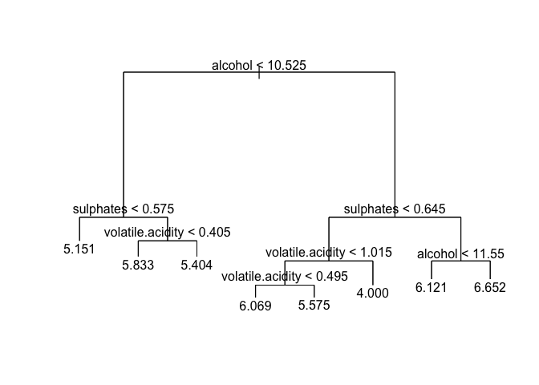
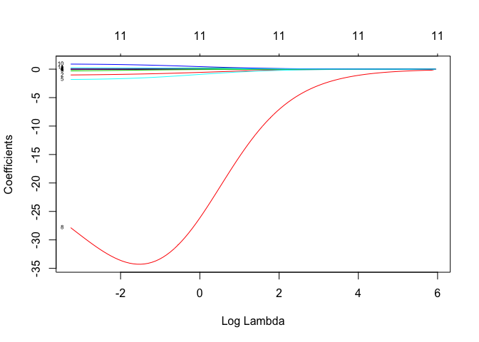

MLModels
================
April Sang
16/06/2019

##### This is a thorough analysis attempting to predict the quality of wine according to the several predictors included in the data set.

##### Regression trees, boosting, linear models, random forests, and lasso are performed below to find the lowest MSE in the long-run:

##### Regression Model

``` r
#regression model
winequality <- read.csv('winequality-red.csv', header = T, sep = ";")
head(winequality)
```

    ##   fixed.acidity volatile.acidity citric.acid residual.sugar chlorides
    ## 1           7.4             0.70        0.00            1.9     0.076
    ## 2           7.8             0.88        0.00            2.6     0.098
    ## 3           7.8             0.76        0.04            2.3     0.092
    ## 4          11.2             0.28        0.56            1.9     0.075
    ## 5           7.4             0.70        0.00            1.9     0.076
    ## 6           7.4             0.66        0.00            1.8     0.075
    ##   free.sulfur.dioxide total.sulfur.dioxide density   pH sulphates alcohol
    ## 1                  11                   34  0.9978 3.51      0.56     9.4
    ## 2                  25                   67  0.9968 3.20      0.68     9.8
    ## 3                  15                   54  0.9970 3.26      0.65     9.8
    ## 4                  17                   60  0.9980 3.16      0.58     9.8
    ## 5                  11                   34  0.9978 3.51      0.56     9.4
    ## 6                  13                   40  0.9978 3.51      0.56     9.4
    ##   quality
    ## 1       5
    ## 2       5
    ## 3       5
    ## 4       6
    ## 5       5
    ## 6       5

``` r
#linear model
winelm <- lm(quality~.,data=winequality)
ws<-summary(winelm)
ws
```

    ## 
    ## Call:
    ## lm(formula = quality ~ ., data = winequality)
    ## 
    ## Residuals:
    ##      Min       1Q   Median       3Q      Max 
    ## -2.68911 -0.36652 -0.04699  0.45202  2.02498 
    ## 
    ## Coefficients:
    ##                        Estimate Std. Error t value Pr(>|t|)    
    ## (Intercept)           2.197e+01  2.119e+01   1.036   0.3002    
    ## fixed.acidity         2.499e-02  2.595e-02   0.963   0.3357    
    ## volatile.acidity     -1.084e+00  1.211e-01  -8.948  < 2e-16 ***
    ## citric.acid          -1.826e-01  1.472e-01  -1.240   0.2150    
    ## residual.sugar        1.633e-02  1.500e-02   1.089   0.2765    
    ## chlorides            -1.874e+00  4.193e-01  -4.470 8.37e-06 ***
    ## free.sulfur.dioxide   4.361e-03  2.171e-03   2.009   0.0447 *  
    ## total.sulfur.dioxide -3.265e-03  7.287e-04  -4.480 8.00e-06 ***
    ## density              -1.788e+01  2.163e+01  -0.827   0.4086    
    ## pH                   -4.137e-01  1.916e-01  -2.159   0.0310 *  
    ## sulphates             9.163e-01  1.143e-01   8.014 2.13e-15 ***
    ## alcohol               2.762e-01  2.648e-02  10.429  < 2e-16 ***
    ## ---
    ## Signif. codes:  0 '***' 0.001 '**' 0.01 '*' 0.05 '.' 0.1 ' ' 1
    ## 
    ## Residual standard error: 0.648 on 1587 degrees of freedom
    ## Multiple R-squared:  0.3606, Adjusted R-squared:  0.3561 
    ## F-statistic: 81.35 on 11 and 1587 DF,  p-value: < 2.2e-16

``` r
mean(ws$residuals^2)
```

    ## [1] 0.4167672

``` r
#MSE:0.4167
```

##### \-

##### Regression Tree

``` r
#tree
library(tree)
winetree <- tree(quality~., data=winequality)
winetree
```

    ## node), split, n, deviance, yval
    ##       * denotes terminal node
    ## 
    ##  1) root 1599 1042.00 5.636  
    ##    2) alcohol < 10.525 983  424.20 5.366  
    ##      4) sulphates < 0.575 391  128.10 5.151 *
    ##      5) sulphates > 0.575 592  266.00 5.508  
    ##       10) volatile.acidity < 0.405 144   70.00 5.833 *
    ##       11) volatile.acidity > 0.405 448  175.90 5.404 *
    ##    3) alcohol > 10.525 616  432.30 6.067  
    ##      6) sulphates < 0.645 272  191.90 5.728  
    ##       12) volatile.acidity < 1.015 262  154.90 5.794  
    ##         24) volatile.acidity < 0.495 116   65.45 6.069 *
    ##         25) volatile.acidity > 0.495 146   73.67 5.575 *
    ##       13) volatile.acidity > 1.015 10    6.00 4.000 *
    ##      7) sulphates > 0.645 344  184.60 6.334  
    ##       14) alcohol < 11.55 206  102.00 6.121 *
    ##       15) alcohol > 11.55 138   59.30 6.652 *

``` r
plot(winetree)
text(winetree)
```

<!-- -->

``` r
cv.winequalityt <- cv.tree (winetree, FUN = prune.tree)
plot(cv.winequalityt, type="b")
```

<!-- -->

``` r
#no pruning

trainindex <- sample(1: nrow(winequality),800)
winetrain <- winequality[trainindex,]
winetest <- winequality[-trainindex,]

yhat <- predict(winetree,winetest[,-12])
mean((yhat - winetest[,12])^2)
```

    ## [1] 0.4326739

``` r
#MSE:0.4108023
```

##### \-

##### RandomForest

``` r
#randomForest
library(randomForest)
```

    ## randomForest 4.6-14

    ## Type rfNews() to see new features/changes/bug fixes.

``` r
wineRF <- randomForest(quality~., data=winequality, mtry=2,importance=TRUE)
wineRF
```

    ## 
    ## Call:
    ##  randomForest(formula = quality ~ ., data = winequality, mtry = 2,      importance = TRUE) 
    ##                Type of random forest: regression
    ##                      Number of trees: 500
    ## No. of variables tried at each split: 2
    ## 
    ##           Mean of squared residuals: 0.3181226
    ##                     % Var explained: 51.19

``` r
#MSE:0.3191
```

##### \-

##### Boosting with loovc

``` r
#boosting with loovc
attach(winequality)
library(gbm)
```

    ## Loaded gbm 2.1.4

``` r
winequalityboost <- gbm(quality~., distribution="gaussian", data=winequality, n.trees=5000, interaction.depth=1)

cvboost <- NA
for(i in 1:nrow(winequality))
  {
dummod <- gbm(quality~., distribution="gaussian", data=winequality[-i,], n.trees=5000, interaction.depth=1)

cvboost[i] <- ((predict(dummod, n.trees=5000, newdata=winequality[i,], type="response"))- quality[i]) ^2 
}
mean(cvboost)
```

    ## [1] 0.436491

``` r
#MSE:0.434
```

##### \-

##### Lasso

``` r
#Lasso
#install.packages("glmnet")
library(glmnet)
```

    ## Loading required package: Matrix

    ## Loading required package: foreach

    ## Loaded glmnet 2.0-16

``` r
grid <- exp(seq(10, -6, length=100))
x <- as.matrix(winequality[,-12])
y <- winequality$quality
lasim <- cv.glmnet(x, y, alpha=1,lambda=grid)

plot(lasim$glmnet.fit, label=TRUE, xvar="lambda")
```

<!-- -->

``` r
plot(lasim)
```

<!-- -->

``` r
lammin <- lasim$lambda.min
lam1se <- lasim$lambda.1se
lammin
```

    ## [1] 0.004025317

``` r
mse <- lasim$cvm[lasim$lambda ==lasim$lambda.min]
mse
```

    ## [1] 0.4244394

``` r
#MSE: 0.424354
```

##### \-

##### ridge regression

``` r
rrsim_d <- cv.glmnet(x, y, alpha=0)
plot(rrsim_d$glmnet.fit, label=TRUE, xvar="lambda")
```

<!-- -->

``` r
plot(rrsim_d)
```

<!-- -->

``` r
mse_r <- rrsim_d$cvm[rrsim_d$lambda ==rrsim_d$lambda.min]
mse_r
```

    ## [1] 0.424602

``` r
#MSE: 0.4241866
```

``` r
winebag <- randomForest(quality~., data=winequality,mtry=11,importance=TRUE)
winebag
```

    ## 
    ## Call:
    ##  randomForest(formula = quality ~ ., data = winequality, mtry = 11,      importance = TRUE) 
    ##                Type of random forest: regression
    ##                      Number of trees: 500
    ## No. of variables tried at each split: 11
    ## 
    ##           Mean of squared residuals: 0.3194318
    ##                     % Var explained: 50.99

``` r
#MSE:0.3168
```

    Out of all the mothods I ran, bagging seems to be the one has the lowest MSE in the long run. 
    For presenting to the company, I would choose lasso because it is easier to expalin to people who do not have too much knowledge on stats, and the MSE of it is not way to high either.
